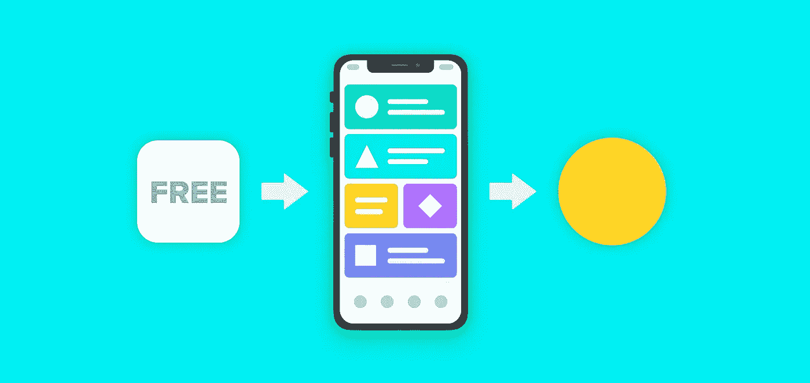
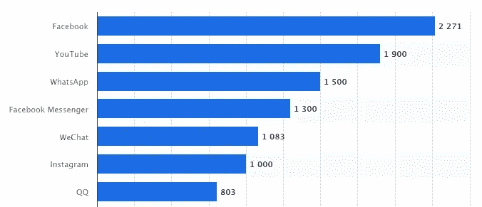
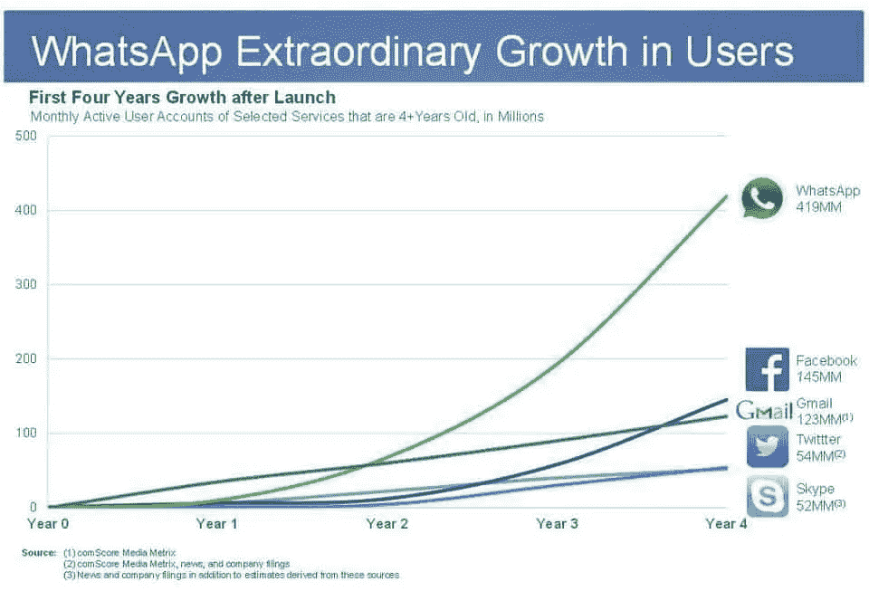
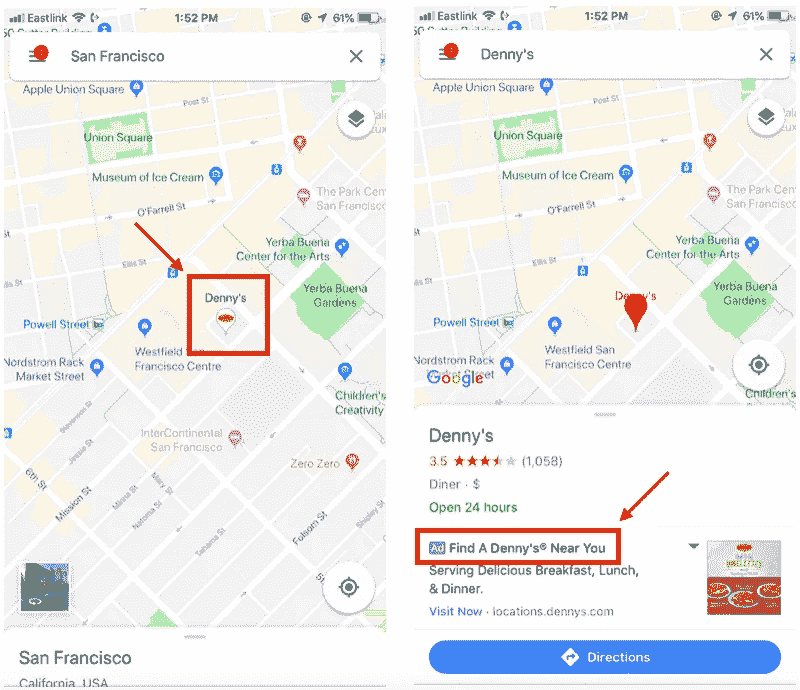
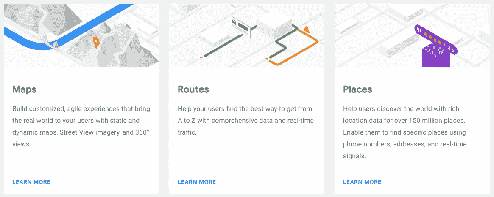
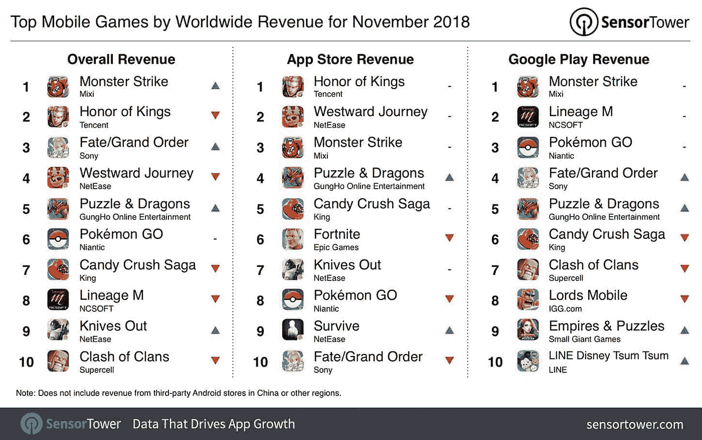
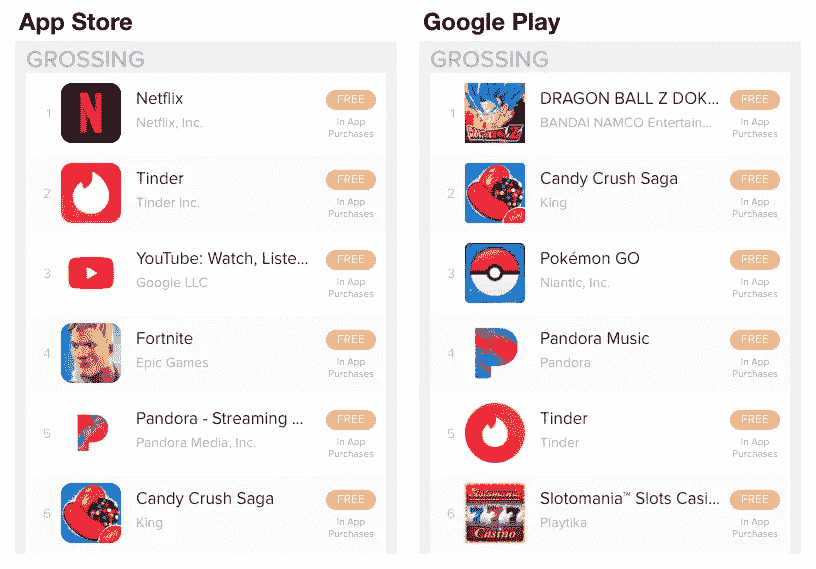
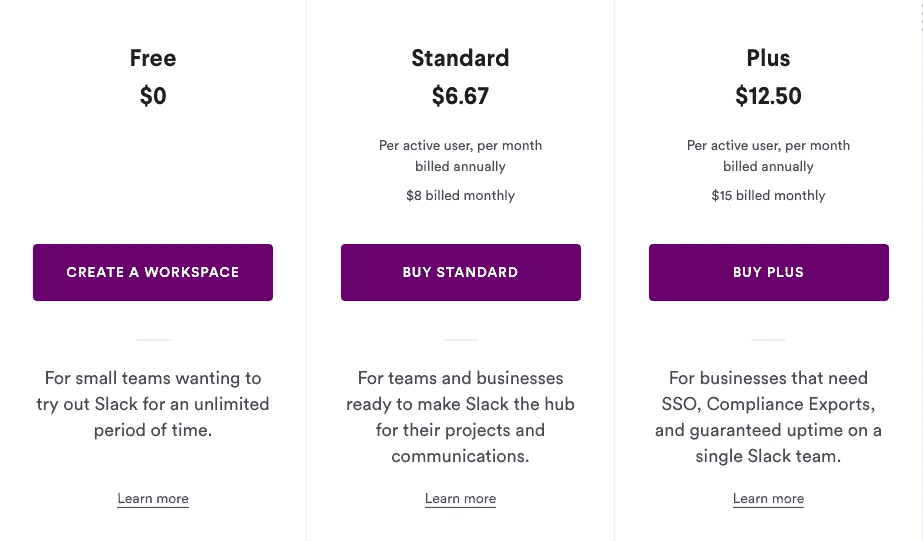
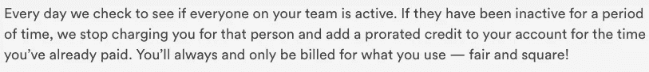

# 免费应用如何赚钱(六个案例研究)

> 原文：<https://medium.com/swlh/how-do-free-apps-make-money-six-case-studies-df7375768f6b>

在任何时候，通常有 400 万到 500 万个应用程序可以从苹果应用商店和谷歌 Play 商店下载。

在这 400 万到 500 万中，大多数都是免费下载的。

免费？是的，免费的。

考虑到我们生活在其中的资本主义社会，你会想:*这些公司是如何赚钱的？*

信不信由你，免费应用程序实际上可以为你的企业带来很多钱。

正如我们在帖子[中所写的，你如何在应用商店中赚钱？](https://mindsea.com/monetize-free-app/)，免费应用基本上通过以下两种方式赚钱:

*   应用内广告
*   应用内附加组件、购买和升级

你可能认为这很简单。但是这两种方法并不适合每一家公司，它们可以有很多不同的应用方式。

在本帖中，我们将向你展示六个不同的应用程序如何成功利用免费定价策略，以及如何将它们的策略转化为你自己的应用程序。

# 1.脸书旗下的全球巨头:WhatsApp

就活跃用户而言，WhatsApp 是世界上最受欢迎的应用之一，它是一款仅通过互联网连接世界的信使应用。它提供了无线供应商无法与之竞争的服务。而且是**全免费**。

## 它是如何赚钱的

[与竞争对手](https://www.forbes.com/sites/greatspeculations/2017/11/10/how-much-revenue-can-whatsapp-generate/#3b049e152f2c)不同，WhatsApp 没有通过我们上面提到的任何一种方式盈利。其实根本没有货币化。那么…它真的赚钱吗？

过去，WhatsApp 通过向一些用户以 1 美元的价格出售应用程序，并在第一年后向其他人收取 1 美元的费用来赚钱。可能是认识到这种不统一的方法造成的混乱，该公司[于 2016 年正式报废了该型号](https://blog.whatsapp.com/615/Making-WhatsApp-free-and-more-useful)。

尽管最初向一些用户收费，但 WhatsApp 自推出以来一直保持着无与伦比的增长。这是它上市头四年的样子:

*图片来源:*[https://www . Forbes . com/sites/Gordon Kelly/2014/02/20/5-key-reasons-whatsapp-is-worth-19bn-to-Facebook/# 40 adecf 360d 9](https://www.forbes.com/sites/gordonkelly/2014/02/20/5-key-reasons-whatsapp-is-worth-19bn-to-facebook/#40adecf360d9)

这种疯狂的增长(今天以每天 100 万新用户的速度持续增长)几乎肯定是脸书将这款即时通讯应用估值为 190 亿美元的部分原因——这是他们在 2014 年购买该应用的价格。现在，2019 年，这款应用仍然通过收取零费用和显示零广告来吸引消费者和小企业。

WhatsApp 获得的任何收入都可能来自其[商业应用编程接口产品](https://www.whatsapp.com/business/api)，该产品允许大中型企业保持形象并与客户沟通。然而，有传言称脸书[也将从今年开始向广告商开放 messenger 应用](https://economictimes.indiatimes.com/magazines/panache/money-matters-whatsapp-to-soon-show-ads-in-status-feature/articleshow/66447443.cms)。

## 我们能从中学到什么

WhatsApp 是真正免费应用的完美例子。这是一种罕见的定价策略，并非所有企业都有能力采用，但对脸书来说，考虑到长期潜力，这是一种显而易见的策略。

想想每天从世界各地发送的数十亿条信息中积累起来的数据。想想如果脸书最终[选择利用](https://www.forbes.com/sites/greatspeculations/2017/11/10/how-much-revenue-can-whatsapp-generate/#20765ea22f2c)广告潜力，已经奠定的基础。

脸书不傻。

另一方面，脸书也不穷，他们现在真的不需要 WhatsApp 赚钱——他们可以顺其自然，继续从他们的核心平台获得数十亿的广告收入。

WhatsApp 对脸书的价值可能只是享受这项服务的用户群体。在你的产品中添加一个应用，仅仅是为了提升客户体验，这并不是一个坏主意…如果你能负担得起的话。可以理解的是，并不是每个公司都和脸书一样大(就规模和收入而言)，因此不能合理地利用这种奢侈。

# 2.我们从不迷路(或挨饿)的原因:谷歌地图

谷歌是另一家着眼于未来的公司。

其 2013 年对免费导航应用 Waze 的收购就是一个例子。虽然有些人认为收购是一个奇怪的举动，但谷歌知道，它可以从应用程序中挖掘的社交数据将是无价的。

但与 WhatsApp 和 Waze 不同的是，谷歌自己的地图工具实际上是货币化的，这给了该公司更大的灵活性来进行长期思考。

## 它是如何赚钱的

有些应用只有一个收入来源，而谷歌地图有几个赚钱的渠道:

**广告**

该应用通过两种方式获得广告收入:推广的 pin 码和本地搜索广告。

在谷歌地图中，你会看到用彩色大头针标记附近的商店——一把刀叉代表一家餐馆，一张床代表一家酒店，一辆购物车代表一家杂货店，等等。但是如果一家公司选择了[促销别针](https://unbounce.com/ppc/google-maps-promoted-pins/)，他们的品牌标志就会出现，而不是普通别针，就像下面截图中的丹尼。你主要在大城市看到促销的胸针，那里有很多商家争夺消费者的注意力。

本地搜索广告将一家企业推上谷歌地图搜索结果的顶端，增加其知名度。广告商甚至可以在搜索结果中列出特价商品和产品清单。

本地搜索广告的一个很酷的额外好处是:谷歌实际上可以追踪用户在点击它的广告后是否访问了一家企业。

**谷歌地图应用编程接口**

谷歌地图还通过允许企业使用其开发平台创建定制地图体验来赚钱。有三种类型的[谷歌地图 API](https://cloud.google.com/maps-platform/products/):

什么样的应用程序利用了这些 API？想想你经常使用的点播应用:优步、Postmates、task rabbit……它们都使用了从谷歌地图借来的(也就是*买的*)地图功能。

**合伙企业**

你知道你可以通过谷歌地图直接点餐吗？是的——该平台集成了第三方服务，因此您无需离开应用程序就可以下单。

同样，你可以通过谷歌地图找到你所在地区可用的优步或 Lyft，它会自动指引你到拼车应用程序进行预订。

**AR 对未来的构想**

谷歌高管对地图的未来有[大计划](https://www.inverse.com/article/30916-google-maps-makes-money)，其中包括一些增强现实升级。例如，想象当你走在街上时，附近企业的详细信息出现在你的手机屏幕上——就像你在 Pokémon Go 中四处走动时出现的 Pokémon 一样。

## **我们能从这次**中学到什么

谷歌地图用户希望看到关于商业和其他兴趣点的详细信息。这就是为什么他们首先打开了这个应用程序——来定位一个企业，找出如何到达那里，找到营业时间，等等。如果他们在购物时出现优惠券或折扣，这是额外的奖励。

谷歌确保其地图广告是用户体验中自然的、甚至是受欢迎的一部分。如果你想让广告成为你的应用程序盈利策略的一部分，试着增强客户体验，而不是用干扰性的、不相关的广告轰炸用户。

# 3.我们玩不够的游戏:糖果粉碎传奇

尽管是免费提供的，但许多游戏应用程序还是获得了可观的收入。看看 SensorTower 的以下数据:

*来源:*[https://bgr . com/2018/12/17/app-store-网飞-top-revenue-apps-2018/](https://bgr.com/2018/12/17/app-store-netflix-top-revenue-apps-2018/)

从这张图中你看不出什么:应用商店中收入最高的 10 款移动游戏应用(*见“总收入”栏*)都被认为是免费的——嗯，某种程度上…

它们可以免费下载，但实际上它们属于免费增值类别。为了获得最佳的整体体验，用户可以付费选择附加服务和升级。糖果粉碎就是这样赚到数百万的。

## 它是如何赚钱的

截至今年,《糖果粉碎传奇》不仅继续在移动应用游戏方面大获全胜，而且在谷歌 Play 商店和苹果应用商店的所有类别中，该应用都是票房最高的十大应用之一。

** 2019 年 2 月 21 日来自 App Annie 的数据*

如前所述,《糖果粉碎传奇》通过应用内的服务赚钱，包括助推器、额外生命和更多旋转。已经有很多关于玩家为什么痴迷于匹配糖果的文章——一方面，这款游戏和老虎机一样令人上瘾——但底线是这款应用程序旨在鼓励人们在这些应用程序上永久消费，它成功了。

不过，*没有*来购买应用内的助推器来玩游戏，所以应用特许经营背后的公司 King 仍然每天从应用内购买中为[产生近 300 万美元](https://variety.com/2018/gaming/news/candy-crush-saga-1-billion-1202908004/)的事实是疯狂的！

事实上，King 通过其三个 Candy Crush 应用程序(原版，加上 Candy Crush Soda Saga 和 Candy Crush Jelly Saga)平均每天赚 390 万美元。

作为付费的替代方式，用户通常可以选择观看视频广告来增加支持者，这是另一个收入来源。

## 我们能从中学到什么

《糖果粉碎》通过开发一个简单的产品，让观众不断回来，成为最卖座的应用之一。

King 坚持认为，其 Candy Crush 应用将继续忠于休闲游戏类别中的利基市场，这激发了核心用户的忠诚度。虽然总会有人满足于享受功能有限的免费应用，但总会有人愿意为增强的体验付费。

迎合多种用户偏好是在不失去客户的情况下将你的应用货币化的好方法。一旦你找到了用户喜欢的东西，就坚持下去。

# 4.每个团队如何开始一天的工作:懈怠

Slack 是创业界的[稀有独角兽](https://www.cbinsights.com/research-unicorn-companies)。自 2014 年推出以来，它已经成为 SaaS 社区的领导者和以正确方式发展科技公司的典范。

## 它是如何赚钱的

Slack 最初是一款游戏产品，后来逐渐演变成一款通讯工具。Slack 背后的公司在发布后的几个月和几年内筹集了大量的投资资本。这在很大程度上是由于它的免费增值定价模式，以及它的创始人斯图尔特·巴特菲尔德的吸引力，他已经在几年前推出并出售了另一家成功的公司 Flickr。快速的增长和高估值使公司对更多的投资者有吸引力，许多大公司[注册使用这项服务。](https://slack.com/customer-stories)

组织可以免费使用 Slack 应用程序，但需要更多灵活性和支持的公司可以为这些服务支付额外费用。

【https://slack.com/pricing】来源:

去年，Slack 报告说它总共有 800 万用户，其中 300 万是付费用户。他们的模式与其他 SaaS 公司不同，因为组织只为积极使用该应用的团队成员付费。如果一段时间内没有任何活动，则不收费。

Slack 还通过第三方合作伙伴关系创造收入。在早期，该公司鼓励这些合作伙伴关系，将其筹集的大部分资金再投资到其他初创公司，这些公司提出为 Slack 平台创建新的集成。

## 我们能从中学到什么

与糖果粉碎制造商 King 一样，Slack 也认识到了迎合不同类型用户需求的价值。Slack 的核心客户是企业——但也是各种规模的企业。大公司希望支付，他们可能愿意支付一大笔钱。另一方面，个人和小型团队必须对他们的支出更加谨慎，并期望更多的回报。

因此，Slack 认为，从长远来看，分层定价最有利于公司和客户。该应用依靠其最大客户的收入运行，将其中大部分再投资于战略合作伙伴关系，并能够以更低的费用或根本不收费为其余客户服务。

在为您自己的企业确定正确的定价策略时，考虑您的客户愿意支付的价格，以及不同用户之间的差异。

# 5.重新露面的音乐应用程序:潘多拉

当你想到音乐流媒体服务时，潘多拉可能不是第一个想到的。也就是说，它一直是两家应用商店中票房最高的应用之一(回头看看上面的图表)——尽管仍然只对美国用户开放。

## **它是如何赚钱的**

据《今日财政》报道，截至 2019 年 2 月，Pandora 拥有[2.5 亿注册用户](http://fiscaltoday.com/how-does-pandora-make-money/)。在早期，该应用试图在用户用完分配的免费流媒体时间后向用户收取年费。几年后，该公司的盈利策略转向付费广告。

如今，Pandora 的定价方式类似于 Spotify 和 Apple Music。它提供:

*   潘多拉(带广告的收音机)——免费
*   Pandora Plus(无广告，无限跳过和重播，有限离线收听)——月费或年费
*   Pandora Premium(无广告，无限跳过和重播，无限离线收听，创建播放列表的能力)——月费或年费

广告(横幅、视频和音频格式)基于用户数据定向投放。免费服务的用户每小时最多只需要处理一分钟的广告。

虽然它的[票务服务没有持续](https://techcrunch.com/2017/06/09/pandora-raises-480m-from-siriusxm-sells-ticketfly-to-eventbrite-for-200m/)多久，潘多拉也通过在许多随时可以拥有的车辆上安装它的服务在汽车行业赚钱。而[关于未来的谈话](https://www.marketwatch.com/story/pandora-spotify-look-to-podcasts-to-boost-profits-2018-11-18)让潘多拉开始寻求进一步渗透播客市场。

## 我们能从中学到什么

如果你正在考虑一个你不确定的定价策略或收入流，测试它，评估结果，然后继续前进。更重要的是，做你的家庭作业。消费者的偏好和购买习惯经常变化，但如果你足够了解你的行业，你应该能够推出有意义的定价策略。通过分析竞争应用，研究市场和与潜在用户交谈，你可以提前做好准备，避免选择一个真正不会与你的受众长期联系的定价策略。

# 6.世界去哪里寻找灵感:Pinterest

Pinterest 是一个在线剪贴簿，用户可以在这里找到从烹饪、旅行、时尚到派对策划等一切事物的灵感，所有这些都以固定图像的形式出现。pin 将用户连接到外部网站，使 Pinterest 成为基于产品的公司的理想社交网络。

## 它是如何赚钱的

根据 Investopedia 的数据，Pinterest [在 2018 年产生了超过 7 亿美元的付费广告利润](https://www.investopedia.com/articles/personal-finance/022415/how-pinterest-makes-money.asp)。这是公司的主要收入来源。

Pinterest 的“促销大头针”的特别之处在于它们是如何无缝地融入网站的美学之中的。公司根据搜索数据和受众人口统计数据付费，让他们的 pin 码针对用户。推广的大头针看起来与搜索结果中自然出现的大头针非常相似，因此不会中断用户体验。

一些 pin 也是可购买的，这意味着用户可以直接从平台上购买。Pinterest 与 Stripe 和 Braintree 等支付服务以及 Shopify 和 Salesforce 等电子商务网站相结合，使这一切成为可能。

## 我们能从中学到什么

用户永远是第一位的。在 Pinterest 上，广告与应用程序体验完美融合。消费者、企业和应用程序都会受益。没有消费者付费使用该工具，企业向 Pinterest 付费是为了让他们的 pin 更快地到达正确的人手中。

# 将这一切结合在一起

这个列表中的应用程序可能是免费的，但他们已经能够通过将它与额外的收入流或业务相结合来维持免费的价格。

故事的寓意:免费应用程序可以赚钱！

这篇文章中的六家公司都做了广泛的研究，以了解他们的目标受众是谁，他们喜欢什么。随着这些公司的成长，他们一直忠于自己的核心产品和服务。您不需要为了应对不断变化的客户偏好而不断重复发明轮子。相反，投资于技术升级、软件更新和新的产品线——不要忘记你的应用程序是如何开始的。

想了解更多移动应用赚钱的方法，请查看[关于移动应用定价策略的所有信息](/swlh/everything-there-is-to-know-about-pricing-strategies-for-your-mobile-app-6b2d7dc3d6cb)。

*原载于 2019 年 3 月 3 日*[*mindsea.com*](https://mindsea.com/how-free-apps-make-money/)*。*

## 这篇文章发表在 [The Startup](https://medium.com/swlh) 上，这是 Medium 最大的创业刊物，拥有+434，678 读者。

## 在此订阅接收[我们的头条新闻](https://growthsupply.com/the-startup-newsletter/)。

