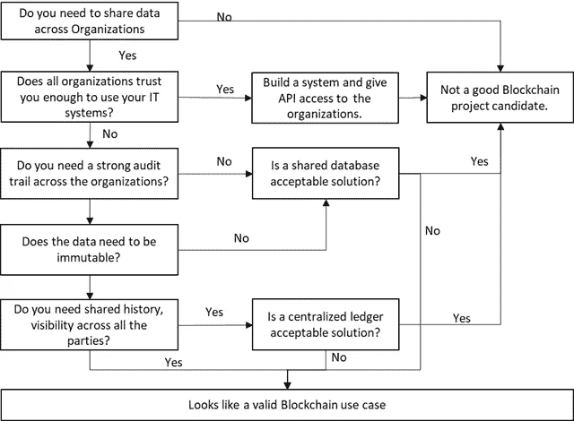

# 我如何选择区块链平台？

> 原文：<https://medium.com/swlh/how-do-i-select-a-blockchain-platform-d7e0dd5a27ad>

Photo by [Marcello Gennari](https://unsplash.com/photos/KA89yJKYtjE?utm_source=unsplash&utm_medium=referral&utm_content=creditCopyText) on [Unsplash](https://unsplash.com/search/photos/start-lego?utm_source=unsplash&utm_medium=referral&utm_content=creditCopyText)

好吧，那么你已经决定在你的组织中做一个区块链项目，但不知道如何开始。这篇文章肯定会有所帮助。

但在开始之前，关键问题是如何选择正确的项目？用例选择是项目成功的关键。本文将给出一个框架，选择正确的项目，然后为选择区块链平台选择正确的平台。

**项目选择**

选择正确的项目是区块链概念验证的第一步。在开始 PoC 之前，我们应该问自己一系列问题。检查下面的决策树:

**区块链平台选择:**

一旦你选择了你的用例，下一个重大的决定就是选择平台。选择平台时，请考虑以下因素:

***有权限 vs 无权限***

如果您需要在加入网络之前授权您的所有参与者，那么您将需要使用许可的网络。但是请记住，许可网络需要身份验证/授权服务，有时也称为公证人。这些服务既可以是集中式的，也可以是分散式的，所以请检查哪种服务适合您的使用情况。

***令牌/加密与否***

如果你正在寻找创造加密货币或想要在区块链上进行令牌化评估，那么请记住不是所有的框架都提供这种功能。例如，Hyperledger fabric 或 Corda 不提供任何创建令牌或加密的工具。如果你需要一个具备令牌化的企业级区块链平台，你的选择极其有限。

***开发者可用性***

市场上没有多少开发人员可以开发这些技术。事实上，许多这些框架都有自己的语言，这使得培训现有的开发人员更加困难，这使得问题变得更加复杂。

***交易速度***

如果你正在寻找每秒成千上万的交易，那么你的选择仅限于大多数许可的区块链。很少有无权限区块链声称这种可伸缩性，但是还没有被证明。

***粒状安全***

并非所有平台都提供企业 IT 系统所需的安全性粒度。务必查看每个平台，并检查安全性粒度。

我希望这些因素将为您提供一个良好的视角，让您了解在您的区块链项目之前需要考虑的因素。

## 这篇文章发表在 [The Startup](https://medium.com/swlh) 上，这是 Medium 最大的创业刊物，拥有+437，678 名读者。

## 在这里订阅接收[我们的头条新闻](https://growthsupply.com/the-startup-newsletter/)。

