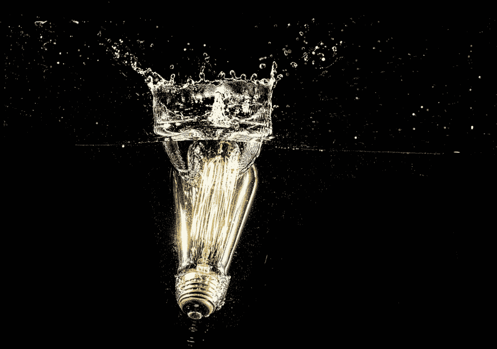

# 他们是如何找到自己无限的能量的？—第一部分

> 原文：<https://medium.com/swlh/how-do-they-find-their-boundless-energy-part-1-d9c537170851>

## 为成功创造最好的条件

有些人似乎有无限的精力和时间。他们在工作中粉碎它，并有一个繁荣的副业。他们指导儿子的棒球队，和朋友出去玩，还有时间参加当地的垒球联赛。

与此同时，另一个人白天的工作足以耗尽他们的精力，让他们在下午六点前感到筋疲力尽..

有一个共同的特征将那些拥有无限能量的人和那些没有能量的人区分开来。

## 两只狼的寓言

我看到一个寓言，讲的是一个老切罗基人在教他的孙子生活:

> “我内心正在进行一场战斗，”他对男孩说。“这是一场可怕的战斗，是两只狼之间的战斗。一个是邪恶的——他是愤怒、嫉妒、悲伤、后悔、贪婪、傲慢、自怜、内疚、怨恨、自卑、谎言、虚假的骄傲、优越感和自我。”
> 
> 他继续说，“另一个是善——他是快乐、和平、爱、希望、宁静、谦逊、善良、仁慈、同情、慷慨、真理、同情和信仰。你内心也在进行着同样的斗争——每个人的内心也是如此。”
> 
> 孙子想了一会儿，然后问爷爷:“哪只狼会赢？”
> 
> 老切诺基人回答道:“你喂养的那只。”

# 驱动你的能量

想象一个能量谱。最左边标有*收缩能*，右边标有*膨胀能*。

*紧缩的能量*收紧，耗尽，缩小，需要努力。膨胀的能量是广泛的、开放的、补充性的、创造性的、不费力的。

现在的问题是，我们如何最好地利用我们的能量来为成功创造最好的条件？

> “我们最多只能希望为成功创造尽可能好的条件，然后放下结果。这样的旅程会有趣得多。”
> 
> 菲尔·杰克逊，十一枚戒指:成功的灵魂

这是一篇由两部分组成的文章。在第一部分，你将仔细观察紧缩能量，以及它是如何出现在你的生活中的。

第二部分将探索如何培养膨胀的能量。这是最有用的能量，让你成为最好的自己，创造生活中你最想要的东西。

# 收缩能量是什么感觉？

对我来说，知道我正在共鸣的能量的最简单的方法是通过注意我身体的感觉。我眉头紧锁，胃里打结，或者衣领下发烫。

这些通常是我们对感知到的威胁做出战斗或逃跑反应的第一个迹象。结果是肌肉字面上的收紧和聚焦的狭窄。

我们准备好行动了。如果我们是生活竞技场上的角斗士，那么这对我们很有好处。但我们没有。

像倾听、沟通、交流、合作和创造力这样的特质是成功的关键。当我们的自我感觉受到威胁时，这些技能是最难利用的。

情商很关键。意识到是什么导致了这些无益的紧缩状态是第一步。

# 这六件事正在扼杀你无限的能量:

## 1.避免压力

对你来说，远离痛苦的经历，朝着感觉良好的方向前进是很自然的。压力是不愉快的，所以你避免它。你推迟做你知道你应该做的事情，因为你不喜欢它产生的压力。

**你的欲望和目标就在你的压力、痛苦和不适的另一边。所以，避免压力，从本质上来说，就是避免生活。**

## 2.判断

你整天到处给所有东西贴标签。*那就好，那就不好，她是对的，他是错的*。

> “如果你为外部事物感到痛苦，那不是它们打扰了你，而是你自己对它们的判断。现在你有能力消除这种判断。”
> 
> 马库斯·奥勒留

如果你想坐在生活的边缘，做一个批评家，那么判断是一个很好的娱乐方式。

但是如果你渴望成为创造生命的积极力量，这些判断对你有什么帮助呢？

## 3.掩护你的屁股

你让恐惧驱动你的行动，小心行事，不愿意举手、发言或表达你的创造力。

更多的时间和精力花在保护自己的身份上，而不是创造一些有意义的东西。

## 4.沉思的

你陷入了自己的想法中。我很烂，这不公平，他是个混蛋，我是个白痴，我永远都做不到，我还没准备好，我太年轻，或者太老。

> 最大的上瘾之一是思考上瘾，你永远不会在报纸上读到它，因为上瘾的人不知道。
> 
> 埃克哈特·托尔

你花了多少时间困在你的脑袋里，而不是与*这个时刻*接触？

## 5.繁忙

你喜欢吹嘘自己很忙。出于某种奇怪的原因，你庆祝自己每晚只睡四个小时。

你发现自己解决了一个又一个问题，但却没有接近你为自己设定的目标。

## 6.过高的期望

不管是什么，你现在就想要，而且你想用你的方式。当你不这样做时，你会生气和沮丧。

你的期望多久会带来挫折？这是一个过度期望的警示信号。

> 事实上，只要我们享受一路上的奋斗，我们升级目标的愿望就没有内在的问题。当人们如此专注于他们想要获得的东西，以至于他们不再从现在获得快乐时，问题就出现了。
> 
> 米哈里·奇克森米哈里河

# 结论

这六个原因正在扼杀你可能正在经历的无限能量。

当你滑入这种能量状态时，抓住你自己。花点时间问问发生了什么，为什么。

很少有紧缩的能量为成功创造条件的情况。避免压力、做出判断、沉思、恐惧、忙碌和过高的期望对你没有好处。

> 还有什么比对已经存在的东西产生内心的抗拒更徒劳、更疯狂的呢？还有什么比反对生活本身更疯狂的呢？生活本身就是现在，而且永远是现在。屈服于现状。对生活说“是”——看看生活如何突然开始为你服务，而不是与你作对。
> 
> 埃克哈特·托尔，现在的力量

在这篇文章的第二部分，我们将探索你如何转变为服务于你的能量 *—* 扩展能量。

**你现在有多清楚自己的能量？**

这对你创造理想结果的能力有帮助还是有伤害？

# 下载我的免费行政早晨计划！

[**点击此处**](https://www.createpurpose.net/executive-morning-plan) 并下载**早晨执行计划:通过控制你的早晨来提高你的表现**(没有收件箱和更多的任务列表)！