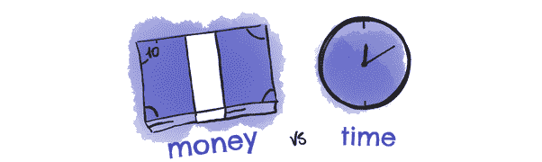
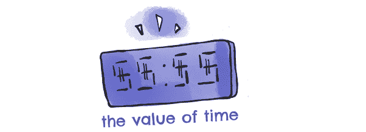
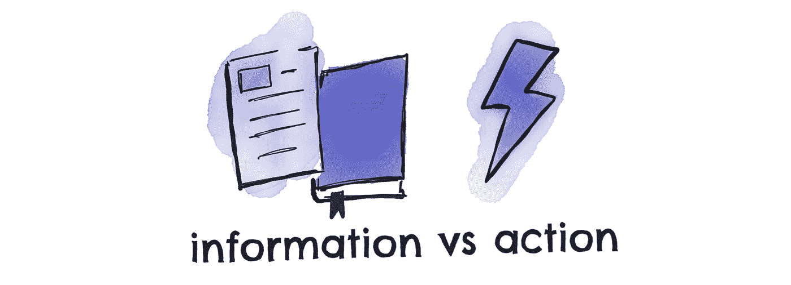

# 像百万富翁一样利用时间的 5 种方法

> 原文：<https://medium.com/swlh/how-do-top-performers-use-their-time-3bd22c5ee74e>

我走进酒店大堂，我有点紧张。我环顾四周，寻找我的商业英雄之一:我只有 30 分钟的相处时间，我想准时到达那里。

太早了，我会开始想太多。
太晚了，那就太失礼了。

他坐在靠近房间角落的一把椅子上。我们聊得很开心，我也吃了很多外卖。最主要的是他有多重视时间。

作为一个百万富翁(也就是数亿)，他非常清楚世界上的钱并不稀缺。但他的时代是。每天和一生中。
事实上，他是有备而来:他让他的助手(和我)准备了一份关于会议的小文件，他告诉我他是如何在洗澡和下楼来见我之间签订了一笔 7 位数的生意。

我付出了惨痛的代价才认识到时间的价值:在我的第一份工作和第一笔生意中，我让“[忙碌](/@mattsandrini/how-being-busy-is-hurting-your-business-59962baabbce)浪费了时间。顶尖高手看待时间的方式与其他人截然不同。

高绩效者非常清楚他们的时间有限。他们一天只有 24 小时，甚至我们的天数也是有限的。你必须明智地使用它们。

相反，忙碌的人表现得好像他们有无限的时间。所以他们无意识地浪费了他们的 24 小时。在商业中，这是忙于做错误的事情，而不是专注于给你带来结果的事情。

以下是优秀员工以不同方式利用时间的五种方式，以及你如何以同样的方式在工作和个人生活中取得成效。

# **错误#1。随着时间的推移选择金钱。**

优秀的员工知道他们可以赚更多的钱。他们可以每次赚更多的钱，他们可以赚回他们花的任何钱，但他们不能得到更多的时间。优秀的员工可以花钱买回时间。你可以通过有一个清洁工，一个司机，有人把你买的东西送到你家，而不是你去超市。

忙碌的人随着时间的推移而重视金钱，所以他们自己做所有的事情。
即使是那些他们不擅长、需要大量时间和精力的事情，他们也不愿意花时间去做。他们用时间换取金钱。为了省钱，他们花费了时间，但到头来什么也没得到:他们没有完成任何实际上能为他们的企业带来更多成果和未来收入的事情。

## 做什么不一样。

接下来的两周，记录下你是如何利用时间的。每增加 30 米写一次，最后加总。这会让你知道你花了多少时间在真正能给你带来结果的活动上(以及花了多少时间在没有结果的事情上)。

当我和一个新的客户一起工作时，我们经常会检查他们在业务中的活动清单:通常，当他们意识到他们的时间创造的价值如此之少时，他们会感到震惊。

# **错误二。销售时间。**

优秀的员工意识到，要完成大事，他们需要其他人，需要其他技能，需要更多时间。所以他们利用其他人。他们利用他人的关系、他人的时间、他人的知识，这样他们就不必事事亲力亲为。他们不需要自己学习所有的东西。他们不必自己应用所有的东西。他们不需要自己创造一切。
他们通过雇佣其他人、合伙、指导、训练来做到这一点:他们利用其他人的时间来节省自己的时间，这样他们就可以把时间分配到能更快产生效果的事情上

另一方面，忙碌的人出卖他们的时间。通常很便宜。他们将自己的时间出售给其他人，让他们用这些时间来完成其他事情，他们通常是按时间、按小时而不是按结果获得报酬。所以他们出卖自己的时间，而不是利用他人的时间。

## 做什么不一样。

要了解你时间的价值，量化它。在我的畅销书 [*投资你的时间*](https://www.timezillionaire.com/book) *，*中，我分享了我的一些百万富翁教练客户用来计算一小时价值的精确公式:梦想率。
简而言之，你设定下一个收入目标(或者工资，如果你的业务有所增长的话),然后用它除以下一年你计划工作的小时数。这将告诉你，为了达到这个目标，你每活跃一小时必须赚多少钱:少赚一点，剔除，自动化，或者外包。

# **错误三。不知道每一小时的价值。**

优秀的员工非常清楚自己时间的价值。他们知道他们的每个小时值多少钱。他们知道，如果你只有 24 小时，你总是要找到一个平衡点。

多睡一个小时会让你工作得更好吗？如果是这样的话，这是一个伟大的投资，可以在接下来的 16 个小时里得到回报。如果两个小时能让你一周的工作效率翻倍，那么这两个小时值得吗？哇，这是一个令人难以置信的投资。另一方面，当你可以以很低的价格外包时，自己熨衬衫或去买杂货是不是一项不错的时间投资？当你可以花两个小时和一个“meh”朋友培养另一段惊人的友谊时，花两个小时值得吗？

成功的人知道生活是一种交换，他们不会试图通过浪费时间来省钱，他们会用那些时间来赚更多的钱。

另一方面，忙碌的人相信他们的时间有着不可改变的内在价值。所以他们期望事情为他们工作，他们期望每小时固定的钱，他们不为自己工作，因为他们认为他们不能增加自己的价值。他们忽略了他们的时间所能创造的价值。

忙碌的人也通过在他们不应该做的事情上浪费时间来寻找省钱的方法:寻找 5%的折扣，做他们自己的 DYI(他们不喜欢)，为了节省而乘坐慢行交通工具(但浪费时间)。他们没有意识到金钱是无限的，而时间是无限的。

## 做什么不一样。

回想一下你上一次发展业务或获得晋升的时候。很明显，你每小时赚的钱不是固定的。现在看看你在第一点中列出的活动清单，排除那些不能让你更接近目标或理想生活方式的事情。

# **错误四。目光短浅。**

优秀的员工知道你现在花时间的方式将决定你明天的选择。你未来的成就。你遇到的人将是你明天身边的人。你今天学到的东西就是你明天会知道的东西。你今天开始的项目就是明天会结出果实的项目。

优秀员工明白，你今天做出的选择将改变你的未来，并塑造你的机会。所以他们投入时间。

忙碌的人想要立竿见影的效果和机会，所以不断寻找逃避现实的捷径和方法。他们麻痹自己，寻找方法转移自己对挑战的注意力，而不是直面挑战，改变未来。他们不建造能创造更美好明天的东西。他们试图逃避他们不喜欢的今天，把时间花在对他们的未来没有影响的事情上。他们一直被困住了。

## 做什么不一样。

要意识到你现在的选择对未来是有代价的，你现在的处境是你过去决定的副产品。
最有效的捷径是改变你的交往对象，通过组织活动、接触他们或与他们一对一地合作，开始结识你所在城市的高绩效员工。

# 错误五。寻找更多信息。

顶尖的表演者有备而来。他们没有直接采取随机行动，而是提前做了研究(并让其他人为他们工作)，因此他们知道确切的步骤，以及未来会发生什么。
然而，他们也知道什么时候该停下来:当他们有足够的信息看清大局并采取行动时，他们会停止寻找答案，而是开始行动。

他们知道事情会随着时间的推移而改变，更多的信息只会减缓决策过程，留给他们更多的时间去操作和调整。就像亚马逊创始人杰夫·贝索斯在接受采访时说的，决定于 70%的信息。“慢就是贵。”

忙碌的人不断寻找更多的信息:更好的指南、终极策略、更详细的博客文章、更简单的完成方法。他们没有意识到，与此同时，他们已经没有时间了，再也无法从自己的行为中学习和调整。他们被卡住了。

## 做什么不一样。

无论何时你需要更多的信息，学会前期研究，然后采取行动。一个很好的方法是根据你目前面临的挑战来为你的内容和书籍设置主题。例如，如果你正在开始一个新项目，确保你只沉浸在相关的文献中。
一旦你完成了，给自己贴上禁令，开始行动吧。
和教练一起工作是一种很好的方式，可以让你承担责任，专注于不再寻找更多信息，并最终采取一致的行动(如果你经营一家企业，你可以在我的个人资料中预订你的免费电话)。

总的来说，高绩效者和经常忙碌的人之间的主要区别在于他们如何看待时间的价值(T4):前者确切地知道如何珍惜时间和如何投资时间。忙碌的人花掉它，挥霍掉它。

# 现在轮到你了。

我等不及你采取行动了。**请在评论中告诉我:**有什么方法可以改变你利用自己时间的方式？我希望你赢。

马特

## 这篇文章发表在 [The Startup](https://medium.com/swlh) 上，这是 Medium 最大的创业刊物，拥有+445，678 名读者。

## 在这里订阅接收[我们的头条新闻](https://growthsupply.com/the-startup-newsletter/)。

