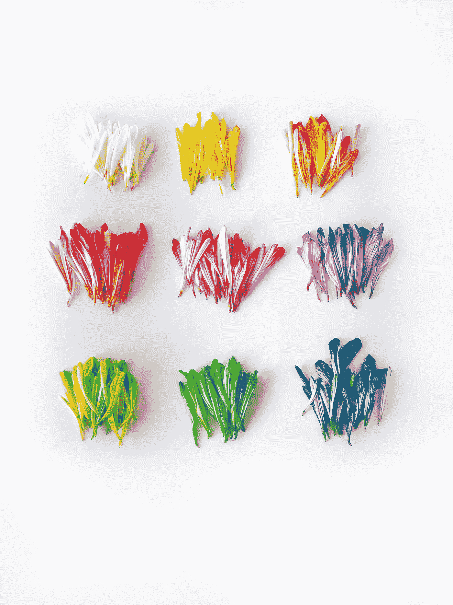

# 作为一个完美主义者，你是如何应对的？

> 原文：<https://medium.com/swlh/how-do-you-cope-with-being-a-perfectionist-5aab1e317646>

Photo by [Jessica Lee](https://unsplash.com/@jaely368?utm_source=unsplash&utm_medium=referral&utm_content=creditCopyText) on [Unsplash](https://unsplash.com/search/photos/organised?utm_source=unsplash&utm_medium=referral&utm_content=creditCopyText)

计划。拖延。完美。

你是否计划或研究了太多事情，以至于你从来没有真正抽出时间去做，因为你害怕你会失败？

当你最终开始做某件事时，你脑海中是否有一个小小的声音告诉你它永远不够好(或者你永远不够好？)