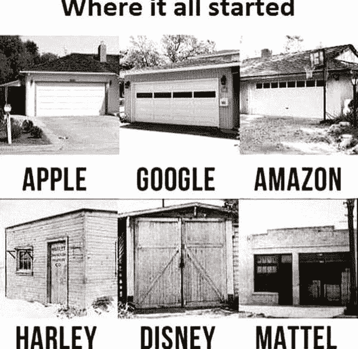

# 作为一个非技术人员，你如何创建一家科技创业公司

> 原文：<https://medium.com/swlh/how-do-you-create-a-tech-startup-as-a-non-technical-person-3f5dd0572230>

Photo by [Lysander Yuen](https://unsplash.com/photos/wk833OrQLJE?utm_source=unsplash&utm_medium=referral&utm_content=creditCopyText) on [Unsplash](https://unsplash.com/search/photos/complex?utm_source=unsplash&utm_medium=referral&utm_content=creditCopyText)

我花了很长时间才找到解决这个问题的方法。
我一直把这个策略留给自己，但现在已经 2019 年了，也许是时候发布了。

几年前，我有一个伟大的想法，我愿意做任何事情来实现它。

唯一的问题是这个想法非常复杂(技术方面)。

作为一名营销爱好者，当谈到营销策略和围绕一个项目在互联网上创造轰动效应时，我有很多东西可以拿出来。

尽管我的营销能力很强，但我真的不是一个技术人员。

**所以我寻找合作伙伴:**

我寻找合适的合作伙伴，一个拥有合适的技术技能来发展我的想法的人，更重要的是，一个我信任的人。

几个星期后，我说服了我的一个朋友加入我，他即将在大学完成他的计算机科学研究，这似乎是一个完美的匹配。

我们为这个项目工作了四个月，大部分时间是在我父母家的地下室。

**我们很快意识到三件事:**

1.  这个想法的技术复杂性要求我们为我们的团队招募一名数据科学家。
    在 idea 中找到一位愿意为百分比工作的优秀数据科学家是一项艰巨的任务，尤其是在以色列，数据科学家的平均工资为**80，000 美元。**
2.  团队中只有一名程序员，我们可能要花六个多月的时间才能达到概念验证阶段。
3.  我们都需要放下生活中的其他事情，只专注于我们的项目。我们还需要做好长期依靠积蓄生活的准备。

我们来到了一个十字路口，从难以置信的乐观，我的程序员开始有许多怀疑，最终他决定接受一份他刚完成学业就得到的工作。

所以只剩下我一个人。

**没有程序员。**

经过四个月的工作。

更糟糕的是，我不知道如何处理他留下的代码。

更糟糕的是，我不知道近期的技术需求是什么，以及我们下一步应该做什么(我的开发人员不知道，因为我们只需要招聘一名数据科学家来解决一些问题)。

如果创业世界是一条食物链，那么非技术型科技创始人的生活将处于最底层。

经过几天的沮丧和 24/7 的网飞，**我决定寻找解决方案！**

Photo by [Clark Tibbs](https://unsplash.com/photos/oqStl2L5oxI?utm_source=unsplash&utm_medium=referral&utm_content=creditCopyText) on [Unsplash](https://unsplash.com/search/photos/startup?utm_source=unsplash&utm_medium=referral&utm_content=creditCopyText)

那时我经常使用 Upwork。

这主要是针对小型项目。

我意识到这个平台上有非常有才华的自由职业者。

当我发布一份工作时，很少有专家用户出价超过我为项目设定的预算，这是很常见的。

**然后我有了一个好主意！**

我把我的项目分成 3-4 个项目。(所以整个项目都是保密的)。

然后我为这个项目设定了一个大大膨胀的预算。(我想大概是 15000 美元左右)。

在需求中，我要求申请这项任务的自由职业者给我发一份详细的计划，告诉我他们将如何一步一步地解决我的问题。

在工作首选项中，我设置了它，以便专家能够申请我的工作。

几个小时后，我发现我自己和 50 多位数据科学家专家一起给我发来了完整的细节，关于他们将如何解决我的问题，他们计划为我们提供哪些工具/编程语言和库，算法需要看起来如何，以及更多有价值的信息。

在不到一天的时间里，我在理解我的项目技术需求方面取得了比我和我的第一个合作伙伴一起工作的四个月更大的进步。

在我从求职申请中收集了最好的专家建议后，我把它们都收集到一个地方并组织起来。

我把所有的信息分成两部分，然后我在 Upwork 上发布了两个新的低预算职位，面向初级数据科学家。

几个小时后，我找到了两个有前途的自由职业者(我甚至和他们进行了视频通话，并进行了某种形式的面试，以确保他们是合法的)。

同时，我阅读了许多与我的项目相关的资料，以便更好地了解它。(我开始学习一些数据科学家算法、情感分析如何工作以及更多与我的项目相关的东西)。

我总是害怕太深入我的项目的技术方面，但从鸟瞰的角度学习它是令人着迷的，它帮助我更好地理解发展我的想法的困难，并在问题出现时提出新的创造性想法。

不到三个星期，花了几百美元，POC 就上线了。

从零开始建立一家科技公司，这是一件具有挑战性的事情，如果你是一个非科技人员，不要放弃！寻找新的创造性方法，将你的伟大想法变成现实。

祝你好运！

## 更多你可能喜欢的文章:

- [**创业公司为什么会失败**](https://startupstash.com/why-startups-fail/)
- [**创业者没有工资养家糊口，如何付账？**](https://www.quora.com/How-do-entrepreneurs-live-without-a-salary-to-sustain-their-families-and-pay-bills)

*最初发表于*[*www.quora.com*](https://www.quora.com/How-do-you-start-a-tech-startup-as-a-non-technical-person/answer/Yuval-Halevi?ch=10&share=c7ab2580&srid=43O3)*。*

## 这篇文章发表在 [The Startup](https://medium.com/swlh) 上，这是 Medium 最大的创业刊物，拥有+436，678 名读者。

## 在这里订阅接收[我们的头条新闻](https://growthsupply.com/the-startup-newsletter/)。

