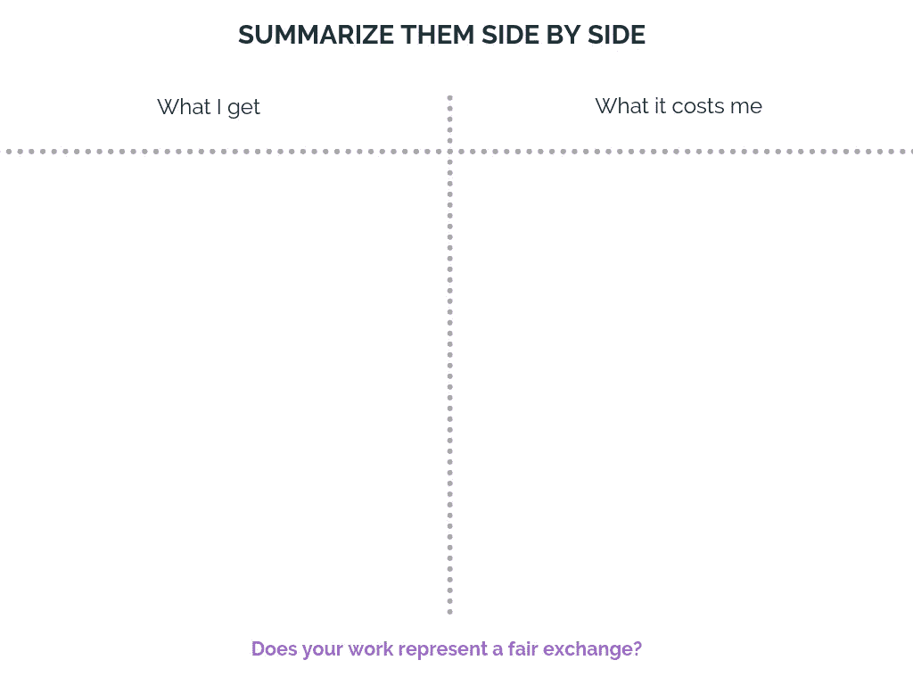

# 你怎么知道什么时候该找份新工作呢？

> 原文：<https://medium.com/swlh/how-do-you-know-when-its-time-for-a-new-job-e8770dd07563>

你怎么知道什么时候是真正改变的时候？它通常始于那种不安的感觉和做其他事情的冲动。除了现在的工作，去别的地方。

Photo by [Ian Tormo](https://unsplash.com/photos/YEWvMidcKkg?utm_source=unsplash&utm_medium=referral&utm_content=creditCopyText) on [Unsplash](https://unsplash.com/search/photos/sign-arrow?utm_source=unsplash&utm_medium=referral&utm_content=creditCopyText)

当我们感到不开心时，我们通常会很快将原因归咎于我们花了最多时间做的事情——比如我们的职业。但是客观看待自己的工作很重要。当你评估它是否是你不满的真正来源时，识别和承认让你坚持这么久的积极方面是至关重要的。然后你可以有意识地选择你的下一步，关注对你有用的东西，而不是没用的东西。

有一个非常简单的练习是我在考虑辞去全职工作时自己做的。它由三部分组成:

第一部分——你的工作成本是多少？

这个问题问自己四五遍。首先，想一想你去工作并充分完成工作所需的金钱成本，如交通、停车、服装、电话费等。然后看看它让你付出的无形的代价，比如时间、精力、内心的平静、健康和你未开发的潜力。你可能会意识到，留在当前职位上的有形和无形的成本根本不值得。

**第二部分——你从工作中获得了什么好处？**

这个问题也要问自己四五次。列出你的薪水、福利、假期、培训和课程、笔记本电脑、电话、健身房会员——你的工作提供给你的一切，包括资源和机会。

不要忘记包括无形的东西，比如和同事的社会关系、导师、社会地位、帮助他人的能力等等。专注于你工作中与你价值观一致的方面(例如，有些人可能认为出差是一件坏事，而其他人则认为这是一个不可思议的机会。)

**第三部分:评估**

拿一张纸，在中间画一条线。然后，在左边列出你工作的成本，在右边列出收益。现在你看到他们并排在一起，你现在的情况是否代表一个公平的交换？当你第一次消化面前的信息时，注意你的本能感觉，在你有机会合理化或说服自己相信这个或那个之前。你的直觉反应是最诚实的——相信它。

Do you need a new job? Listing your pros and cons on one page so you can step back and evaluate — excerpt from “Uncover your passion and design a career you love”.

这个由三部分组成的练习是我的[职业电子工作簿](https://www.hellonomad.info/uncover-your-passion-workbook)的一部分，指导你完成自我发现的过程。这只是一种工具，可以帮助你更清楚地了解什么类型的工作会让你感到满足。一旦你决定是改变的时候了，你的下一步就是弄清楚改变应该是什么样子的。你有能力设计自己的职业生涯，但除非你能明确指出过去哪些是可行的，哪些是不可行的，否则你无法实现目标。