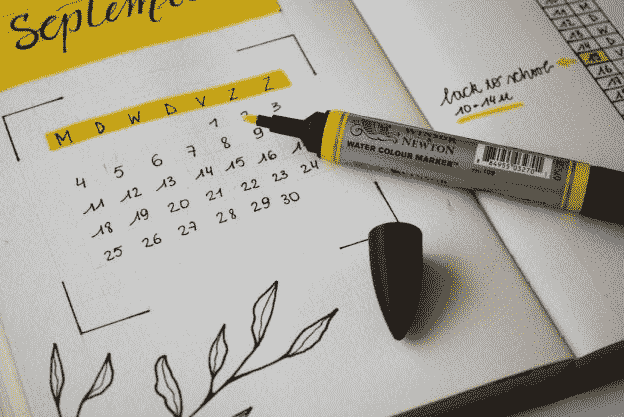

# 每天做一件事如何提高我的效率

> 原文：<https://medium.com/swlh/how-doing-one-thing-per-day-increased-my-productivity-ae827f194f06>

Image by Estée Janssens, from Unsplash.

曾经有一段时间，我只想在同一天做很多事情。我会早起，看新闻，去上班或上课。然后我会回来，小睡一会儿，然后去看足球或网球比赛，读一本书，做饭和写作。之后，我会看一部电影或一些电视节目。我也会抽时间和朋友聊天，看一些 YouTube 视频，做一些…