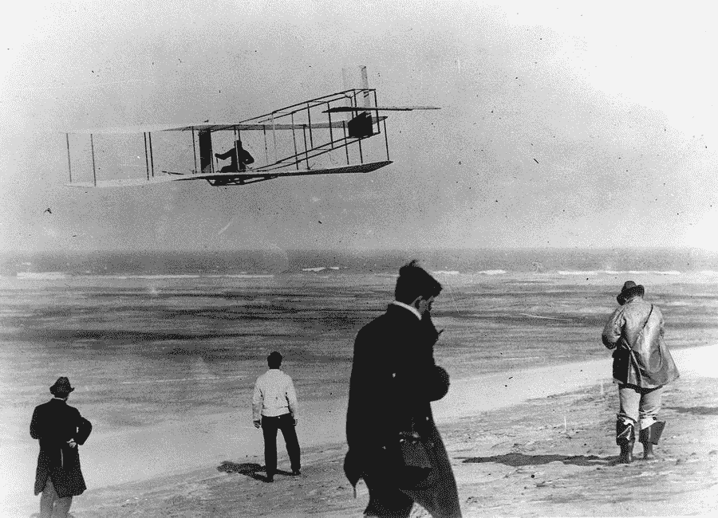

# 梦想是如何消亡的

> 原文：<https://medium.com/swlh/how-dreams-die-8415d421eed3>

## 不放弃梦想的信念的力量。

“In full flight” from [Daily Herald](https://www.dailyherald.com/article/20150711/business/150719959/)

1903 年 12 月的一个下午，当威尔伯和奥维尔·莱特的飞行器——当时这种飞机被称为——飞向天空时，这是世界上最重要的发明之一的旅程中的一大步。

飞机的发明是人类历史上最重要的创新之一。它改变了…