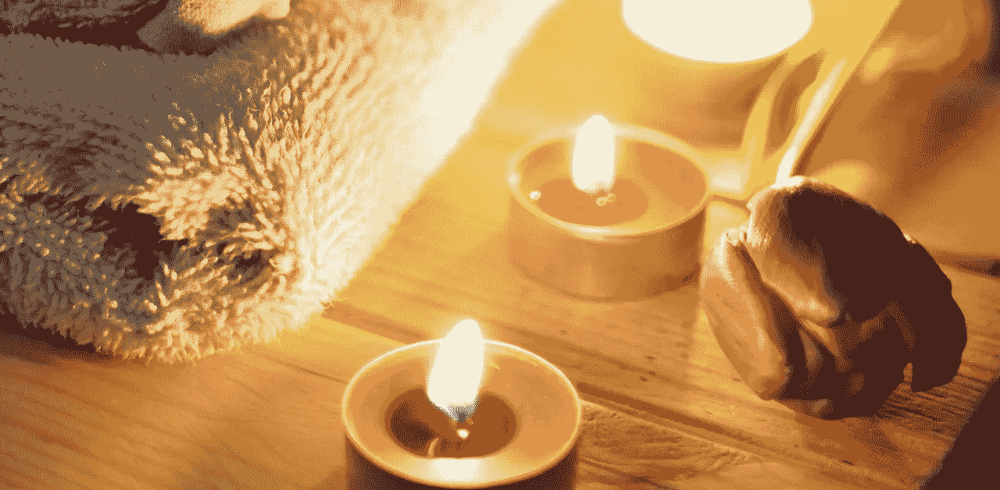

# 上午 10 点饮酒如何让新年富有成效

> 原文：<https://medium.com/swlh/how-drinking-at-10-am-leads-to-a-productive-new-year-a99cf3b7251>

Pexels

> "如果你在中午前喝酒，你就是个酒鬼。"

这是爷爷在中午 12:01 打开啤酒罐时常说的话。

我想知道如果他知道我在上午 9:30 打开瓶塞，他会怎么想我。

是的，我做到了。