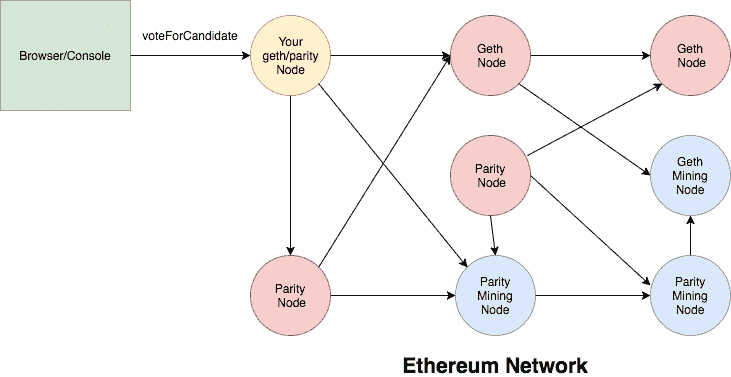

# 以太坊如何让您的企业受益

> 原文：<https://medium.com/swlh/how-ethereum-can-benefit-your-business-1850446a7746>

以太坊对你的生意有很多好处。这是一个构建区块链应用程序的新的高级平台。这项技术最好的部分是它允许开发者制作分散的应用程序。

以太坊是负担得起的、开放的，并且非常方便地保持多个参与者之间的持续合作。这就是为什么以太网在商业中的使用日益增加。

当谈到数据协调时，以太坊就像一个分布式账本，然而，它的结构以拥有独特的层而闻名，这些层使业务系统强大并产生新的可能性。

此外，以下是以太坊为企业带来的好处:

**简单数据分配:**

借助以太坊的去中心化系统，数据分配变得容易多了。由于这个原因，一组网络参与者不需要依靠中央机构来管理他们的事务。

它加强了信任和协调，这意味着没有必要全神贯注于交易调解人的信誉。这就足以知道商家为什么要用以太坊了。

**快速部署:**

由于像 Kaleido 这样的一体化 Saas 平台，企业可以很容易地部署和管理专用区块链网络，而不是从一开始就编码区块链实现。

**允许的网络:**

Kaleido 的区块链业务云使企业能够建立联盟网络，其中受益的节点可以充当监管者或看门人。

简而言之，他们可以停止执行，浏览明文中的加密状态信息等等。

ConsenSys 的协议工程发言人 Pegasys 正在构建 Pantheon，这是一个 Apache 2.0 许可的以太坊 Java 客户端，可用于个人和公共网络用例。

**高性能和可扩展性:**

借助于权威共识的证明和定制的阻塞时间和气体限制，在以太坊上开发的联盟网络有可能比 mainnet 执行得更好。

此外，根据网络配置，它们可以增加到每秒数百个事务或更多。

此外，协议级服务，如分片和离链，第二层扩展解决方案，如等离子体和状态通道，使以太坊更容易进一步提高其吞吐量。

**更大的网络规模:**

以太网能够与成千上万的节点和数百万的用户一起工作。大多数区块链企业的竞争对手都在使用 10 个节点以下的网络，并且没有任何可行网络的参考案例。

网络规模在企业联盟中扮演着重要的角色，而企业联盟的发展受限于少量节点。

**不容置疑的结局:**

区块链共识算法以保持信心安全和远离对交易发生的任何怀疑而闻名。这种交易变得并保持规范，几乎完好无损。

以太坊为不同的企业网络案例提供了包括 IBFT 和 RAFT 在内的易于定制的共识机制，确保即时交易的最终性。

此外，它们还减少了工作证明算法所需的基础设施。

**高级层:**

以太坊的高级层使商业网络建立现代机制成为可能，这将严厉打击犯罪活动，并为验证和可用性等活动创造诱人的回报。

**概要:**

以太坊如何让企业受益？这篇博客回答了这个问题。该博客讨论了以太坊可以让企业受益的五种**方式**，列举如下:

1.  轻松分配数据
2.  更快的部署
3.  高级层
4.  更大的网络规模
5.  允许的网络

了解了以太坊的**商业优势后，你必须愿意使用这项先进的技术来发展你的业务。**

如果你想[雇佣以太坊开发者](https://www.valuecoders.com/hire-developers/hire-ethereum-developer)，那么估值师会出来作为你的第一个也是最后一个选择。

ValueCoders 已经提供了超过 14 年的网络和移动应用程序开发服务，其满意的客户名单仍在增长。

## 这篇文章发表在 [The Startup](https://medium.com/swlh) 上，这是 Medium 最大的创业刊物，拥有+432，678 名读者。

## 在此订阅接收[我们的头条新闻](https://growthsupply.com/the-startup-newsletter/)。

