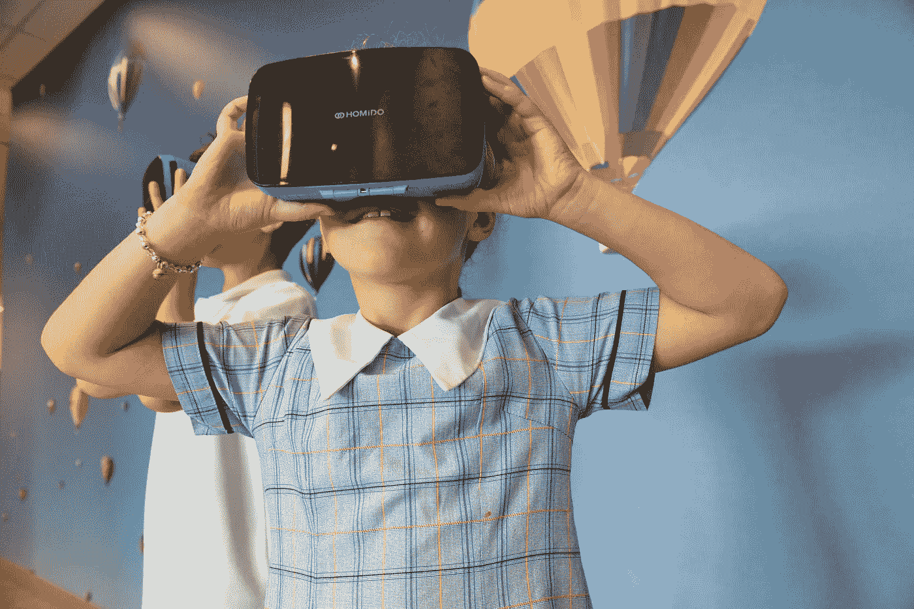

# 由于你的社交媒体习惯，你每天都在互联网上失去一部分决策权。

> 原文：<https://medium.com/swlh/how-every-day-you-are-losing-a-portion-of-the-decision-making-power-to-the-internet-due-to-your-2d768edb2974>

Photo by [Daniel Lincoln](https://unsplash.com/photos/2iKehl1xKcI?utm_source=unsplash&utm_medium=referral&utm_content=creditCopyText) on [Unsplash](https://unsplash.com/search/photos/selfie?utm_source=unsplash&utm_medium=referral&utm_content=creditCopyText)

# 社交媒体颠覆了互联网。你每天去社交媒体，为它可能给你带来的东西感到惊讶。同样的事情现在也适用于互联网。

互联网不再是关于发现，而是关于它每天可能带给我们的惊喜。

社交媒体向我们展示了我们周围的世界，人们正在做的事情，新闻，病毒视频等等。社交媒体从不征求你的意见，而是当你喜欢一个视频或你关注某人时，它会为你带来你可能喜欢的智能反馈。

同样的事情现在也适用于购物、音乐、照片应用程序，它会为你提供类似的信息，供你在过去的购买或不购买行为中使用。

你不会抱怨它带来的反馈，而是花几个小时听应用程序为你整理的音乐、抖音上的视频或 Instagram 上的照片。这种无声认可的基本转变给我们的行为带来了巨大的变化

> 你已经把决策权交给了互联网

> 你想让互联网来决定，什么对你最好。你已经通过屈服于社交媒体反馈给予了认可。互联网只是听从你的指挥。当我们使用社会学家丹尼尔·贝尔(Daniel Bell)称之为“智能技术”的工具时，我们不可避免地开始具备这些技术的品质。

**还有另一件事对人类大脑有着类似&的巨大影响。它是通知。**

[尼古拉斯·卡尔](https://www.theatlantic.com/author/nicholas-carr/)在 2008 年的一篇著名文章中提到的是[谷歌让我们变笨](https://www.theatlantic.com/magazine/archive/2008/07/is-google-making-us-stupid/306868/)

在过去的几年里，我有一种不舒服的感觉，有人或某物一直在修补我的大脑，重新映射神经回路，重新编程记忆。据我所知，我的思想没有改变，但它在改变。我不再像以前那样思考了。我在阅读时能最强烈地感受到这一点。让自己沉浸在一本书或一篇冗长的文章中曾经很容易。我的思想会被叙述或争论的转折所吸引，我会花几个小时漫步在长长的散文中。这种情况已经很少了。现在我的注意力经常在两三页后开始漂移。我变得烦躁不安，失去了思路，开始寻找其他事情做。感觉自己好像总是把任性的大脑拽回文字里。曾经水到渠成的深度阅读变成了奋斗。

当你无法集中注意力时，你将无法决定。简单。通知和社交媒体源是如何连接的？他们之间有什么共同点。它们都削弱了我们的决策意识。

是什么让你每隔几分钟，每小时检查一次手机。可能是通知。你想检查那里有什么新活动的通知&如果那里没有通知，你可能只是对你的个人领域没有新活动发生感到失望。

> 每隔几个小时，当你失去查看电话通知的意愿时，你就给了互联网一部分意志力

在一段时间内，当这种情况重复发生时，你开始检查你的手机，即使没有活动或没有必要，你已经把自己交给了互联网。

恭喜互联网公司从根本上改变了我们的行为，那么接下来呢。

将最低决策权交给消费者的互联网公司将在互联网世界取得成功。高度复杂的人工智能和机器学习将确保以最少的投入获得更好的体验。已经在社交媒体上发生的事情，将很快被互联网的其他部分所取代。

例子很多，但我会选择一个流行的 App。为什么印度的新闻应用程序“新闻短片”取得了惊人的成功？不是因为它用 60 个字带来新闻，而是它不让你选择你的新闻提要。现在它为你提供了一些种类的选择，但它仍然保持着令人惊讶的元素。这是自动化控制你想要阅读和消费的欲望的最好例子之一。

我想在我的上一家公司实施类似的销售策略，这家公司在澳大利亚从事教育行业。完全自动化录取流程，不要让学生思考也不要允许他思考，拿数据替他决定。90%的时间他会坚持互联网为他做的决定。

我的建议是，如果你想让你的产品在网上销售，收回你给消费者的选择，猜猜是什么，“消费者想要它”。如果你现在不实现自动化，他会主动要求的。互联网是关于选择的，现在很遗憾不再是这样了。

让我知道你的观点，非常感谢你的来访。在[https://www.linkedin.com/in/chandanmishra/](https://www.linkedin.com/in/chandanmishra/)与我联系

## 这篇文章发表在[《创业](https://medium.com/swlh)》上，这是 Medium 最大的创业刊物，有+430，678 人关注。

## 订阅接收[我们的头条新闻](https://growthsupply.com/the-startup-newsletter/)。

