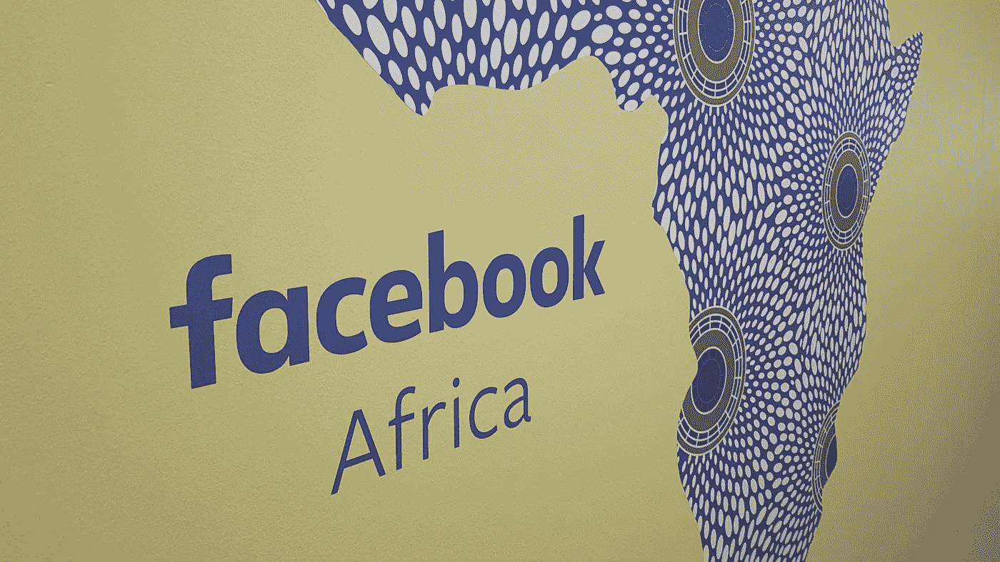
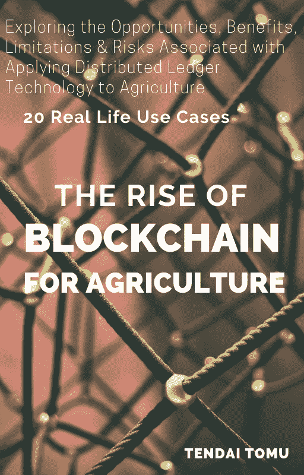

# 脸书的天秤座将如何扰乱非洲

> 原文：<https://medium.com/swlh/how-facebooks-libra-is-going-to-disrupt-africa-6db654c2787>

## 它将比比特币发展更快的 10 个理由

*** * * * * * * * * * * *在** [**亚马逊**](https://www.amazon.com/Libra-Africa-Facebooks-going-disrupt/dp/1077622562/ref=sr_1_1?keywords=tendai+tomu&qid=1567073956)*** * * * * * * * * ***上获取该主题的完整书籍

几年来，有关比特币、区块链和非洲加密货币的新闻受到了普遍的恐惧和怀疑。虚拟货币有可能被操纵用于犯罪、逃税和洗钱，这种情况一直存在。

然而，随着越来越多的信息开始渗透到非洲社区，以及那些敢于尝试加密货币的人向他们的同龄人提供证明启蒙，越来越多的人开始接受加密货币。

许多国家疲软的法定货币的持续崩溃和机构滥用也促进了区块链货币的上涨，因为人们试图保护他们的财富和收入的价值。

根据负责 libra 硬币的新成立的脸书子公司 [Calibra](https://calibra.com/) 发布的白皮书[显示，全球有 17 亿成年人仍然处于金融系统之外，无法进入传统银行。尽管事实上有 10 亿人拥有移动电话，近 5 亿人可以上网。](https://libra.org/en-US/white-paper/)

现在需要注意的是，这些无银行账户人口中的大多数居住在非洲大陆，根据这份 [2014 年报告](https://www.worldbank.org/content/dam/Worldbank/Research/GlobalFindex/PDF/N2Unbanked.pdf)，世界银行估计撒哈拉以南非洲约有 3.5 亿无银行账户的成年人，占全球总数的 17%。

> 为什么如此多的非洲人没有银行账户

如此大量的非洲人没有银行账户的原因与该地区人民的低收入有关，因为大多数银行收取高昂的服务费，大多数人认为没有银行账户更容易生活。

由于大多数非洲国家普遍存在高失业率，使得非正规就业成为大多数人谋生的最可行途径，从而加剧了这种情况，而非正规部门是一个现金区。

对金融机构缺乏信任也是一些人回避金融服务的部分原因，这在津巴布韦等国家更为常见，这些国家有银行倒闭和货币贬值的历史。

当然，在一些非洲国家，人们会避开不符合他们宗教信仰的金融机构，这种情况在几乎全部是穆斯林人口的国家很普遍，如尼日尔，那里现有的金融产品与伊斯兰金融原则不相容。

# 好消息！！！

正如之前所承诺的，这本书更深入地探讨了这个话题，现在已经为你准备好了。

Purchase the book: |[Amazon](https://t.co/s9z9MLp7LT?amp=1) |[Gumroad](https://gum.co/iDLha) | [Bitcoin](https://t.me/Blockchain_Agriculture)|

> 为什么天秤座硬币

脸书似乎一直在研究如何为没有银行账户的世界人口服务，因为天秤座的硬币倾向于为“被遗忘的人”服务——还记得马克·扎克伯格突然造访内罗毕了解移动货币吗？—他们这次好像做足了功课。

手上的信息将 Libra coin 描绘成一种可行的工具，它将确保数字银行服务到达世界上没有银行服务的地方。不仅非洲，所有发展中国家都将受益。

以印度这样的国家为例，它迫切需要这样的服务，主要是在汇款方面——考虑到有近 2 亿人使用 WhatsApp。这个亚洲国家的侨民汇款市场是世界上最大的市场之一，据世界银行估计，仅 2018 年就有约 8000 万美元汇往该国。

# ***在** [**【亚马逊】**](https://www.amazon.com/Libra-Africa-Facebooks-going-disrupt/dp/1077622562/ref=sr_1_1?keywords=tendai+tomu&qid=1567073956) ***** 上获取该主题的完整书籍

*如果你喜欢这篇文章，请关注我的*[*Twitter*](https://twitter.com/Tendy263)*/*[*Linkedin*](https://www.linkedin.com/in/tendai-tomu-75903612/)*。你也可以在这里* *给我买一杯* [*咖啡！*](https://www.buymeacoffee.com/Tendy263)