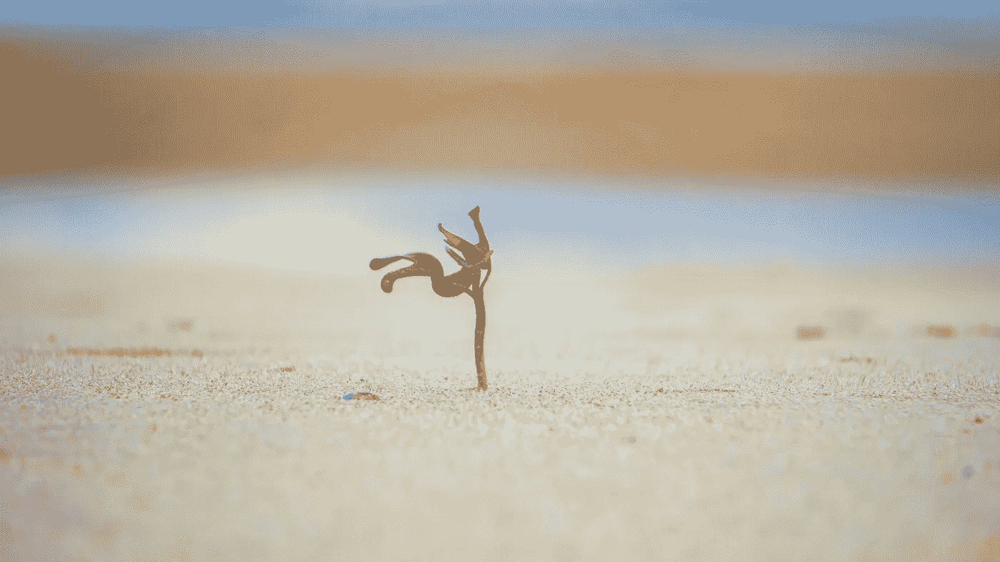

# 追随最新潮流是如何毁掉你的成长的

> 原文：<https://medium.com/swlh/how-following-the-latest-trends-is-ruining-your-growth-96ad62c53809>

## 在不一致的世界中保持一致

Photo by [Benjamin Patin](https://unsplash.com/photos/Zg_Nq31KDfE?utm_source=unsplash&utm_medium=referral&utm_content=creditCopyText) on [Unsplash](https://unsplash.com/search/photos/growth?utm_source=unsplash&utm_medium=referral&utm_content=creditCopyText)

成长。

这是我们都在追求的。

我们想变得更好。

我们中的一些人想成为最好的。

但是趋势和时尚在多大程度上破坏了我们实现目标的机会呢？