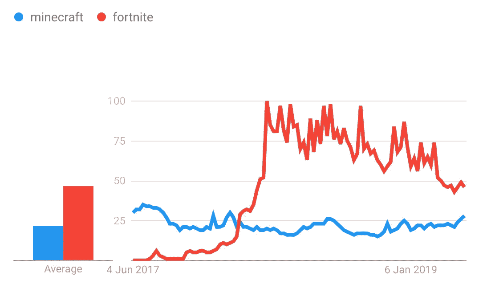
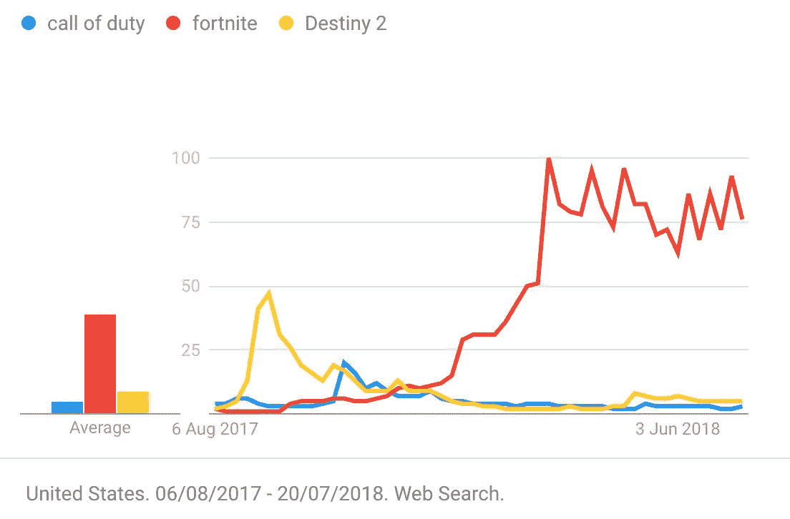
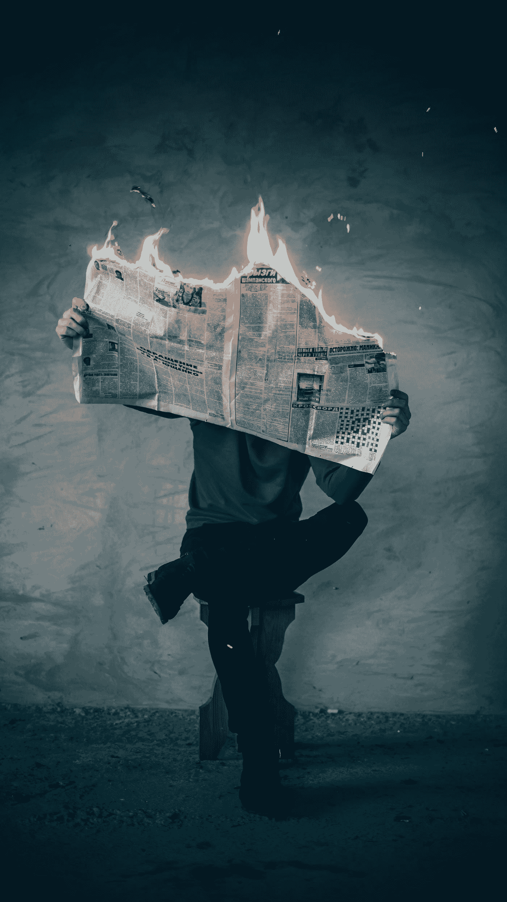

# 堡垒之夜如何革新游戏营销——适度推出后的完美执行

> 原文：<https://medium.com/swlh/how-fortnite-revolutionised-game-marketing-perfect-execution-after-a-modest-launch-17e6785ba3d>

Epic Games 在创造和推出拥有巨额营销预算的游戏方面经验丰富，但最近他们采取了不同的方法。

《堡垒之夜》是一款未知且未经测试的游戏，这意味着他们不可能投入数亿美元来发行。

这不像他们的另一个战争机器系列，它有一个现有的粉丝群。

凭借他们的新方法，Epic Games 仅在 2018 年就为堡垒之夜创造了**24 亿美元的收入，首席执行官蒂姆·斯维尼认为这是*“超越了游戏的发展”***

# **传统上游戏是如何推出的？**

**当新版本的使命召唤到来时，我们不能不听到它。奥运会所有者 Activision 租用大型广告牌，出租公共交通空间，并在报纸上购买在线和离线广告。**

**这种方法会在发布的前几周带来大量的销售，他们可以直接知道游戏是繁荣还是萧条。然后，在着手下一年的版本之前，这个团队会举行一个派对来庆祝他们的成功或者借酒消愁。**

**这种方法已经成功了很多次，但是它确实看起来效率很低，并且很难归因。你如何衡量给定广告牌的销售数量？此外，游戏玩家会看到游戏，想要购买，然后被迫等待几个星期才能发布。然后，如果游戏没有得到很好的接收，就很难恢复。**

**但是，还有另一种方法，而且非常有效。**

****

**Google Trends Data For Minecraft and Fortnite Popularity showing a slow launch until the game reached a critical mass of players.**

**尽管堡垒之夜在 6 月份进行了一次小规模的发射，但是到了第二年的 3 月份，它已经完全飞起来了。这款游戏在谷歌趋势上超过了《我的世界》，而且是以一种我们从未见过的方式。**

****

**Google Trends showing the launches of Destiny 2, Call of Duty WWII and Fortnite.**

**《命运 2》和《使命召唤》以传统方式营销他们的游戏，将大部分营销预算花在游戏发布上。**

**Epic Games 以不同的方式完成了任务。**

**堡垒之夜现在拥有比网飞更多的活跃用户，2.5 亿对 1.55 亿。这是这个星球上最受关注的游戏之一，本月累积了 8300 万观众小时，是其他任何游戏的三倍多。**

**对于那些仍然不清楚堡垒之夜如何运作的人来说——100 名玩家坐满了一辆由热气球悬挂的蓝色校车。玩家选择在一个岛上的哪里降落，并与武器、盔甲和防御战斗到死，通过成为最后一个站着的玩家来宣布胜利。**

# **那么，堡垒之夜是如何变得如此受欢迎的呢？**

# **堡垒之夜舞蹈挑战赛**

**我们几乎可以肯定地说，没有其他游戏公司尝试过的一种方式是舞蹈挑战。我们不能说这是一个有意的营销噱头，但它在产生免费推广方面非常有效。**

**在堡垒之夜，当一个玩家杀了一个人，他们被允许用跳舞来庆祝他们的成就。这些舞蹈基于现实生活中的舞蹈，其中最受欢迎的包括 Psy 的“疾驰”，2012 年发布的“江南 Style”音乐视频。这些舞蹈产生了大量的宣传，并成为全国性节目和杂志的特色。**

**这些舞蹈甚至进入了足球，安托万·格里兹曼用“拿着 L”堡垒之夜舞蹈庆祝他的 2018 年世界杯决赛进球。**

**美国足球明星也被卷入这股浪潮，并很快发现获胜是多么的困难。**

# **进展和免费*游戏**

**在为特蕾莎·阿马比尔和史蒂文·克莱默的书《进步原则》做研究时，他们分析了 12000 份员工的日常日记，以了解他们对工作的感受。最满意的员工是那些朝着某个目标前进的人，或者至少感觉自己在进步，这种对进步的痴迷延伸到生活的各个方面。**

**堡垒之夜用《战斗通行证》完美地挖掘了这种对进步的渴望——一种有偿的额外津贴。他们是一个混合体，既需要进步又害怕错过(FOMO)。战斗通行证允许玩家升级并获得更好的奖励，如清凉的化妆品和新的舞蹈庆典。等级是通过完成任务和寻找箱子获得的。**

**每个赛季持续 10 周，球员的化妆品奖励延续到下一个赛季。**

**(战斗通行证的所有奖励都只是装饰。这使得 Epic Games 可以在远离令人讨厌的“付费赢”概念的同时获得收入。)**

**没有购买战斗通行证的玩家可以以同样的方式升级，但会获得较低的奖金，并且在每一级都会看到如果他们购买了战斗通行证会得到什么。堡垒之夜允许用户在赛季中的任何时候升级，仍然可以获得以前级别的所有奖金，即使他们当时不是通行证持有者。**

***正是这个机械师*创造了最强烈的 FOMO 感。随着玩家的进步，他们越来越倾向于订阅并获得他们已经赢得的越来越多的奖励。玩家只能在那个赛季获得某个赛季的奖励；如果你现在开始玩，你将无法获得上一季的战斗通行证化妆品。**

**每一季的奖励都是限量版。**

**堡垒之夜增加了这一机制，允许玩家在没有时间获得赛季奖励时“跳过”关卡。在赛季末，玩家可以购买跳票来获得该赛季的所有化妆品。**

**如果你的孩子不在乎化妆品，那就没什么理由去买。然而，当你考虑到在任何给定的游戏中，只有 1/100 的玩家获胜——而且也是同样小比例的玩家经常获胜，就更容易理解一些孩子只关心化妆品……因为他们几乎没有获胜的机会。**

****

**Photo by [Elijah O'Donnell](https://unsplash.com/@elijahsad?utm_source=medium&utm_medium=referral) on [Unsplash](https://unsplash.com?utm_source=medium&utm_medium=referral)**

# **进入壁垒**

**史诗游戏消除了任何人玩游戏的障碍。**

# **免费(mium)**

**堡垒之夜可以免费玩——这是一个让用户享受游戏的因素，也给了 Epic Games 一个吸引他们的机会。无论游戏玩家是在学校，在去音乐会的路上，还是坐在家里，他们都可以在任何设备上下载堡垒之夜，它将在 2 分钟内免费播放并运行。不用再存钱或等到生日才开始玩。**

# **易用性**

**当使命召唤发布时，他们通常会与 Playstation 或 Xbox 合作，并在前三个月内使他们的游戏只兼容一个品牌的主机。这可能在短期内赚了很多钱，并让他们在游戏前有现金花在营销上，但它疏远了只能买得起一台游戏机的庞大用户群，并阻止他们在最受欢迎的前几个月玩游戏。**

**Epic Games 使他们的新版本兼容所有可能的主机。《堡垒之夜》可以在 Xbox 和 Playstation 上下载，也可以在 PC、任天堂和手机上下载。一旦人们看到有人玩它的视频或听到朋友谈论它，就没有入门的障碍了。**

**堡垒之夜是一款满足习惯于更强游戏的游戏玩家的射击游戏，但对年轻玩家来说不太暴力(正如其 PEGI 12 评级所反映的那样)。由于 PEGI 18 的评级，儿童被阻止玩使命召唤，削减了大量的潜在玩家。**

# **看堡垒之夜很有趣。**

**Twitch 是流媒体市场的主要参与者，在流媒体市场表现良好的游戏会吸引大量粉丝。堡垒之夜是平台上最受欢迎的游戏。最受欢迎的堡垒之夜飘带被命名为忍者。他之前是一名职业光环玩家，这使他有能力成为堡垒之夜顶级玩家之一。他开始了他的旅程，并积累了大量的追随者。他还创建了一个 YouTube 频道，在那里他积累了超过 2000 万的用户。**

**其他职业游戏玩家看到了他的成功和人们对堡垒之夜的反应，开始制作视频。甚至不是游戏玩家的视频制作者们开始制作视频，因为他们看到了他们可以获得的观看量。Epic Games 免费获得了数亿的视频浏览量，这导致了谷歌趋势图中显示的指数增长。**

# **摘要**

**堡垒之夜营销策略的每个方面都很简单，但却非常有效。Epic Studio 创造了一款超级吸引人的游戏，只需要一推就能起飞。他们充分利用了相对较新的流媒体平台，并设法产生了数亿次免费视频观看。**

***原载于 2019 年 7 月 17 日*[*【https://www.nathangrieve.com】*](https://www.nathangrieve.com/how-fortnite-revolutionised-game-marketing/)*。内森定期发表营销案例研究，并对创始人和首席执行官进行采访。***