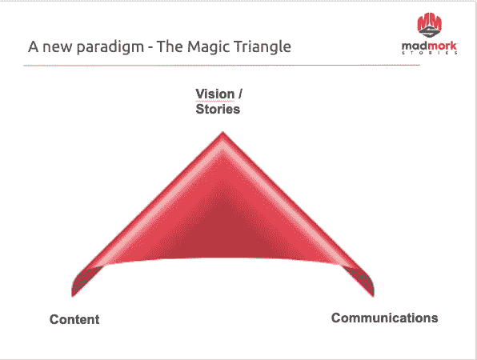
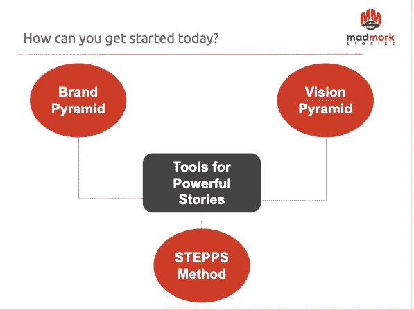
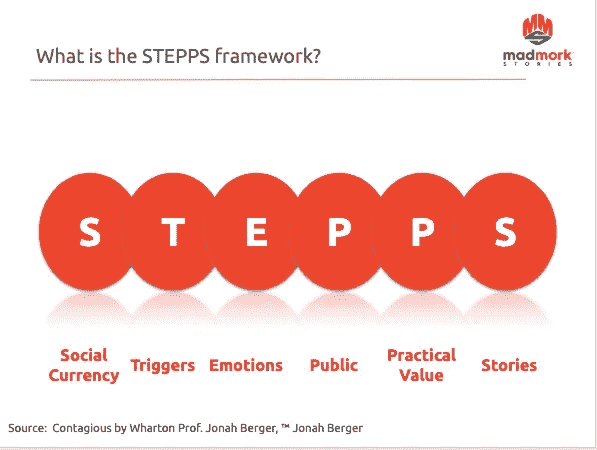

# 创始人如何将伟大的产品转化为强有力的故事

> 原文：<https://medium.com/swlh/how-founders-can-turn-great-products-into-powerful-stories-923be3369160>

作为一名专注于营销的高管教练，创始人和商业领袖最常问我的一个问题是:“我如何讲述我们的故事？我们有很棒的产品和惊人的技术，但我们似乎找不到正确的方式来表达我们的观点。”

我经常遇到的另一个问题是:“我们将何去何从？我们的策略应该是什么？

虽然这两个问题是不同的，但它们都源于一个相似的问题:公司的愿景不清晰。

几周前，我在 2019 年创业日发表了主题演讲，这是今年最大的东欧创业会议之一。听众包括 1000 名企业家、投资者、高级商业领袖和政府官员，我的演讲是关于讲故事的力量，以及为什么它现在比以往任何时候都重要。

那天晚些时候，我给一个挤满了人的房间开了一个研讨会，讨论如何创作和讲述这些故事，我想和这里所有的读者分享。

那么为什么故事很重要呢？

首先，故事很重要，因为我们从未有过像今天这样多的噪音。在社交媒体、电视、广告牌、博客、电子邮件和我们生活中的其他一切事物之间，消费者从未如此分心。

事实上，噪音如此之大，以至于美国营销协会估计我们每天都会接触到大约 10，000 个品牌！

但事情会变得更好。最重要的是，我们已经看到，多少可以预见，我们也有一个更短的注意力持续时间。有多短？有研究称，短至 8 秒，比松鼠还少。让我们远离屏幕变得如此困难，以至于营销从未如此昂贵。

但是营销真的有效吗？

那是另一个问题。当我看了一些与脸书广告成本相关的数字，并将它们与点击率进行比较时，数据确实不令人鼓舞，如下图所示:

当然，这是去年美国脸书广告效果的季度对比，所以我们不能妄下结论，说社交媒体广告无效。但是，当你看到每次点击成本(CPC)和每次展示成本(CPM)增加，而点击率(CTR)下降时，这对广告商来说不是一个令人鼓舞的迹象。

然而，更有趣的问题是，尽管我们经常谈论移动广告、社交媒体和搜索，但我们也越来越多地谈论进入这些沟通渠道的信任。

还是那句话，数据不言自明。2017 年 6 月 Digiday 博客上的一篇文章显示，如果我们根据消费者的信任度对媒体渠道进行排名，传统媒体仍然会赢得这场比赛。尽管他们看到的受众少得多，但仍有超过 80%的受访者相信平面广告，其次是电视广告。最值得信赖的数字媒体？大约 60%的受访者认为搜索是值得信赖的渠道。

因此，尽管我们喜欢谈论消费者把时间花在哪里，但这并不一定反映出他们最信任哪种媒体。

**神奇三角**

我在爱沙尼亚分享的接触用户和建立信任的方法，我称之为魔力三角，看起来是这样的:

**视力**

这个想法很简单:你从一个强有力的愿景开始，清晰地回答以下问题:

1.我们为什么作为一个公司而存在？我们的目的是什么？和/或

2.我们希望未来是什么样子？我们对社会有什么影响？

通过经历一个过程并回答这个简单的问题，你开始为你的公司绘制一个长期的路线图。

为什么强大的愿景如此重要？

当我们看一些最受尊敬的品牌/公司的愿景声明时，让我们考虑一下:

耐克:*给世界上每一个运动员带来灵感和创新*

迪士尼:*让人开心*

特斯拉:*通过推动世界向电动汽车的过渡，创建 21 世纪最引人注目的汽车公司*

注意不同的公司采取不同的方法。耐克和迪士尼似乎回答了第一个问题，而特斯拉专注于他们想去的地方。但是，它们的共同点是相对简短、清晰、有主见、大胆、鼓舞人心。

强有力的愿景陈述为制定这些陈述的公司带来了巨大的好处:

1.它们有助于调整组织，使其能够专注于核心目标

2.它们提供了一个清晰的路线图，有助于消除干扰

3.他们激励利益相关者(员工、客户、投资者、合作伙伴)

4.他们使公司在市场上与众不同

5.在困难时期，他们激励组织

最后，当公司能够将他们的愿景融入他们的营销时，他们就可以创造有影响力的内容，这是我们三角的第二个组成部分。

**内容**

一旦你有了一个伟大的愿景，你就必须从内在和外在两方面将它付诸实践。在今天的市场中，这意味着创造伟大的内容或故事。

这可以通过博客帖子、播客、视频、信息图表、电视广告、印刷品和一系列其他营销材料来实现。

创建内容时，最重要的是它需要回答以下问题:

1.谁是我们的观众？

2.我们在解决什么痛点？

3.我们有什么不同？

4.我们希望消费者/客户做什么？

5.我们是在教育、娱乐还是两者都有？

然而，当你开始考虑内容的时候，在你开始之前，有许多其他的工具你也应该融入到你的思考中。这些工具将帮助你开发更好的内容，在信息和品牌上更加一致。

这是我最近分享的一张幻灯片，总结了一些你可以用来开始的工具。

品牌金字塔:我已经详细讨论了品牌金字塔，你可以在我为 INSEAD 知识博客写的这篇**帖子中找到你需要的所有信息。金字塔是你的 [**品牌圣经**](/@madmork/the-brand-bible-what-it-is-and-why-your-tech-company-needs-one-b2fb1be37ccd) 不可或缺的一部分，在决定你如何谈论你的品牌以及你的品牌的核心本质是什么时，它是至关重要的。**

**愿景金字塔:愿景金字塔着重回答 3 个问题:**

**1.你的愿景是什么？**

**2.你的任务是什么？**

**3.你的策略是什么？**

**上面我们已经讨论了愿景的重要性，但从根本上来说，愿景和使命的区别在于，愿景是公司及其创始人所向往的长期的、有抱负的、几乎不可能实现的未来状态。**

**但是，虽然愿景声明回答了“为什么？”，任务回答了“如何做”的问题。使命陈述更为实际，侧重于 3-5 年的中期目标。他们也是多变的。**

**该战略甚至更为短期；6-18 个月甚至更细。它可以专注于进入某个市场，改变某个特定的产品，甚至专注于特定的目标受众或分销渠道。**

**STEPPS 框架:STEPPS 框架是由沃顿商学院的市场学教授 Jonah Berger 开发的，并在他的畅销书《传染——事情如何流行》中得以推广。这是一系列步骤或检查标记，你可以根据这些步骤或检查标记来衡量你的营销，以评估你的内容传播的可能性。**

****

**这里有一个很好的[帖子](https://curatti.com/viral-success/)告诉你每一步需要做什么，给你一个如何改进内容的主意。所有这些步骤都很重要，但我想特别提醒大家注意 E(情感)和最后的 S(故事)，因为与消费者建立联系并抓住他们的注意力是多么困难。**

**我最喜欢的广告之一，也是我认为真正抓住了这种方法的广告，是下面这个在 YouTube 上有超过 5600 万次观看的广告。你能确定它使用了哪些步骤吗？**

****通信****

**我们神奇三角的最后一部分是沟通。这是真正关注“如何”将我们鼓舞人心的、有用的和有趣的内容送到我们期望的客户手中的部分。我们可以开发出世界上最激动人心、最感人、最令人难忘的内容，但是如果我们瞄准了错误的受众，传递了错误的信息，使用了错误的渠道，我们就会浪费我们创造的内容。**

**在流程的这一点上，这通常是大型公司与他们的广告公司、媒体购买者/策划人和公关公司合作，制定策略来传播他们的信息。在更小、更精简的创业公司中，这可能只是一个在社交媒体网络上运行广告、搜索和发送电子邮件的创始人或营销人员。**

**当您考虑通信时，需要记住三个重要的注意事项:**

**1.不要猜测，测试。尤其是在移动/数字/社交时代，你会想要测试不同的渠道、行动要求/信息，甚至不同的受众。不要指望你的沟通活动会马上成功。走出去，测试不同的变体，一旦你发现什么有效，那么你就可以扩大/增加你的营销支出。**

**2.利用你所有的渠道。假设你开发了一本精彩的电子书。你要确保你使用了所有的渠道。这意味着不仅要使用搜索、电子邮件、社交媒体广告、重新定位和登录页面等明显的营销渠道来获取线索。这还意味着确保你的公关团队与主要商业媒体分享你的电子书的执行摘要，让合作伙伴在社交媒体上传播消息，甚至利用你的销售团队在他们的电子邮件签名中包含你的电子书的链接。不遗余力地利用每一个渠道。**

**3.有一个时间表，并保持一致。最好的营销组织有一个长期(至少每月或每季度)的内容日历，他们在日历中安排他们发布什么类型的内容以及何时发布(一周中的哪一天、一天中的什么时间、频道等)。).他们也是一致的。例如，如果你的目标是成为酒店行业的领先软件，你不能简单地推出一本电子书，然后消失 6 个月。制定一个时间表，并坚持下去。你会很高兴你做了。**

**几千年来，故事一直是传递思想、知识和娱乐我们的最可靠、最真实的工具。在当今这个社交媒体、视频和移动时代，我们比以往任何时候都更需要打破噪音，利用强有力的情感故事与客户、合作伙伴和投资者互动。因此，走出去，发展你的公司愿景，创建一个强大的内容战略，并与伟大的沟通。**

**这可能需要时间，开始时会很痛苦，但请记住:痛苦只是暂时的。后悔，是永远的。**

**享受旅程！**

**疯狂默克**

**<upscribe src="”<a" class="ae jw" href="https://upscri.be/16a744" rel="noopener ugc nofollow" target="_blank">https://upscri.be/16a744>/upscribe></upscribe>**

****

## **这篇文章发表在 [The Startup](https://medium.com/swlh) 上，这是 Medium 最大的创业刊物，拥有+436，678 名读者。**

## **订阅接收[我们的头条](https://growthsupply.com/the-startup-newsletter/)。**

****