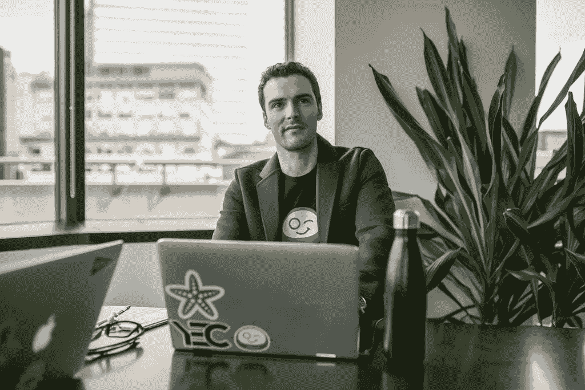

# 《变得脆弱》如何帮助恩里科·帕尔梅里诺在两个月内为“僵尸管理员”获得 450 万美元

> 原文：<https://medium.com/swlh/how-getting-vulnerable-helped-enrico-palmerino-land-4-5-million-for-botkeeper-in-two-months-9e734ad9f50b>

Botkeeper 的诞生源于创始人恩里科·帕尔梅罗对他的第一家公司的一次挫折。这家名为 [ThinkLite](https://www.thinklite.com/) 的企业提供了一种分析、设计和制造 LED 灯的创新流程。但即使有 850 万美元的经常性收入，Enrico 有时也很难保持正常运转。

“我们有 60 名员工，在[公司 5000 强](https://www.thinklite.com/thinklite-has-made-the-2017-inc-5000-list-of-the-fastestgrowing-private-companies-in-america/)名单上排在第 46 位。尽管有这么多收入，我们还是没有现金，因为我们的账目总是落后，”Enrico 说。“我们建立了这个不可思议的企业，但我们记账的速度不够快，几乎让它破产，这让我非常沮丧。”

所以恩里科重新设计了他的软件，使会计流程自动化。Enrico 使用他为分析照明而构建的决策树，在第一年帮助大约 60 个客户阐明了最佳财务实践。

最初，恩里科反对筹款。

Enrico 说:“我想尽可能长时间地启动它，而且可能永远不会加注。“当我们看到唯一阻碍我们的是营销投资时，这改变了我的生活，”他继续说道。“我们意识到，如果我们的营销资金翻倍，我们的客户就能翻两番。如果我们可以做一些内部改进，我们可以更快地搭载它们。”

**追逐漏洞**

为了准备筹资，Enrico 和他的团队决定在坐下来进行任何正式推介之前，重点与 [.406 Ventures](https://www.406ventures.com/) 建立独特的关系。

“我们做了可能是我们能做的最伟大的事情，那就是我们变得脆弱了，”Enrico 说。“我去跟他们说，‘我以前从来没有养过。我不知道你想从我这里看到什么。"

. 406 Ventures 为 Enrico 提供了各种建议，从演示文稿的格式到应该包含哪些指标。通过与. 406 的关系，Enrico 认识了该公司投资组合中的其他公司，其中许多公司成为了僵尸网络管理员的客户。

“他们说，‘让我跟你的客户谈谈，把你介绍给我们的一些投资组合公司，看看他们是怎么想的。’然后他们的投资组合签约了，这意味着我们有了更多的客户。所以这个笑话是，也许我们永远不应该停止提高。"

当他开始筹集资金时，Enrico 认为应该立即开始。他和他的团队列出了大量需要接洽的风投，并要求董事会集体讨论热情的介绍。

“我们说，‘今天之前不要做任何介绍，’”恩里科说，然后让僵尸管理员冲进了筹款现场。“然后不到两个月我们就有了银行里的第一笔 400 万美元，这是超级快的。”

**只工作，不玩耍(至少两个月)**

恩里科在两个月内会见了 40 名投资者，通常是多次。他试图每天安排三到四次会议。这一紧凑的日程安排让投资者感到惊讶，他们预计他会在他们的时间内运行，这给了 Botkeeper 一个受欢迎的声誉，并加剧了投资者之间的竞争。

“我可能会迟到几分钟去参加一个风投会议，借口是我正在参加另一个会议，”Enrico 说。"然后那个会议不得不准时结束，因为紧接着我又有一个会议."

这不是没有牺牲的，但 Enrico 说他并不后悔:“我真的把所有的事情都搁置了。我仍然有大约 1200 封那段时间的邮件没有得到回复。”

他确实确保尽快回复投资者的任何后续询问。

Enrico 说:“从来没有一个风险投资人向我提出要求，而我没有在同一天处理。”“即使他们晚上 10 点给我发了东西，他们凌晨 2 点就收到了。”

他不断记录流失率、收入、客户获取成本、竞争对手、贷款价值比、客户规模和数量等数据。这种对细节的关注和对数字的专注让 Enrico 对增长做出了令投资者印象深刻的预测。

“我们很快就安排好了这些会议，我可以告诉他们，‘到了月底，数字会变成这样。两个月后，他们就会变成那样。下一次见面时，他们完全符合我的预测，”Enrico 说。

**关系>现金**

归根结底，这不仅仅是钱的问题，所以 Enrico 和他的团队小心翼翼地收集与不同投资者合作的第一手资料。

他闪电般的一轮会议让恩里科与 [Ignition Partners](https://www.ignitionpartners.com/) 取得了联系，后者最终签约成为了 Botkeeper 的主要投资者。

“我们可以从银行贷款，”恩里科说。“但是点火带来了更多的行业洞察力。我和很多他们的投资组合公司谈过，我从来没有和一个不称赞他们的人谈过。大家都说点火对待投资就像对待合伙企业一样，关心创业者。

Enrico 说:“尽可能多做计划，尽可能快地接触到更多的风投，并以一种对你的收入有预测性的方式去做。”你能拿走的变数越多，你就越有可能结束一轮比赛。"

*内森·贝克德是 Foundersuite.com***的首席执行官，这是一个软件平台，自 2016 年以来已经帮助用户筹集了超过 10 亿美元的种子和风险投资。这个 Q & A 是根据 Foundersuite 的* [*我如何筹集它的播客*](https://soundcloud.com/user-2586856/how-i-raised-it-with-enrico-palmerino-of-botkeeper-on-3718) *的一集改编的，一个关于创业公司创始人如何筹集资本的幕后故事。**

**

## *这篇文章发表在 [The Startup](https://medium.com/swlh) 上，这是 Medium 最大的创业刊物，拥有+440，678 名读者。*

## *在这里订阅接收[我们的头条新闻](https://growthsupply.com/the-startup-newsletter/)。*

**