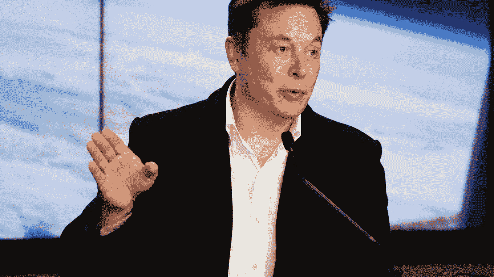

# 企业家标签如何影响我们的认知(错误的方式)

> 原文：<https://medium.com/swlh/how-hashtag-entrepreneurs-influence-our-perception-the-wrong-way-17732a2603ee>

创业很辛苦。“就像吃玻璃，凝视深渊”。这是埃隆·马斯克(Elon Musk)在德雷珀大学演讲时发表的评论，同时描述了企业家精神的真实本质。

他的另一个评论是“不要这样做”——对于那些寻求鼓励和友好的人来说，这是一个相当毁灭性的观点