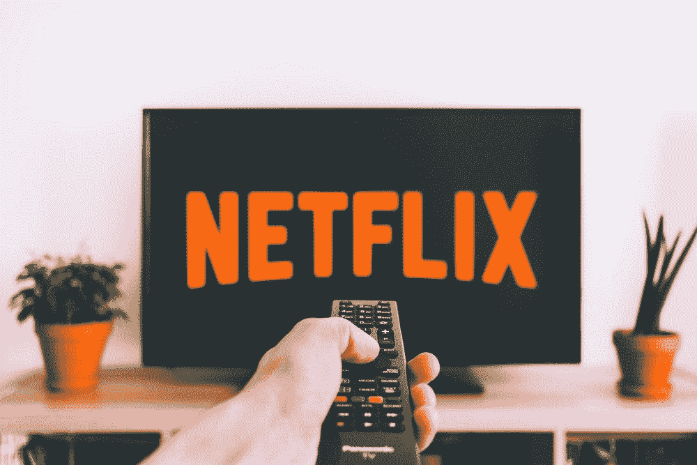

# 网飞能提价多高？

> 原文：<https://medium.com/swlh/how-high-can-netflix-raise-prices-c13fe323cc03>

*注:本文原载于* [*市场兄弟传媒*](https://marketbrothersmedia.com/how-high-can-netflix-raise-prices/) *。*

本周[有消息传出](https://gizmodo.com/at-ts-plan-for-a-netflix-killer-reportedly-gets-an-over-1835307796)AT&T 的流媒体服务将每月收费 16-17 美元，投资者不得不问自己:在失去订户之前，网飞能提价多高？他们为什么要问这个？因为这个答案将决定未来 3-5 年的股价。