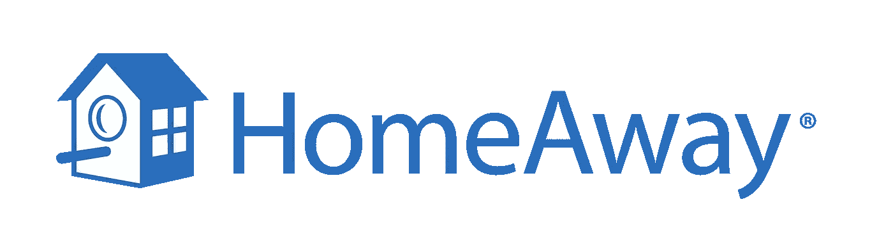

# 只要做一些改变，HomeAway 就能在网站上吸引更多的顾客

> 原文：<https://medium.com/swlh/how-homeaway-can-engage-more-users-on-its-website-a-ux-walkthrough-341fa8dcf776>

HomeAway 是全球最大的度假租赁市场之一，业务遍及 190 个国家。它吸引了两类用户——业主和旅行者。我试着浏览桌面网站的用户体验，以发现需要进一步改进的地方。

> 网站注册