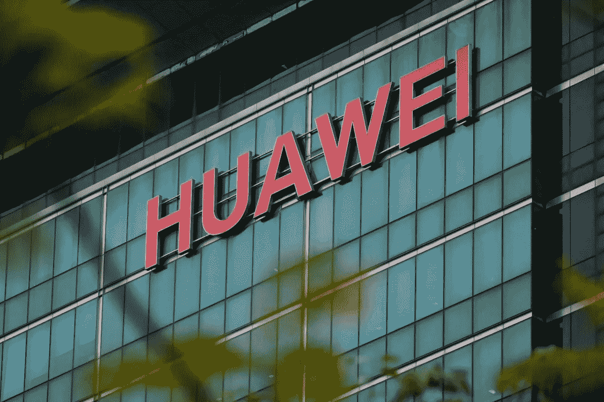

# 华为如何为 Android 后的生活做准备

> 原文：<https://medium.com/swlh/how-huawei-is-preparing-for-life-after-android-652081df5b16>

Huawei’s headquarters in Shenzhen on March 6, 2019\. Photo: AFP

## 康复之旅

上个月(5 月)之后，华盛顿禁止美国公司向华为提供技术，这是针对华为间谍指控的长期运动的一部分，华为否认了这一指控。美国的这一举动使得第二大智能手机制造商失去了使用谷歌操作系统 Android 的许可，这给了…