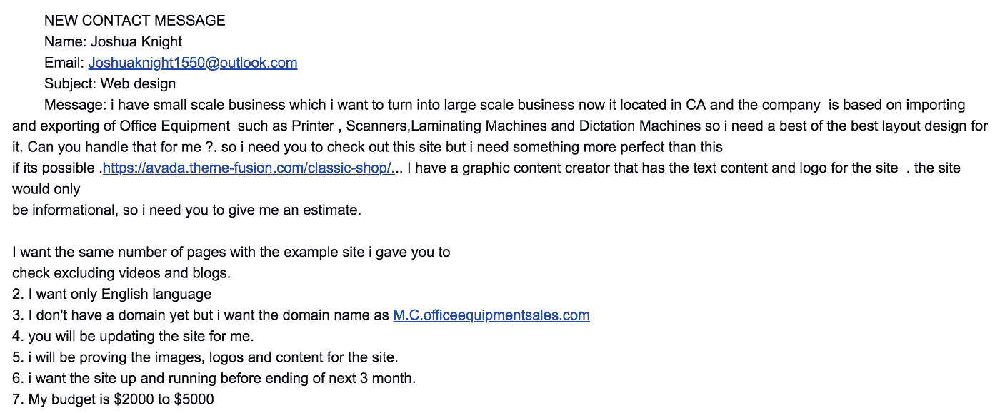
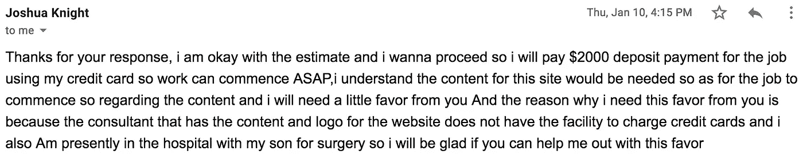
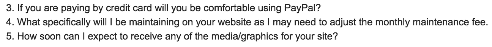
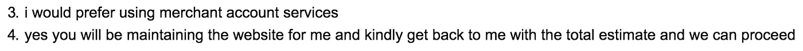
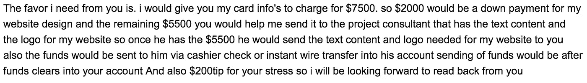
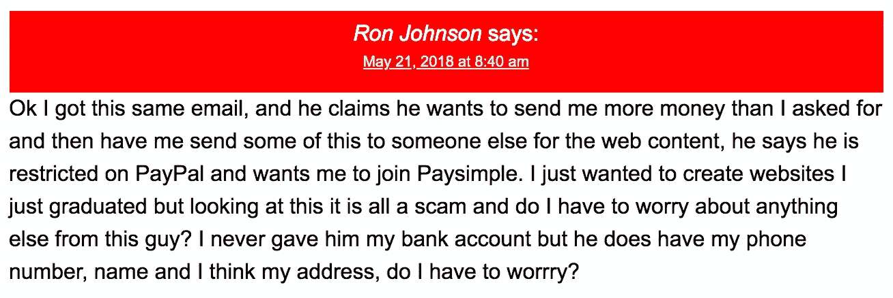

# 我是如何差点被自己的网站骗了

> 原文：<https://medium.com/swlh/how-i-almost-got-scammed-through-my-own-website-aadddb1e38ef>

## 对于任何拥有个人网站的设计者或开发者来说，以下是骗局如何运作以及如何避免的方法

1 月 9 日星期三，我从我的网站上收到了这个通知

Scamming 101

***红旗#1:标点符号之间怪异的间距***

***危险信号#2:为什么所有的“I”都是小写的，还有糟糕的语法是怎么回事？***

读完邮件后，我欣喜若狂。坦率地说，这是第一次有人通过我的网站联系我，我渴望开始这个项目。然而，这种渴望几乎盲目地导致我成为“约书亚”骗局的受害者。事后看来，我显然忽略了我们最初接触中的所有危险信号。

随着我急于开始这个项目，我给“约书亚”回了一封电子邮件，对网站的估计和我可以完成它的时间表。

*四个小时后，我收到了“约书亚”发来的电子邮件……*

“a little favor”

***危险信号#3:非常慷慨的首期付款的早期承诺***

***危险信号#4:请求“小恩惠”***

读完这封邮件后，我开始预感到有些事情不太对劲。为什么“约书亚”要支付这么大一笔首付款，大约是我最初在网站上报价的三分之二？更重要的是，我需要什么样的帮助，而“约书亚的”顾问没有信用卡收费设施，这对我有什么影响？此外，很明显，这封邮件的最后一部分是一个小小的尝试，利用悲情来进一步引诱我进入“约书亚”的小青睐。

出于谨慎，我发送了几个后续问题，包括下面截屏的问题，以真正了解我是否在与一个骗子打交道

My follow up questions

“Joshua’s” follow up answers

***危险信号#5:避免像 PayPal*** 这样的安全支付服务

***危险信号#6:完全回避/不回答我的问题***

当我后来问“Joshua”为什么想使用商家账户服务而不是 PayPal 时，他提到他的卡不能用 PayPal，而且他以前在通过他们的平台汇款时遇到过问题。此外，“约书亚”从未回答我关于网站的媒体和图形的第五个问题，直到我收到这封电子邮件，我才发现这个问题更加可疑…

What a “little favor”

***危险信号#7:将资金转入另一账户***

***红旗#8:好得难以置信***

乍一看，我觉得这似乎是经过深思熟虑的。在我的脑海里，我仍然在想，如果“约书亚”通过一个安全平台付钱给我，我怎么可能被骗呢？但是退一步说，我有一个问题，“为什么约书亚不能直接把资金汇给顾问本人？”出于好奇，我把“约书亚的”邮件复制粘贴到*谷歌*上，不敢相信我[发现的](https://www.consumerblitz.com/my-name-is-joshua-knightdo-you-do-website-design-for-new-company-and-do-you-accept-credit-card/)。

[Check it out for yourself](https://www.consumerblitz.com/my-name-is-joshua-knightdo-you-do-website-design-for-new-company-and-do-you-accept-credit-card/)

我震惊地发现，不仅有关于这个骗局的信息，还有人讲述了同样的经历。“约书亚的”小骗局就这样结束了——谢天谢地。

## 这个骗局是怎么运作的？

广为人知的是*农业美国骗局*或 *Gacillia Nut 骗局*，这种骗局的运作方式类似于[超额支付骗局。](https://www.scamwatch.gov.au/types-of-scams/buying-or-selling/overpayment-scams)

1.  骗子用一个可能的项目引诱你，并试图把自己描绘成一个可靠的客户
2.  骗子避开像 PayPal 这样集成了卖家保护服务的支付服务
3.  骗子让你相信他们需要寄比你给他们的报价更多的钱，双方都同意你会寄一些钱给第三方
4.  骗子用偷来的信用卡支付项目费用
5.  你按照约定将一部分资金电汇给第三方，实际上是骗子的银行账户
6.  合法持卡人对付款有争议，你和你的企业就麻烦了

## 设计师和开发者如何成为目标？

任何可能在网上列出联系信息的设计师或开发商都很容易成为这个骗局的目标。然而，为了提高找到这类目标的效率，诈骗者使用一个自动机器人在互联网上搜寻不受机器人保护的联系页面。从那里，机器人通过目标的内置网页或电子邮件地址向目标发送通用电子邮件，请求一个项目。

## 如何避免被骗

如果你曾经收到过类似的电子邮件，或者你的客户想要给你寄比你报价更多的钱，立即终止与他们的联系。如果事情看起来好得不像真的，就走开。

避免收到这些垃圾项目请求的最有效方法是实现 *Google 的* reCAPTCHA。使用 reCAPTCHA 为您的联系页面增加了一层额外的安全保护，这将最大限度地减少自动机器人和骗子向您伸出援手。要了解更多关于 reCAPTCHA 集成的信息，请点击[此处](https://developers.google.com/recaptcha/intro)。

## 结束语

虽然我很幸运地从这个骗局中脱身，没有损失太多，但这次经历让我大开眼界，认识到与新的未知客户一起经营自由职业业务的现实。如果我对我的客户进行一些快速的背景调查，或者从一开始就识别出危险信号，我就可以完全避免这种情况。也许我最大的收获是永远不要让赚钱的渴望抑制或阻碍一个成功和安全的企业的运作。相信你的直觉，保持安全✌🏼

## 想知道更多吗？

 [## 当心网页设计骗局！骗子瞄准了网页设计师

### 网页设计诈骗越来越频繁地发生——第三方支付诈骗，支付撤销诈骗，和…

alexwright.net](https://alexwright.net/web-design-secrets/avoid-web-design-scams/)  [## 网页设计骗局！抬头！树屋社区

### 参与和其他树屋成员的讨论并学习。

teamtreehouse.com](https://teamtreehouse.com/community/web-design-scam-heads-up) 

## 这篇文章发表在 [The Startup](https://medium.com/swlh) 上，这是 Medium 最大的创业刊物，拥有+415，678 名读者。

## 订阅接收[我们的头条](http://growthsupply.com/the-startup-newsletter/)。

