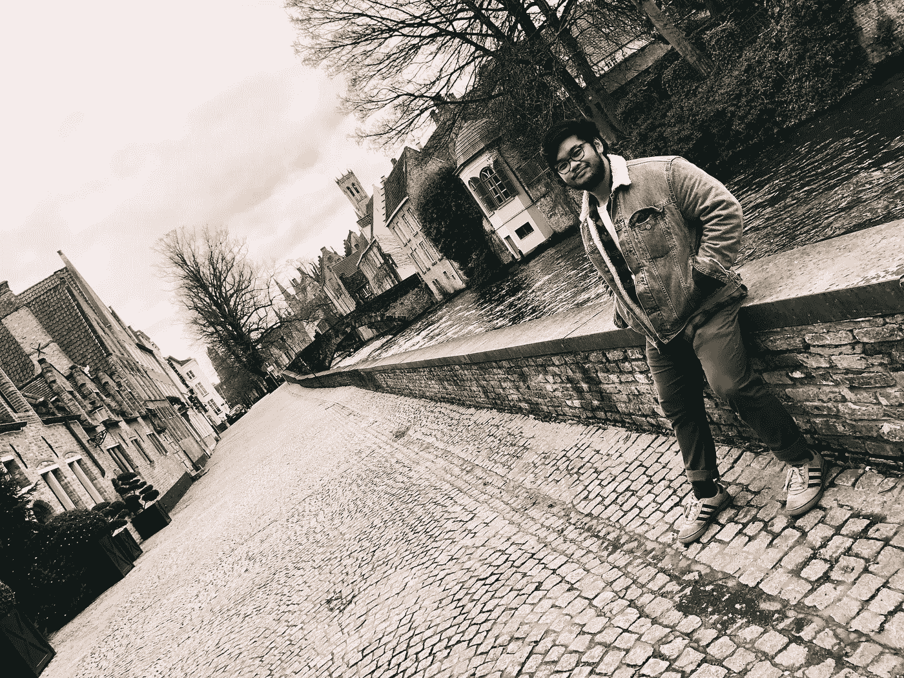

# 我是如何战胜海洛因成瘾，成为一名世界旅行家，并开始自己的事业的

> 原文：<https://medium.com/swlh/how-i-beat-heroin-addiction-became-a-world-traveler-and-started-my-own-business-9f07f58eb812>

2014 年 10 月我想了很多。

大约四年半以前，我坐在密西西比州杰克逊医院的病床上，全身插满了管子。

我醒来时，双手被绑在病床上，以抑制我零星但无意识的愤怒殴打和争吵。我不记得醒来时…