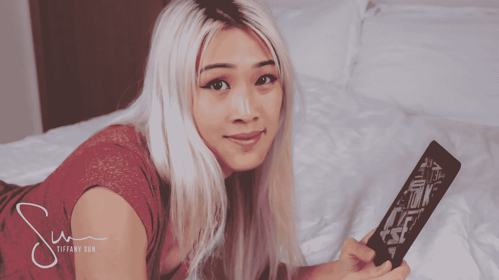

# 我是如何迷上阅读的

> 原文：<https://medium.com/swlh/how-i-became-obsessed-with-reading-816b9e4b91aa>

## 我以前很讨厌它。

当我还是个孩子的时候，我的父母经常鼓励我读书。他们会带我去图书馆，给我买儿童读物，偶尔会指着一个埋头看书的孩子，建议我也这样做。

但是为什么呢？我问他们。*如果我不喜欢读书，我为什么要读呢？你知道，阅读并不像玩芭比娃娃或* …