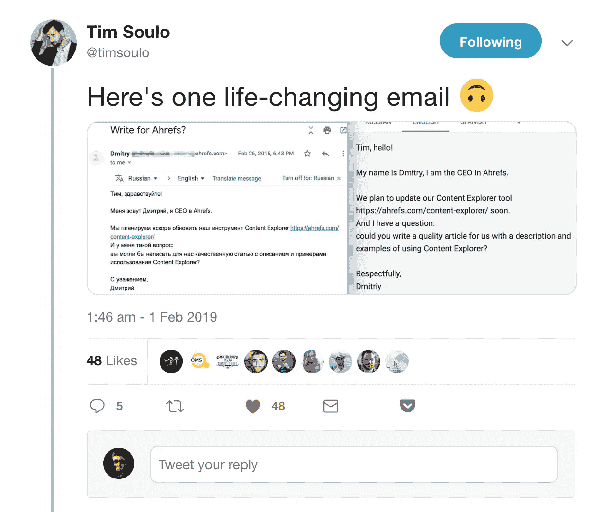
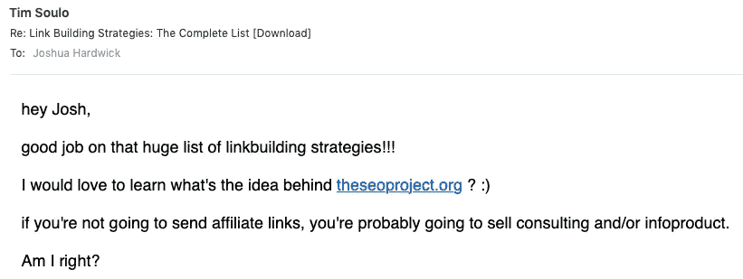
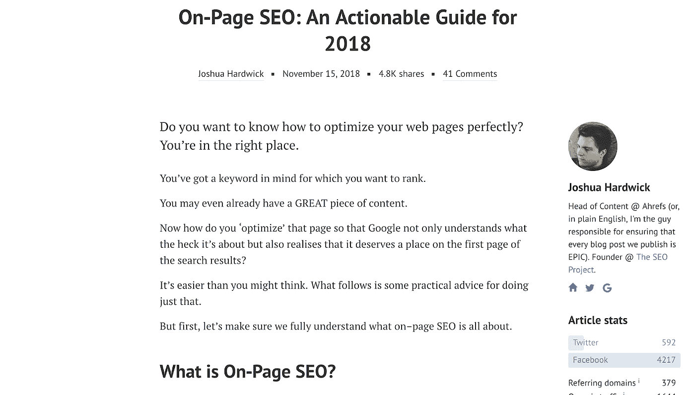

# 我如何为一家 8 位数的公司建立营销团队

> 原文：<https://medium.com/swlh/how-i-built-an-8-figure-marketing-team-from-scratch-4dccca716f1a>

> *你的博客流量*停滞*。*
> 
> *我能试着重写你的主页吗？*
> 
> 该功能的用户界面/UX 可以做得更好。

2015 年，Ahrefs 的首席执行官兼创始人 Dmitry 从我这里收到了这些信息。有趣的部分？

我甚至还不是雇员。我是一名自由职业的营销人员，不怕对我的客户诚实，Ahrefs 就是其中之一。

Dmitry 在寻找能够为他 8 位数的 SaaS 公司撰写高质量内容的营销人员时与我取得了联系。

最初的一次性文章写作很快演变成各种协作任务:产品反馈、设计输入、内容营销策略等等。

几个星期后，德米特里说，“哟，蒂姆！你为什么不来为我们工作，兄弟？”*开个玩笑，Ahrefs 的 CEO 不会真的这么说话。*

不久之后，我收到了工作签证，上面写着“产品营销总监”。

当我的朋友们听说我为了一份新工作要搬到 8600 公里外的新加坡时，他们都很兴奋。然而，他们错误地认为我将管理整个部门。

现实呢？我是一个人的团队。

当然，这并不罕见。初创公司和初创企业通常会在聘用更专业的职位之前，聘用一名全面的营销人员，或者说*多面手*。

这个人负责从内容策略到社交媒体管理的一切。

但是，一个组织如何负责任地从第一营销人员过渡到随后的雇员呢？这是我在营销策划团队中听到的最常见的问题。

以下是我处理这一过程的方式:

# **1。一切都是我自己做的。**

尽管有预算，我还是决定等待招聘更多的营销人员，原因有两个:

1.  我想深入了解我正在推广的软件，以及我正在接触的受众，从而成为一名更好的营销人员。
2.  我已经习惯了自己做一切事情；在加入 Ahrefs 之前，我启动了一个 Wordpress 插件业务。

老实说，营销对我来说不仅仅是薪水。我喜欢帮助塑造成千上万人使用的产品，创建内容营销策略，并与客户交谈。

独自面对挑战比立即雇佣一群人的传统方式更令人兴奋。毕竟我姓 *SOuLO。*

然而，我一直在努力创作我所设想的高质量内容。并不是说我*不能*写出关于 SEO 的引人注目的文章，而是我没有时间。定期发布现象级内容极其耗时。

简而言之，如果你从未做过，你就不知道在研究、写作和编辑过程中要做多少工作。诚然，我也缺乏我们博客所需要的高级 SEO 知识。

然而，建立一个优秀的公司博客是我营销策略的基础。我想让人们在谷歌上找到我们的博客文章，无论他们何时有关于 SEO 的问题。我希望我们的文章能够教会他们如何使用 Ahrefs 来达到他们的目标。

> *“任何产品的首次使用都是在消费者的脑海里。”—未知*

我认为，我的第一个雇员需要 a)是一个非常有才华的作家，对 SEO 有深刻的了解，b)已经是 Ahrefs 的真正粉丝，可以自然地在我们的文章中“推销”产品。

卷起袖子，自己做每件事，揭示了我最大的需求，这也是我第一次被雇佣的原因。换句话说，我不需要*团队*——我需要完成重要的工作。

根据你的营销策略和个人能力，你的最大需求可能与我的不同。也许你已经有了内容营销，但迫切需要一个付费的流量专家来为你的产品带来廉价的线索。

大多数早期创业公司都是从招聘增长主管或内容主管开始的。然而，没有“正确”的决定。让工作堆积起来，通知下一个被雇佣的人。

# **2。我不是雇来填补“职位”的。**

在确定我需要一个内容作者后，我意识到我需要一个有特定技能的人。意思就是:我不想要一个作品集里有关于精酿啤酒、房地产和汽车的文章的人。

我也不希望有人在创建公司宣传册，电子邮件序列或杂志文章的经验。我希望有人在围绕深度搜索引擎优化主题撰写引人入胜的博客内容方面有经验，因为我们出售搜索引擎优化工具包。

幸运的是，我在我们的[内容负责人 Josh](https://ahrefs.com/team) 身上找到了那个人。

在浏览 SEO 社区的时候，我偶然发现了他写的一篇关于链接建设的文章。我们正在谈论 60，000 字的每一个可以想象的链接建设策略。

我惊讶地摇了摇头。"是什么促使他无偿写这封信？"我以为。“他想在自己的领域建立信誉吗？他想扩大自己机构的规模吗？”

所以，我伸出手，问了那些问题。

Josh 说他对 SEO 很着迷，想写一些人们会从阅读中受益的内容。他非常喜欢这个主题，花了 5 个月的时间研究这个资源！

事实证明，为 Josh 提供一个可见的平台来实现这一目标是双赢的。所以说服他加入我们的 Ahrefs 并不困难。

尽管乔希擅长内容写作，但他实际上是“多面手”这些年来，我给他分配了各种各样的营销任务，这些任务都被完美地执行了。

这证明了聪明、负责和勤奋的雇员不需要局限于特定的任务——他们可以处理任何事情。

我们的营销团队大多由多面手组成，他们同时在几个方向工作:写博客文章、在 Quora 上发帖、管理播客广告和运营我们的企业 Twitter 账户。

在与“营销领导”交谈时，我经常听到这样的问题:

> 我应该雇用谁？你在你的团队中扮演什么角色？我应该雇用更多的多面手还是专家？

老实说，他们让招聘过程变得太复杂了。我不把我的团队成员视为多面手或专家。我需要的是有能力完成重要工作的人。

我们的工作主要是制作和分发高质量的教育内容，展示我们产品的魅力。属于什么“立场”或“经验类型”并不重要。

也就是说，乔希*在撰写关于 SEO 的文章方面非常出色——所以他大部分时间都花在这方面。*

> 底线:不要陷入“多面手对专家”的困境。雇佣你信任的人来完成重要的工作。

# **3。我雇佣了远程人才。**

成为最好的需要雇佣最好的*。不幸的是，顶尖人才并不总是住在你的后院。*

*Ahrefs 通过依靠外国的自由职业者来消除这一障碍。例如，乔希在英国谢菲尔德舒适的家中全职工作。和我一样，他最初是一名自由职业者。然而，我们不相信他*需要*来这里做贡献。*

*Ahrefs 市场部另一个不可替代的成员是我们的视频负责人 Sam。他在多伦多的家中制作教育视频并管理我们的 YouTube 频道。在新加坡找到一个像 Sam 这样拥有多种技能的人几乎是不可能的。*

*这种灵活的工作安排使我们能够与世界各地的超级人才合作。这是全公司的政策，不仅限于营销部门。我们许多超级聪明的开发人员(包括我们的 CTO)都在远程工作。*

*对于希望以最小风险雇佣兼职人才的初创公司来说，依靠自由职业人才也是一个划算的选择。*

# ***4。我雇佣了 FSO 的人。***

*我的第一个全职雇员是尼克，他是我在 BloggerJet 的前合伙人。值得一提的是，我雇佣的人中有 30%是我在需求出现之前就已经认识的人。*

*我雇用尼克是因为他聪明、值得信赖，而且愿意“解决问题”正如布莱恩·哈里斯在他的视频中建议其他企业家和营销人员的那样:*

> *“你只有一项工作——那就是把事情搞清楚。需要更多客户？弄清楚。需要更多流量？弄清楚。需要雇佣一个程序员、设计师还是作家？搞清楚！”*

*布莱恩·哈里斯大力提倡规划自己的道路，我同意他的理念。在我为一家公司[工作的近 4 年时间里，虽然我为 Ahrefs 的快速增长做出了贡献，但我忽略了许多标准的增长黑客建议](/swlh/how-we-achieve-65-yoy-growth-by-ignoring-conventional-startup-advice-24a3eef619c1)，而是倾向于找出最适合我们公司的方式。*

*我想和类似的能够自我指导的人一起工作。在招聘过程中尽早发现这类候选人的一个方法是评估他们的书面沟通技巧。*

*从一封简单的电子邮件中，你可以收集到关于一个人的如此多的信息，这是令人惊讶的:*

*   *他们是否以连贯的方式组织了他们的思想？*
*   *他们遗漏了不必要的细节吗？*
*   *他们回答了你所有的问题吗？*

*雇佣一个写邮件很棒的人；他们可能会有你需要的高*(FSO)*商数。当与远程团队成员一起工作时，优秀的沟通技巧更加重要。*

# ***5。所有员工都在客户支持部门工作。***

*最后，如果一个营销人员不真正了解产品，他的教育、工作经验和软技能就没有任何意义。*

*出于这个原因，我坚持认为营销团队的每个新员工都应该在我们的客户支持团队工作至少 6 个月。这个策略是基于我早期几乎每天回答支持问题的经验。*

*与我们的用户直接对话帮助我为我们的主页撰写了文案，选择了一个[编辑方向](https://ahrefs.com/blog/)，并在我们的 YouTube 频道上获得了超过 100 万的浏览量。这也让我对产品本身更有热情。*

*事情是这样的:Ahrefs 是一个由 45 个人组成的团队，与 Moz (200 多人)和 SEMrush (600 多人)这样大得多的组织竞争。但是如果你有机会见到我们团队中的任何人，你会被他们对使我们的工具包独一无二的东西的真正热情所震撼。*

*在现实生活中见过 Josh、Sam、Nick 和我的客户可以证明这一事实。见鬼，当我在巴厘岛度假时，我甚至在公司的空闲时间“闲逛”!*

*因此，我们的*支持到营销政策*不仅帮助新员工更多地了解我们的客户，还提高了他们对产品独特功能的热情。在我看来，这是我们无懈可击的营销团队的“秘制酱”。*

## ***现在，轮到你了……***

*总之，我通过以下方式建立了 Ahrefs 的营销团队:*

*   *最初，我自己做每件事来确定最大的需求。*
*   *招聘基于这些需求，而不是职位。*
*   *利用远程员工获得最佳人才。*
*   *优先聘用那些能够自己解决问题的人。*
*   *要求所有新的营销人员从事产品支持工作。*

*你正在建立一个营销团队吗？*

*如果是的话，到目前为止最具挑战性的方面是什么？*

*此外，如果你有这里没有提到的建议，请在下面的评论中告诉我们。*

*//*

> *感谢阅读。如果你喜欢这篇文章，请随意鼓掌👏按钮几次(👏👏👏👏)帮别人找:)*

*更多深入的营销文章，[请访问 Ahrefs 博客](https://ahrefs.com/blog/)。*

*//*