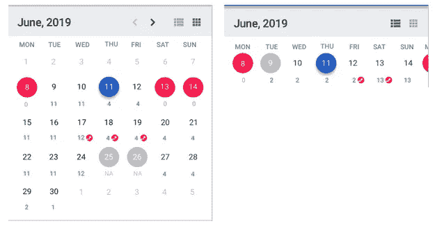
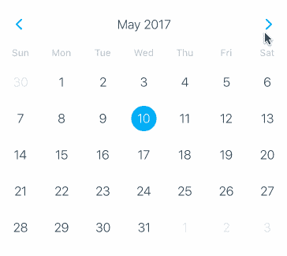
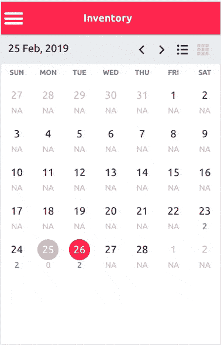

# 我如何使用 react-native-calendars 在 react-native 中构建水平和网格日历

> 原文：<https://medium.com/swlh/how-i-built-horizontal-as-well-as-grid-calendar-in-react-native-using-react-native-calendars-eb7a2edcc5db>

最近在我现在的公司，我得到了一个项目，我必须在 react-native 中制作一个日历 UI。日历需要同时支持水平视图和网格视图。提供的模拟是这样的



calendar in grid and list format

我在网上搜索并找到了 react-native-calendars 库[https://github.com/wix/react-native-calendars](https://github.com/wix/react-native-calendars)，它与我的要求匹配度高达 80%。它有以下日历组件-



react-native-calendars Calendar component

有几个问题-

1.  我需要一个 react-native-calendars 不支持的自定义日历头(截至目前)
2.  日历还必须支持水平条形视图
3.  我需要自定义日组件，以适应我的项目需求

第三个问题已经解决，因为 react-native-calendars 支持自定义日组件，所以我所要做的就是编写自己的日组件，并将其作为 prop `dayComponent={CalendarDayComponent}.`

为了解决第一个问题，我深入源代码并添加了对另外两个属性的支持- `calendarHeaderComponent`和`headerData.`。基本上，我检查用户是否提供了自己的头组件，如果是，那么使用它并传递 *headerData* 作为它的附加属性，如果不是，那么回退到现有的头组件。 *headerData* 是一个对象，它可以包含信息，例如在日历标题中显示的选定日期。

我用上面的更改创建了这个拉式请求(现在还没有合并)-[https://github.com/wix/react-native-calendars/pull/747](https://github.com/wix/react-native-calendars/pull/747)

要解决的主要问题是提供对水平日历的支持。我使用带有 *horizontal* 属性的 *ScrollView* 来显示一个水平日历。我添加了一个新的道具*横向*来区分横向/网格日历视图。

```
 {
    this.props.horizontal ?
      <ScrollView 
        style={[this.style.monthView, {flex: 1}]}
        horizontal
        ref={this.horizontalScrollViewRef}
      >
        {weeks}
      </ScrollView>
      : <View style={this.style.monthView}>{weeks}</View>
  }
```

那么问题解决了吗？是的，但是还有一个问题——上面的代码在水平滚动条中显示了所选月份的周数，并且一次只有大约 8 天是可见的(不像网格视图中一个月中的所有日子都是可见的)。因此，如果选择的日子是月中/月末，它是不可见的，用户必须滚动来显示它。这可能会给用户造成混乱，所以我必须找到一种方法来自动滚动日历，使选定的日子可见。为了解决这个问题，我在渲染结束后以编程方式将日历滚动到所需的偏移量。

```
 // scroll the horizontal calendar to make selected date visible
  componentDidUpdate() {
    const horizontalScrollView = 
        this.horizontalScrollViewRef.current;
    if (horizontalScrollView) {
      const windowWidth = Dimensions.get('window').width;
      horizontalScrollView.scrollTo({
        x: horizontalScrollViewOffset * windowWidth,
        animated: true
      });
    }
  }
```

为了给库做最后的润色，我添加了两个新的道具*onpresslitview*和 *onPressGridView* 来切换日历视图。

## 如何在您的项目中使用这种自定义日历？

我分叉 react-native-calendars repo，并在 branch **horizontal_calendar 中进行所有更改。**要在您的项目中使用修改后的库，请在您的 package.json-中使用 github url 添加包

```
**"react-native-calendars"**: **"git://git@github.com/varunon9/react-native-toggle-calendar.git#horizontal_calendar"**
```

然后你可以像下面这样使用它-

```
<**Calendar
  current=**{**this**.**state**.**calendarDate**}
  **dayComponent=**{CalendarDayComponent}
  **calendarHeaderComponent=**{CalendarHeaderComponent}
  **headerData=**{{
    **calendarDate**: calendarDate.format(**'DD MMM, YYYY'**)
  }}
  **style=**{{
    **paddingLeft**: 0, **paddingRight**: 0
  }}
  **onPressArrowLeft=**{**this**.onPressArrowLeft}
  **onPressArrowRight=**{**this**.onPressArrowRight}
  **onPressListView=**{**this**.onPressListView}
  **onPressGridView=**{**this**.onPressGridView}
  **markedDates=**{{
    **'2019-02-23'**: {**soldOut**: **false**, **blocked**: **false**, **inventory**: 2},
    **'2019-02-24'**: {**soldOut**: **false**, **blocked**: **false**, **inventory**: 2},
    **'2019-02-25'**: {**soldOut**: **false**, **blocked**: **true**, **inventory**: 0},
    **'2019-02-26'**: {**soldOut**: **true**, **blocked**: **true**, **inventory**: 2}
  }}
  **horizontal=**{**this**.**state**.**horizontal**}
  **onDayPress=**{**this**.onDayPress}
/>
```

## 最终结果-



react-native-toggle-calendar

## 完整代码-

## 结束注释

我是第一次接触 react-native，我真的很喜欢这种定制。我正在等待我的 PR 被合并到官方的 react-native-calendars 库，到那时我将使用 github 库作为依赖包。另外，这个库与 react-native-web :D 兼容

网址:[https://github . com/varunon 9/react-native-toggle-calendar/tree/horizontal _ calendar](https://github.com/varunon9/react-native-toggle-calendar)
举例:[https://github . com/varunon 9/react-native-toggle-calendar/tree/master/toggle calendar](https://github.com/varunon9/react-native-toggle-calendar/tree/master/ToggleCalendar)

[](https://medium.com/swlh)

## 这篇文章发表在 [The Startup](https://medium.com/swlh) 上，这是 Medium 最大的创业刊物，拥有+428，678 名读者。

## 在这里订阅接收[我们的头条新闻](https://growthsupply.com/the-startup-newsletter/)。

[](https://medium.com/swlh)