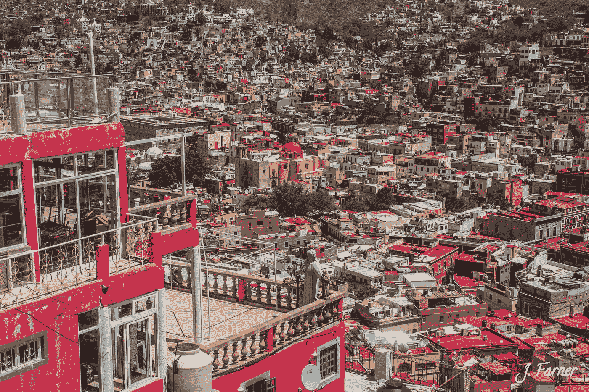

# 我是如何在墨西哥瓜纳华托成为一名外籍人士的

> 原文：<https://medium.com/swlh/how-i-found-myself-becoming-an-expat-in-guanajuato-mexico-de6394ed9ab2>

Credit to Myself

我的旅行习惯带我去世界各地。但是现在，我一年中大约有一半的时间住在墨西哥的瓜纳华托市。

这座联合国教科文组织的城市没有自己的机场(你必须飞到附近的西劳)，与大约 90 公里外的圣米格尔·德·阿连德(San Miguel de Allende)的外籍人士社区相比，它显得相形见绌，被称为小美国。