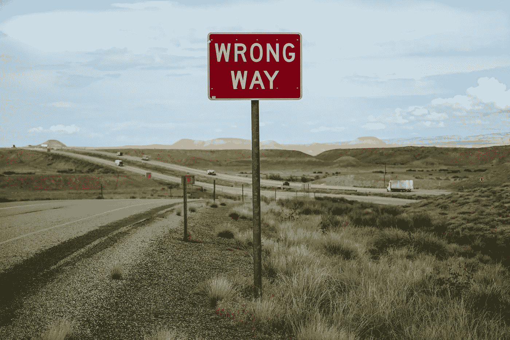

# 我如何通过研究“错误的东西”找到“正确的东西”。

> 原文：<https://medium.com/swlh/how-i-found-the-right-thing-by-studying-the-wrong-thing-f3665c295ce0>

Photo by [Free To Use Sounds](https://unsplash.com/@freetousesoundscom?utm_source=unsplash&utm_medium=referral&utm_content=creditCopyText) on [Unsplash](https://unsplash.com/search/photos/wrong?utm_source=unsplash&utm_medium=referral&utm_content=creditCopyText)

## 追随你的梦想说起来容易做起来难。

事实是，即使你一开始就对自己的生活有一个明确的想法，但几乎没有人最终会遵循那条直线。

我们大多数人从第一天起就没有这种信念，这很正常…这需要时间。

> 更重要的是，你的人生只有一个目标。活出你想要被记住的样子！

# **第一章:回顾过去**

Connect the dots — Photo by [Paul Bence](https://unsplash.com/@bencepaul?utm_source=unsplash&utm_medium=referral&utm_content=creditCopyText) on [Unsplash](https://unsplash.com/search/photos/dots?utm_source=unsplash&utm_medium=referral&utm_content=creditCopyText)

那是 2015 年。我 19 岁，做了一生中最大的决定。我在新加坡国立大学选择了化学——有人可能会说这是一个很大的学位。对我来说，这是一门我不介意学习的学科，但它并没有像我想象的那样让我兴奋或鼓舞。

> 你的生活不是偶然变好的，而是通过**改变**变好的。

我记得，从那天起，我告诉自己，“我不想再有那样的感觉了”，一切都开始变好了。所以，我改变了。就这样。

我的生活并没有立即改变，但很明显，我变得更容易接受新的机会，这些机会让我走出了自己的舒适区。

我从加入 [EURIP](https://www.chemistry.nus.edu.sg/education/undergrads/enrichment/enrichment.htm) 开始，接着申请 [NOC](https://enterprise.nus.edu.sg/educate/nus-overseas-colleges) 并获得在 [Cellutech](/@limshuxin123/my-chemistry-noc-stockholm-experience-f39ae8d9438d) 工作的重要机会，最后选择 [FYI](http://nus.edu.sg/cfg/students/internships) 在 [Croda](/@limshuxin123/bye-croda-c84e9d33d74b) 工作。

在大学的四年里，我认识到世界有多大，每个职业机会都是你应该抓住的——你永远不知道它会把你引向何方。

这些经历告诉我，无论你去哪里，无论你从事什么工作，你都希望努力提高你的职业技能。

注重培养硬技能，如解决问题、商业写作和表达，或软技能，如采取主动、与他人相处和参加会议。

> 对你喜欢做的事情(和不喜欢做的事情)感到好奇，并注意到是什么给了你很多能量。

# 第二章:生活就像一盒巧克力？

Photo by [Food Photographer | Jennifer Pallian](https://unsplash.com/@foodess?utm_source=unsplash&utm_medium=referral&utm_content=creditCopyText) on [Unsplash](https://unsplash.com/search/photos/chocolates?utm_source=unsplash&utm_medium=referral&utm_content=creditCopyText)

大约在这个时候，我毕业了，我并没有感到兴奋和自由，而是感觉到一块大石头落在了我的肩膀上。毕竟我有名牌大学的化学学位。按照这个世界的标准，也就是别人的眼光，我注定会成功，找到一份好工作，结婚，生子，经常旅行，工作到 70 岁，在如此美好的生活后退休。问题是，我无法摆脱这种感觉，它似乎非常令人钦佩，会成为一部好的电视剧。但是不用了，谢谢。

与此同时，意识到传统意义上的科学之路不适合我，我感到沮丧和窒息。我花了几个星期散步、阅读、跑步，说实话，哭，我一直在想…

*   我是谁？
*   我是怎么到这里的？
*   我这辈子想做什么？

> 人生就像一道选择题，困扰我们的往往是众多的选择，从来就不是题目本身。

有人曾经告诉过我上面这句话，意思是生活就像一道选择题。困扰我们的往往是众多的选择。从来都不是问题本身。

在现实生活中，当你得到选项 A 或 B，而你想要不存在的选项 C 时，我希望我有勇气早点克服自我怀疑，知道我不需要一条老路来思考什么是可行的职业生涯。

> 不需要理由，就是感觉对。:)

我不再专注于做什么，去哪里，如何完成我认为我想要的生活，而是专注于释放我对这一切的期望。

我现在专注于我想做和能做的事情。我终于跳了进去。

# 第三章:我受够了。鼓起勇气。

你的生活不会改变，除非你说" **F & %$ it，最坏能发生什么？！***。很多时候，我们害怕做某事，因为害怕会让我们的情况变得更糟。*

当你准备说“F#$% it！”我向你保证，这将会给你的生活带来翻天覆地的变化，这种转变一开始可能会令人不安，但我向你保证，过一段时间后你会发现这是一种解放。

你正在放弃你生活中所有熟悉的、可预测的和可控制的东西，为了一些从潘多拉盒子里出来的不确定的东西。只有当你把自己从当前束缚你的枷锁中解放出来，你才会创造健康的新生活。

NZ Queenstown Nevis Bungy on 31.05.2019

这让我想起了我在蹦极台上结冰时的感觉，看着山谷中的水流过，我的心脏和无数的想法都在加速。在确定这是最佳时机之前，我不想搬家。时间在流逝，而我却静止不动。

就在倒计时前几秒钟，我还在喊‘不，不，不。我觉得我做不到。’但是当倒计时开始时，我知道我所能做的就是集中注意力，准备好行动模式，“五、四、三、二、一——跳！”

我从蹦极中学到的是，你等着跳的时间越长，你就有越多的时间说服自己放弃。

> 有时候在生活中，勇敢一点，闭上眼睛，跳起来，一切都会好的。

跳完之后，当我还在震惊中颤抖的时候，我意识到不管有多可怕，多困难或者看起来不可能，只要我想，我就能做到(你也一样)。

在现实生活中，只有一种方法可以度过难关——无论如何都要推动自己去做。吞下你的恐惧，站起来，直接跳进去。而且事后的自豪感和成就感是无价的。

# 第四章:跳跃后的生活。

Toronto Blue Jays Jump GIF BY MLB

我很快发现我自己的故事也在改变。很简单，如果你认为你是你故事中的英雄，你会试着去做一些让事情变得更好的事情。

加入可再生能源行业让我感到前所未有的活力。这已经成为一种召唤，而不是一种选择。

不是我选择了这个，是它选择了我。

Photo by [Nathan McBride](https://unsplash.com/@nathan_mcb?utm_source=unsplash&utm_medium=referral&utm_content=creditCopyText) on [Unsplash](https://unsplash.com/search/photos/renewables?utm_source=unsplash&utm_medium=referral&utm_content=creditCopyText)

所以确切知道自己这辈子想做什么并不重要。人会变的。经济在变化。所以，大胆地宣称“我知道我想要什么”是不现实的

每个人唯一需要的是方向感。你想去哪里的愿景。

感谢[全球风能理事会(GWEC)](https://gwec.net/) 让我梦想成真。为期两天的越南风力发电大会(#VWP2019)让我大开眼界，让我的手忙脚乱，并在几乎没有指导的情况下解决了许多问题。尽管如此，我从未同时感到如此兴奋、困惑、压力和快乐！当我介绍自己为 GWEC 工作时，我有时还是想掐一下自己，等不及更多了！

# 第五章:展望未来。

我不知道你在职业生涯或总体生活中处于什么位置，但让我重复一下标题:

> 如果你不做你上学要做的事情，这完全没关系。

我之所以走到这一步，是因为我忠于自己，你想要的——真的，非常想要的——是最基本的。人生苦短，不要浪费时间去做自己不喜欢做的事情。不要感到害怕或觉得自己不够好。对自己有信心，你只需要从现在开始。

一个不争的事实是，人类比我们想象的更有适应力。

> “总有更多我们能够给予的爱，更多我们能够拥有的希望，更多我们能够释放的激情，涌向这个世界。”

Tired bored by GIPHY

累了就慢慢走。悄悄地走。但是不要停下来。你厌倦了所有正确的理由。你累了是因为你在做改变。继续走，因为你快到了。总有一天，这种改变会让位于你所需要的返老还童。

# 第 6 章:我希望我有的建议。

最后但同样重要的是，我想和你分享我在这次灵魂探索之旅中的一些经验。

Photo by [Frame Harirak](https://unsplash.com/@framemily?utm_source=unsplash&utm_medium=referral&utm_content=creditCopyText) on [Unsplash](https://unsplash.com/search/photos/advice?utm_source=unsplash&utm_medium=referral&utm_content=creditCopyText)

1.  利用一切可用的资源。

*   谷歌并尝试很多东西，弄清楚它们到底是什么。
*   与业内人士交谈，了解他们实际上是什么样的人，以及他们是如何做到这一点的。

2.恐惧不应该阻止你实现任何梦想！

*   没有什么所谓的活错了人生。
*   从你真正想要创造的东西开始，如果这个决定让你前进了一步，那就去做吧。

3.但是随着事情的发生，一扇门关闭，更多的门打开。

# 轮到你了

你有没有想过毕业？或者说你的第一份工作是怎么找到的？在评论里分享给我吧！