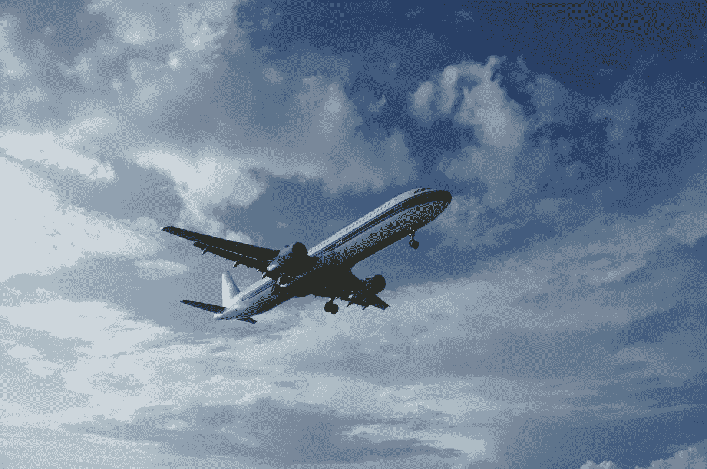

# 我是如何克服对飞行的恐惧的

> 原文：<https://medium.com/swlh/how-i-gained-and-wrestled-down-my-fear-of-flying-7227a1cc57b2>

## 有时候你无法消除你的恐惧。但是你可以和它交朋友。

Credit: PXhere

回到 2011 年，我经历了一次来自地狱的飞行，那是一次从奥兰多到纽约的短途旅行，绕过了一个巨大的风暴前沿。湍流打开了行李箱，让松散的物体飞了出去；人们恐惧地尖叫。当我蜷缩在座位上时，每一块肌肉都紧绷着…