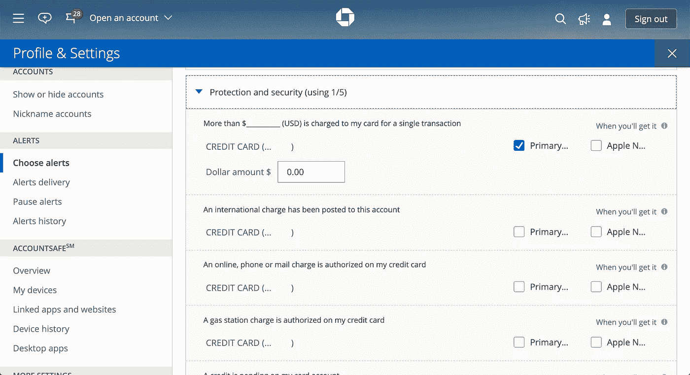
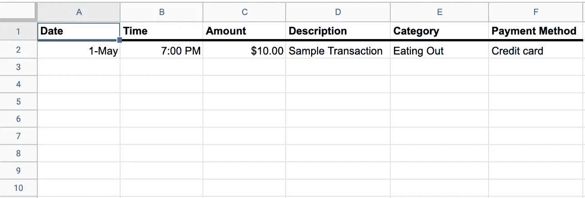
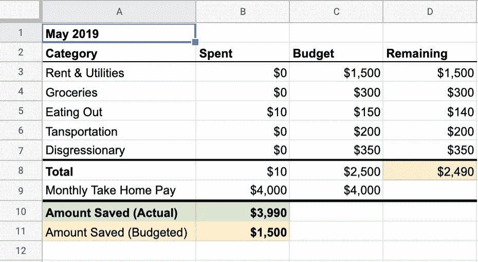

# 我如何用几个无代码服务和 100 行 Python 代码控制我的支出

> 原文：<https://medium.com/swlh/how-i-got-control-of-my-spending-with-a-couple-no-code-services-and-only-100-lines-of-python-code-36c8ac75f670>

支出跟踪应用程序的源代码可以在我的 [Github](https://github.com/peters-josh/spending-tracker) 上找到，以及如何为自己设置它的端到端说明。

大学毕业后，作为一名软件工程师，我开始了我的第一份真正的工作，在这之后，我对自己的个人财务没有任何控制权和洞察力。4 美元的咖啡，12 美元的工作午餐，30 美元的亚马逊购物，75 美元的酒吧之夜——这一切看起来都很正常。加起来不到*那*多，对吧？这就是我错的地方。

尽管头几个月薪水滚滚而来，我几乎没有增加存款。然后，我做了每个理性的、数据驱动的工程师都会做的事情——将我的两张信用卡、一张借记卡和一个 Venmo 账户的所有交易复制并粘贴到 Excel 中，然后查看数字。我在 T4 的花费比我意识到的要多得多。我成了生活方式膨胀陷阱的受害者，需要迅速控制我的开销。

将来自六个不同来源的数据复制到 excel 中不仅繁琐，而且也不能让我实时了解我的支出情况——每次我想评估我的支出时，我都必须重复这个过程。我研究了现有的预算软件，如 Mint 或 YNAB 它们功能齐全，但安装麻烦，使用复杂。我想要的只是一个简单、统一的视图，显示我在所有支付机制中的交易历史，以及一些我可以自己进行分析的消费类别。我开始制造我需要的工具。

# 银行的秘密 API

在我研究的早期，我遇到了一个主要障碍；我的 banks 和 Venmo 都没有提供一种以编程方式实时访问我的事务的方法。然而，在我的大通信用卡账户中挖掘偏好设置后，我发现可以为每笔交易打开电子邮件购买通知。

Purchase notifications via email are the secret API of financial products.

我财务账户的 API 藏在显眼的地方。我所有的信用卡、借记卡，甚至 Venmo 账户都可以选择打开电子邮件购买通知。我怀疑每一个主要的信用卡公司或支付应用都有同样的选择。

在我的脑海中，我展示了我的支出跟踪应用程序如何工作的架构图。带有购买通知的传入电子邮件将被转发到后端服务。交易描述和金额将被解析并分配一个类别。然后记录将被上传到数据库。然后，一个简单的 CRUD web 应用程序会调用一个 REST API，与数据库中的事务进行交互。

# 无代码服务可以帮助您快速将想法变为现实

当考虑数据库的选择时，我突然意识到——为什么不直接使用 Google Sheets。它是我项目后端的完美选择，因为*它也可以作为我的应用程序*的前端。可以在任何设备上查看表单。我可以在工作簿中直接建立总数。我甚至能够开箱即用地编辑/删除带有版本控制的事务。为了处理电子邮件通知，我做出了类似的选择，没有推出自己的服务。我使用 [Zapier](https://zapier.com/) 接收 Gmail 自动转发的电子邮件，然后在 HTTP `POST`中将主题和正文作为 JSON 有效负载发送到我的应用程序上的 REST 端点。

直到我开始编写应用程序，我才意识到我学到了宝贵的一课——当试图让一个产品起飞并验证一个想法时，你不需要过度构建一个解决方案。通过使用一些无代码服务，我能够将我的项目的范围和复杂性从数周的努力减少到只有 100 行 Python 代码。在这个移动速度和运输速度更快的时代，重要的是要认识到无代码工具可以成倍地提高您的生产力和上市时间。作为一名工程师，建造东西是我的天性。然而，太容易陷入思维定势，认为你必须构建*一切*。这种心态经常导致一个人陷入过多的不完整产品，这些产品变得太复杂，以至于在失去兴趣之前无法完成。使用无代码或低代码的应用程序来帮助完成你的目标并实际交付一个项目并不可耻。

Transactions are automatically captured in the Sheets workbook and added to a month-by-month summary.

我的费用跟踪应用程序的最终状态是一个简单的 Python Flask REST API，其中一个端点接受来自 Zapier 的`POST`请求。该应用程序解析交易描述&金额，自动分配支出类别，然后将数据发布到 Google Sheets 工作簿。Sheets 工作簿有两个选项卡:一个跟踪我的两张信用卡、借记卡和 Venmo 帐户的所有支出，另一个按月汇总支出类别。Python 应用程序中的一小组规则和过滤器会处理重复计算的事务，并忽略不应该跟踪的事务。

无代码应用可能不适合每一个用例，但它们启动了我的开发，让我在几个小时内从想法到概念验证。我希望在未来的发展中，尤其是在探索性的情况下，融入更多的内容。

支出跟踪应用程序的源代码可以在我的 [Github](https://github.com/peters-josh/spending-tracker) 上找到，以及如何为自己设置它的端到端说明。