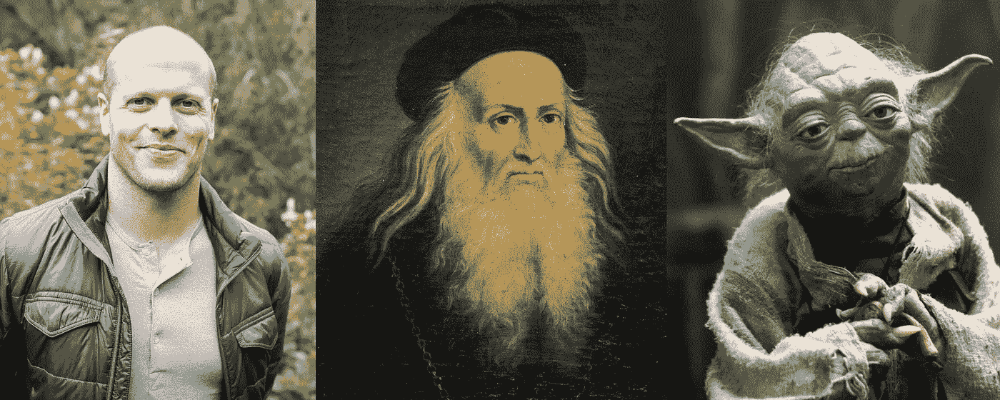

# 我如何在 18 个月内学会 50 项技能，你也可以

> 原文：<https://medium.com/swlh/how-i-learned-50-skills-in-18-months-and-so-can-you-789d4ee9f9a7>

From left to right: [Tim Ferriss](https://medium.com/u/56d3bc91794f?source=post_page-----789d4ee9f9a7--------------------------------), Leonardo Da Vinci, Yoda

## 不同的智力，不同的方法

写作、学会学习、公共演讲、讲故事、编程、西班牙语、冥想、人像摄影、演奏尤克里里、萨尔萨舞、生产力、绘画…

你想如何学习这些技能，甚至更多？