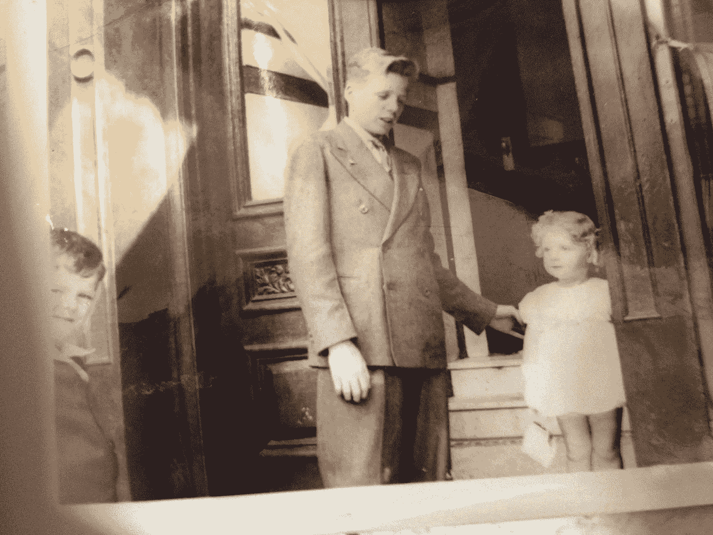

# 我是如何学会颠倒着爱我的哥哥的

> 原文：<https://medium.com/swlh/how-i-learned-to-love-my-brother-upside-down-5395d72847bc>

Author’s photo. Frank and Helen (and cousin Jackie Drudy, left) 1941, about two years before we lived in the Quincy Avenue House

## 我永远是他的女孩。

我被伟大的兄弟姐妹们祝福和诅咒。幸福是因为他们是/曾经是伟大的人，我爱他们。被诅咒是因为我是最后一个，总有一天我会是最后一个站着的。

我在 4 月 23 日，我哥哥弗兰克的生日，写了这篇文章的初稿，以此向他致敬。92 岁时，他 12 岁了…