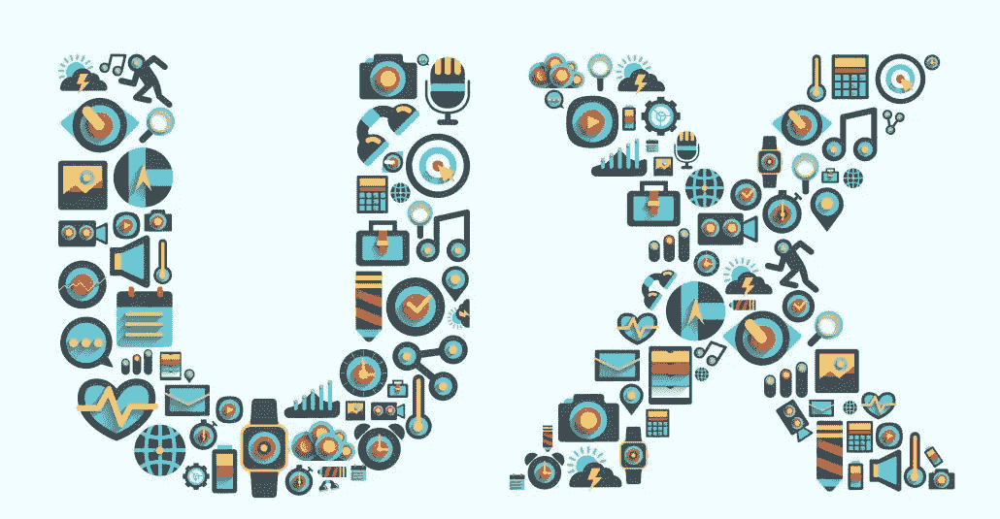
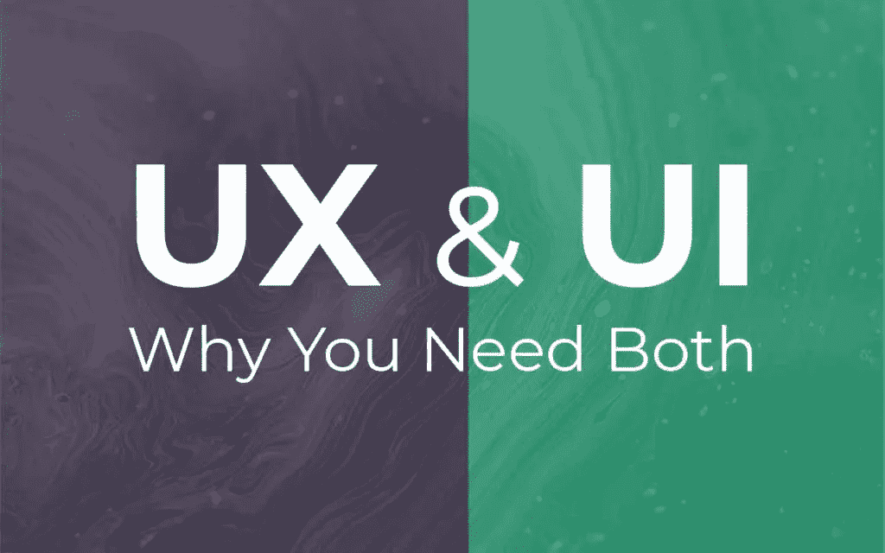
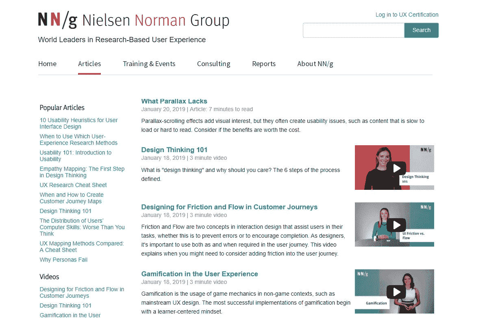

# 我是如何在一周内学会 UX 的！

> 原文：<https://medium.com/swlh/how-i-learned-ux-in-a-week-e4917006e80a>

UX

用户体验(UX)涉及到对用户的深刻理解，他们需要什么，他们重视什么，他们的能力，以及他们的局限性。UX 还考虑了服务提供商和用户双方的利益。UX 的主要目标是不断即兴创作用户与数字界面的互动质量，以及对你的产品和任何相关服务的感知。现代的 UX 对于一个好企业来说极其重要，因为好的设计就是好的企业。

在阅读了大量文章，观看了不太有用的 YouTube 视频，阅读了人机交互百科全书(HCI)的几个章节后，我肯定会在开始实践之前列出用户体验的基础知识。

以下是我对你开始 UX 设计之前应该知道的事情的看法。这些文章谈到了 UX 组件，与 UI 知识的关系，UX 的原则，UX 的工作角色，以及薪酬和一些有价值的参考资料，我发现这些资料在我的 UX 之旅中非常有用。有了下面这些，我希望这篇文章能帮助你在接触 UX 设计之前了解 UX 的基础知识。

# UX 组件

## 1)人物角色

人物角色是在研究的基础上创建的人物、对象、情况、问题、挑战和重新设计的角色表现，代表将使用服务、产品或网站的不同用户类型。创建人物角色有助于理解用户的需求、体验、行为和目标。

## 2)用户旅程地图

用户旅程图是一个流程，表示用户可能与您的设计进行交互的场景。用户旅程图是一个包含用户目标、动机、情感、痛点、总体特征、需求和要求的演练。

## 3)任务模型

对于任务分析来说，任务模型非常重要，有助于确定改善 UX 的机会所在，并产生初步想法，应对重新设计挑战。任务模型是触发器、期望结果、基础知识、必需知识和工件的生态系统。

## 4)系统映射

系统图是服务技术组织的直观描述；不同的因素，包括它们之间的相互联系以及系统中材料、信息和布局的流动。

## 5)经验映射

体验映射是捕捉和传达复杂客户互动的战略流程。映射活动在您的组织中建立知识和共识。此外，该地图有助于构建无缝的客户体验。

## 6)线框

线框可以描述为显示网站或页面功能元素的一幅或一组图像，通常用于规划网站的结构和功能。

## 7)原型

原型是网站/应用程序的第一个或初步版本，其他形式是从它发展而来的。

## 8)用户测试

网站/应用程序投入工作时的测试。

# 我们需要学习 UI 来理解 UX 吗？

我的回答是肯定的。你应该学习 UI 来更好地理解 UX。

**用户界面(UI)设计**是关于制作一个*概念*的外观和感觉令人惊叹。

**用户体验(UX)设计**是关于验证概念的可用性和可行性，让用户从 A 点到 b 点

如果一个 UX 设计师对界面毫无头绪，用户将如何通过迷宫从 A 点到达 B 点？为了理解 UX，分析接口的知识是极其重要的。用户体验设计或用户体验分析是从理解用户界面开始的。给定一个界面设计，只有当设计者。

## 没有 UI 设计的 UX 设计:

如果你只关注 UX 设计，你会错过重要的 UI 设计原则。尼尔森诺曼集团被认为是 UX 研究的先驱，但这并不意味着他们有一个惊人的网站。过多的文本和信息会让用户不知所措，这是一个很明显没有遵循的基础知识。

Nielson Norman Group’s Website

通过用户界面与产品互动是用户体验的一部分，所以我们 UX 设计作为一个创意领域是更广泛的，包括 UI 设计作为其不可分割的一部分。UX 的设计师考虑的更多的是逻辑、过渡、可用性、可访问性、情感和美学诉求、数据呈现和许多其他东西，以形成整个用户体验。

# UX 原则

1.  **可学性**:用户是否能轻而易举地完成任务？
2.  **效率**:界面是否允许用户及时完成任务？
3.  **易用性**:产品方便、清晰、逻辑清晰、易于使用
4.  **实用性**:产品提供有用的内容，解决用户的问题
5.  **易用性**:产品方便不同类别的用户使用
6.  **合意性**:产品具有吸引力并能解决问题，它能留住用户并创造他们愿意重复的积极体验
7.  记忆能力:在离开一个网站后，用户下次访问时有多大可能记得如何使用它？
8.  错误:界面采取什么步骤来减少用户出错的机会，以及如何让用户改正错误？
9.  满意度:用户喜欢与设计互动吗？

# UX 设计师

## UX 领导/主任

用户体验领导研究，计划，建筑师 UX 为网络，电话或其他数字平台的设计。这个人从用户的角度领导数字产品的创作。

## UX 设计师

一个 UX 设计师的任务是跟随 UX 领导/导演完成的设计。他/她将分析目标受众及其需求，进行研究，创建有效的布局和经过深思熟虑的过渡系统，将其包装在一个有吸引力但高度可用和清晰的视觉设计中，并测试解决方案。然而，一个 UX 设计师不是一个开发者:他们工作在同一个产品上，但却是一枚硬币的两面。

## UX 建筑师

他负责从用户的角度在网站上创建一个有意义的信息和组织结构展示。UX 建筑师不同于 UX 设计师或分析师。架构师必须站在分析师的角度，确保在呈现信息时满足所有用户需求。

## UX 分析师(可用性分析师)

他们分析。就在构建模型之前，UX 分析师构建人物角色、用户旅程图、任务模型、体验图、移情图，了解给定应用程序的可用性和用户体验需求。一旦这些需求被很好地理解了，他们就给实际的 UI 设计、模型、原型或模拟打上了绿色的标记，这些设计、模型、原型或模拟将创建用户界面并显示用户交互。

## UX 顾问

UX 顾问专注于使一个网站易于使用，或者使一个应用程序以用户期望和认为合理的方式工作。他也可能是因专业知识而被聘用的团队中的第三人。一个 UX 顾问可能收取每小时 12 到 15 美元的基本 UX 设计费用。UX 顾问费用取决于设计质量和网页设计师的经验。

## 首席探索官

CXO 是一名主管，负责一个组织的产品和服务的整体体验。首席设计官是一个公司头衔，授予负责组织设计计划的执行官。首席体验官(CXO)是确保与组织外部客户积极互动的执行官。CXO 是顾客和组织之间的纽带。首席体验官(CXO)是负责组织整体用户体验(UX)的官员。

以下是一些有趣的列表，以及它们是如何定义 UX 的:

## Airbnb 的体验研究员

> “体验研究团队的任务是提供产品团队在产品开发周期的每个阶段都需要的可靠、丰富和可操作的研究。作为一名研究人员，你融入了一个由设计师、项目经理和其他跨职能合作伙伴组成的团队。您不仅能进行一流的多方法研究，还能开发深入的、以研究为导向的产品专业知识。”

## 谷歌的 UX 工程师

> “您将与研究人员和设计师合作，定义和提供新功能，将概念转化为活生生的原型，并迭代交互、动画和细节，以提供完美的体验。UX 的工程师还与 UX 的研究人员密切合作，对新概念进行用户测试，并协助工程设计

## **谷歌的 UX 研究**

> “用户体验(UX)研究人员致力于回答设计中最具挑战性的问题。他们通过进行初步研究，探索行为和动机，并与设计师、产品经理、工程师和其他人合作开发新功能，来揭示用户对我们产品的需求。他们通过发表令人兴奋的报告来激发变革。最重要的是，研究人员帮助 UX 团队了解是什么让用户的体验感觉更直观、更容易获得，甚至更神奇。”

## **阿迪达斯的用户体验设计师**

> “您将在一个快节奏的组织中工作，以实现优质、个性化和互联的体验。收集见解和调查数据，您将利用现有的基础，开发新的能力来创造新的。”

# 我喜欢的推荐人:

## 书籍:

1.  [唐·诺曼的日常用品设计](https://jnd.org/the-design-of-everyday-things-revised-and-expanded-edition/)
2.  [人机交互百科全书](https://www.interaction-design.org/literature/book/the-encyclopedia-of-human-computer-interaction-2nd-ed)

## 网站:

1.  [Tubik 工作室](https://tubikstudio.com/)
2.  Planet.org UX
3.  [交互设计组织](https://www.interaction-design.org/)
4.  [尼尔森诺曼集团](https://www.nngroup.com/articles/)

UXing 快乐！干杯！

## 这篇文章发表在 [The Startup](https://medium.com/swlh) 上，这是 Medium 最大的创业刊物，拥有+414，678 名读者。

## 在这里订阅接收[我们的头条新闻](http://growthsupply.com/the-startup-newsletter/)。

