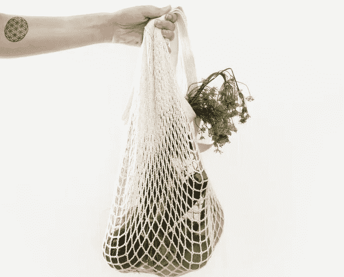
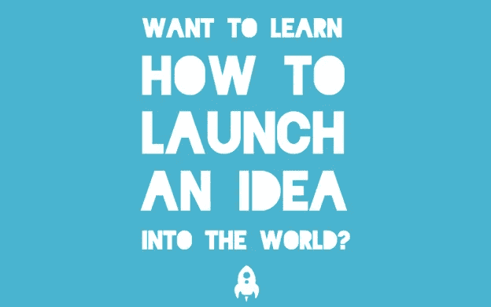
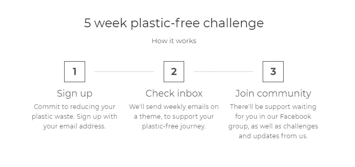
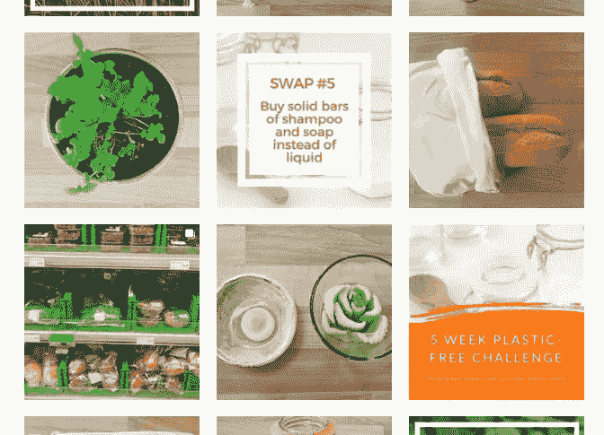
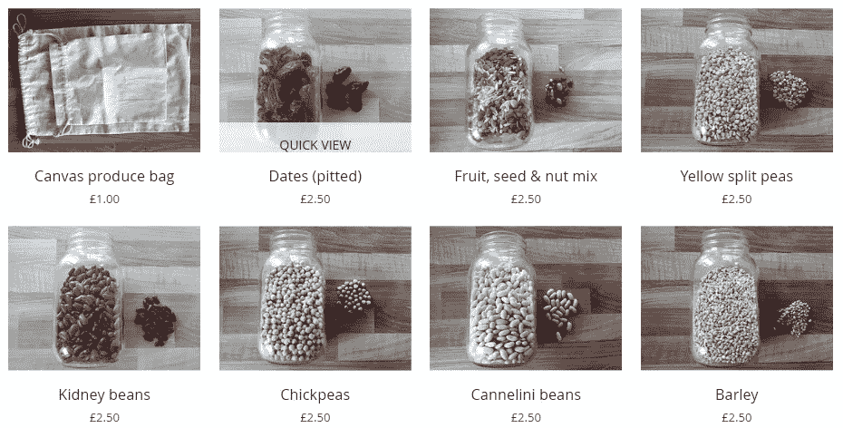
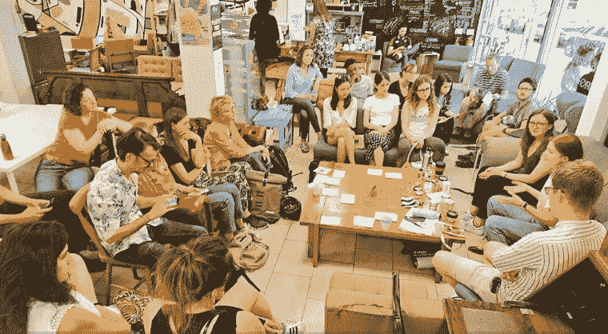

# 我是如何开始无塑料食品杂货递送业务的

> 原文：<https://medium.com/swlh/how-i-started-a-plastic-free-grocery-delivery-business-722da5126edf>

## 我从零开始创业，解决塑料垃圾问题

> "你的使命或目标就像一块磁铁，让你不断前进."
> 
> —多丽丝·约翰逊

在塑料存在的 65 年里，我们已经使用了超过 83 亿吨的塑料。塑料需要 1000 年才能分解——一旦它出现在地球上，就永远不会消失。它不只是无害地四处漂浮:90%被调查的信天翁胃里有塑料，到 2048 年，我们海洋中的塑料将比鱼还多。

2016 年夏天我开始吃素。我做出这一改变是出于道德原因，但这也开启了我的可持续发展之旅。2017 年，我开始意识到零废物运动，并开始了解塑料废物对我们星球的影响。我开始改变自己的生活，试图在购物时不使用塑料。

与此同时，我对自己的职业感到沮丧。我在一家大公司做营销工作，这家公司最关心的是增长、利润和股东回报。努力实现收入目标并不适合我，我决定探索如何将我的个人道德、价值观和激情与我的职业结合起来。我想做些好事。我想拥有一份对环境没有负面影响的工作，我也想激励其他人去关心环境。

在旅程的某个时刻，我对创业的想法产生了兴趣。我看不到一条清晰的职业道路，可以把所有的框都勾上，但我可以看到，我可以通过创业为自己建立这条道路。所以，我开始探索我能创造什么生意来解决塑料问题。这篇文章的其余部分将记录我是如何做到这一点的。我试着把我觉得当时会有用的细节包括进去，但是如果你有任何具体的问题，请评论，我会尽力回答。

免责声明:我后来决定，这项业务不符合我的价值观和目标，所以它不再存在。你可以在我的其他文章中读到更多关于这个的内容:

*   [*为什么我不再无塑*](/@tabitha.whiting/why-im-no-longer-plastic-free-7c9f779468ea?source=friends_link&sk=7b761754e194891eb651fd4643c50b8a)
*   [*我为什么辞职*](/@tabitha.whiting/last-year-i-quit-my-stable-job-to-pursue-a-career-with-impact-heres-my-story-86f35d9aa00b?source=friends_link&sk=4136970ddbd4896c54c4cad8a7be703d)

# 第一步:逃离城市

Credit: Escape the City

当我最初对创业感兴趣时，我尽可能多地收集信息。我和 MaRS 一起参加了一个[在线‘创业 101’课程。我听了萨姆·奥特曼(Sam Altman)的 Y Combinator“如何创办一家初创企业](https://www.marsdd.com/news/entrepreneurship-101-more-than-just-a-free-course/)”系列的录音，每个午餐时间听一次讲座。我读了埃里克·里斯的标志性著作 [*精益创业*](http://theleanstartup.com/) 。我去参加了牛津大学赛德商学院的系列讲座(我就住在这个地区)，名为“创业”。

我学到了很多。但是我仍然觉得我不能开始。进入:逃离城市。

我不确定我是如何第一次遇到[逃离城市](https://www.escapethecity.org)的，但那时候肯定感觉像是意外之喜。那是 2017 年 11 月，他们正在为他们的下一批[创业加速器](https://www.escapethecity.org/startup-accelerator/)做广告，从 2018 年 1 月开始。这是一门非全日制课程，是为那些想兼职创业的人设计的——一种“兼职行当”。他们的校友似乎都是带着真正的目标创业的。像 Oddbox 这样的公司通过出售成箱的不稳定的水果和蔬菜来解决食物浪费问题。或者像 [Davy J](https://www.davyj.org/) 一样，用海洋塑料垃圾为爱冒险的女性制作泳装。这是一项投资，但感觉很好。我马上就申请了。

我进入逃离城市启动加速器的想法是一个无塑料超市。我对自己减少塑料垃圾的个人旅程充满热情，但我发现无包装购物非常不方便。不像在伦敦，在牛津没有任何零浪费或批量购买商店。我不得不在每个周末逛农贸市场，花上几个晚上研究无塑料牙膏的最佳选择。这令人筋疲力尽，我知道如果这是唯一的方法，那么无塑料生活就不可能成为主流。

我想让无塑料购物变得简单方便，让它成为所有人的轻松选择。我想解决我自己的问题，并通过这样做来激励其他人也更加意识到他们自己对环境的影响。最初，这将是我在牛津地区的地方，但我有一个大计划，要在全国范围内创建一个无塑料超市连锁店，成为乐购、塞恩斯伯里和维特罗斯的竞争对手。

创业加速器在伦敦进行了三个多月，每周三晚上有一次会议，外加周末。每周他们都教我们创业的一个要素，从客户开发到营销和销售。当然，成为企业主的第一个关键步骤是:定义你的 MVP。

# 第二步:最有价值球员

> “我们必须了解客户真正想要什么，而不是他们说他们想要什么，或者我们认为他们应该想要什么。”
> 
> — Eric Ries，精益创业

MVP(最小可行产品)是一种以最小风险测试你的商业想法的方法。您创建了一个产品或服务的版本，它允许您测试您的客户如何使用它，它是否解决了他们的问题，以及前进的最佳方式是什么。

例如，Dropbox 一开始根本没有产品。他们制作了一个解释者视频，向潜在客户解释他们的 Dropbox 产品如何工作，以及如何改善他们的工作体验。这让他们可以在投资开发和技术之前，先看看是否有人对这个想法感兴趣。

因此，我的无塑料超市接管从一个不起眼的电子邮件挑战开始，通过每周发给他们一次的 5 封电子邮件，帮助人们开始减少他们的个人塑料垃圾，每封电子邮件包含一个不同的挑战。我还将围绕这一挑战创建一个社区，有一个脸书小组，成员们可以分享他们的经验并寻求建议。

我从事营销工作，因此创建一个电子邮件之旅对我来说相当简单，它可以让我测试牛津地区是否有人想减少塑料垃圾，但不知道从哪里开始。我还可以开始建立一个联系人数据库，以后我可以向他们推销杂货配送服务。

要设置电子邮件挑战，我:

*   写下每封邮件的内容，这将构成 5 周的挑战。我希望它专注于缓慢的、可持续的改变，并真正理解塑料垃圾的问题。
*   在免费电子邮件营销服务 [Mailchimp](http://www.mailchimp.com) 中建立电子邮件之旅，并添加我写的内容。这将是一个自动化的电子邮件链:一旦用户注册了营销列表，他们将在 5 周内每周收到一封电子邮件，内容是挑战。
*   使用[醒目的](http://a.strk.ly/vgfvr)网站生成器创建了一个简单、免费的网页，人们可以在那里报名参加挑战。现在已经不用了，但是你可以在 www.jarfull.strikingly.com 的[吃一顿。](http://jarfull.strikingly.com/)
*   在 [Mailchimp](https://mailchimp.com) 中建立一个数据列表，并创建一个与该列表相关的注册表单。在这里，人们可以输入他们的电子邮件地址来参加挑战。我把这个注册表单的链接添加到了[醒目的](http://a.strk.ly/vgfvr)网站上。
*   创建了一个私人的[脸书群](https://www.facebook.com/groups/)，我会用他们的电子邮件地址添加挑战的新成员。

一旦这一切都设置好了，我开始营销挑战。我把重点放在牛津的目标社区，因为这将是我的杂货交付的最终目的地。我的主要营销渠道是:

*   Instagram。我为 Jarfull 建立了一个 [Instagram 账号，并给自己设定了每天在他们上面发布一次的目标。这是照片和图片的混合，还有提示、引用等等——这些是我用在线设计工具](https://www.instagram.com/jarfull_co/) [Canva](http://www.canva.com) 创作的。

*   中等。有趣的是，这个非常普通的账户开始时是 Jarfull 的营销渠道。[逃逸创业加速器的负责人之一本·基恩](/@benkeene)曾向我推荐过它作为一个平台。我写了一些关于塑料的博客，比如[‘5 个最好的可重复使用的水瓶’](/@tabitha.whiting/the-5-best-reusable-water-bottles-83e5c3e0aab?source=friends_link&sk=07c5d83521aed35acddb445666e6fcd7)。我已经删除了很多帖子，但是你可以在我的简介的底部看到一些原文。然后我在网站上创建了一个“博客”标签，直接链接到 Medium。
*   脸书。我开始在当地社区团体上发布关于挑战的帖子，甚至直接与人们接触。相信我，这完全不符合我的性格，也是走出我的舒适区的一个很好的挑战。
*   事件。作为另一个“走出你的舒适区”挑战，我报名参加了 2018 年 3 月的[牛津素食节](http://www.oxfordveganfestival.com/)，主题是素食主义和塑料垃圾问题的交集。我不是天生的演说家，但这是传播信息和报名参加挑战的一个很好的方式——我带了一台笔记本电脑，人们在离开时留下了他们的电子邮件地址。

我在二月份建立了网站和注册表格，到三月初，我已经有 150 个注册了。我不知道会发生什么，但我肯定没想到会有这么多人感兴趣。

# 第三步:杂货店送货

挑战感觉很顺利。这是我的第一次尝试，我有 150 人注册并跟进。一些人在脸书小组上互动，我甚至有几个成员给我发了他们进展的照片——一个人甚至用马铃薯皮做了一些自制的薯片。

下一步是实际建立无塑料食品杂货店。

首先，我需要搞清楚物流。我会批量购买股票，最初从我在牛津苦苦寻找的没有塑料包装的几样东西开始(小扁豆、豆子、枣、水果和坚果零食组合)。最初，我会把接受订单的区域限制在牛津市中心，这样我就可以自己骑车去送货了。我会用帆布生产袋来运输产品，顾客可以另外付费保存，或者在我到达时将产品分发到他们自己的容器中。

我把我的网站搬到了 [Wix](https://www.wix.com/) ，那里有一个商店元素，我被告知很容易使用(事实也的确如此)，我创建了一个包含所有产品的网页。

一切准备就绪后，我将网站上线。我给我所有的挑战参与者发了一封电子邮件(别担心，我已经确保一切都符合 GDPR 标准)，邀请他们购物，在牛津的脸书团体上发帖，并在我所在的地区张贴传单。

命令来了，缓慢但稳定。在大约一个月的上线过程中，我积累了一个常规的送货订单，以及该地区的一些一次性送货。我向我的客户征求反馈，以便我可以改进，我可以看到这个业务增长的潜力。

但是，我也能感觉到一些问题的出现。第一个问题是，我将如何扩大业务规模，以容纳更多的客户。本质上，它是一家物流公司。虽然我可以用一辆自行车和一个背包应付一些订单，但如果我想扩大规模，我需要一辆带拖车的自行车，或者找到替代交通工具——当然，我希望保持可持续发展。然后是产品的储存，确保卫生标准高，我知道该买多少才能满足需求。

第二个问题更加紧迫。我开始觉得自己的心已经不在这行了，我质疑这是不是真品。

在建立企业的过程中，我一直将塑料垃圾减少到最低限度。但是在这个过程的最后，我开始远离这一点。你可以在我的文章[“为什么我不再无塑料”](/@tabitha.whiting/why-im-no-longer-plastic-free-7c9f779468ea?source=friends_link&sk=7b761754e194891eb651fd4643c50b8a)中读到完整的故事，但本质上我开始觉得我在我可以购买的物品上受到了限制:甚至菠菜和浆果都成了禁区。我也开始感受到解决塑料问题(以及整个气候变化)的个人压力，这感觉不公平。难道政府、媒体和大企业不应该首先推动变革吗？我仍然相信(现在仍然相信)个人行动是重要的，但我不认为所有的责任都应该由消费者来承担，因为这些改变会耗费他们的时间和金钱，而由于我们社会所依赖的系统和供应链，最终几乎不可能做到无塑料。如果我个人不再专注于减少塑料垃圾，那么努力说服别人这样做就感觉不对了。

# 第四步:改变方向

我不想就这样关闭业务，但我确实想改变方向。我开始关注“低影响”的理念，以及用我们的声音从底层推动变革，而不是改变消费者的习惯。我最喜欢的业务元素实际上是创建电子邮件挑战，并围绕减少环境影响开发一个社区。因此，我将电子邮件挑战重塑为“低影响挑战”——连续四周每天一封电子邮件，围绕我认为对维持我们星球上的生命至关重要的四个领域:

*   第一周:我们的饮食对环境的影响
*   第二周:能源和交通
*   第三周:消费主义的角色(包括包装)
*   第四周:行动主义和用我们的声音去改变。

我在这个博客上投入了更多的精力，把它变成了一个个人博客，在这里我可以分享我对可持续发展重大问题的想法，这也是我一直关注的焦点。当地的业务看起来很重要，所以我写了第一篇关于“我如何在牛津无塑料购物”的博客，已经有超过 1300 次阅读，这是我最成功的媒体博客。我也想支持其他致力于可持续发展使命的人，所以我创建了一个简单的[谷歌购物地图](https://www.google.com/maps/d/viewer?mid=1iUiaMGRHmLNt1iK6Rn5oYujERM8ENplK&usp=sharing)——最初专注于牛津，但后来扩展到整个英国。这张照片被《牛津邮报》转载，至今已有超过 2300 次浏览。

同时，我也在重新评估我的职业生涯。我一直是一名作家，我喜欢创造东西并把它们发布到世界上，尤其是如果它们在传递我认为重要的分享信息。这就是为什么市场营销非常适合我的职业，它符合我的创造力。这也是为什么我喜欢创建电子邮件挑战赛和博客，而不是递送杂货的物流服务。

所以，我开始寻找可以让我写作和创作的交流角色，但我会在符合我所关心的活动中工作——社会影响和环境可持续性。我遇到了 [Monchü，这是牛津的一家创意机构，与慈善机构、初创企业和社会企业合作，通过品牌和营销来提高它们的影响力](http://www.monchu.uk)。它符合要求，他们正在寻找有通信背景的人，从那以后我一直在那里工作。

# 第五步:吸取教训

目前，成为一名企业家和建立一家企业不再是我的重点。但我认为这段经历是我迄今为止人生中最有价值的一课。如果我想出一个好主意来解决未来的紧迫问题，我相信我有能力建立一个成功的企业。

以下是我从开始无塑料食品杂货递送服务中学到的一些经验:

*   完全从零开始创造东西是令人难以置信的满足，而且比你想象的更容易，风险更小(财务上)。
*   不舒服是好事。如果你生活在舒适区，你就有阻碍个人成长的风险。
*   你头脑中的想法并不总是和现实中的一样。我以为我在创建自己理想的企业，但结果却是一家物流企业，这根本不符合我的技能，也不符合我喜欢做的事情。
*   永不满足，永远奋斗。到目前为止，我为自己的职业生涯感到自豪，但我也知道我永远不会结束或满意——我将永远有动力去做，去创造，去建设，去解决问题。

Being uncomfortable: leading a workshop for Oxford’s Green Week on how to live plastic-free