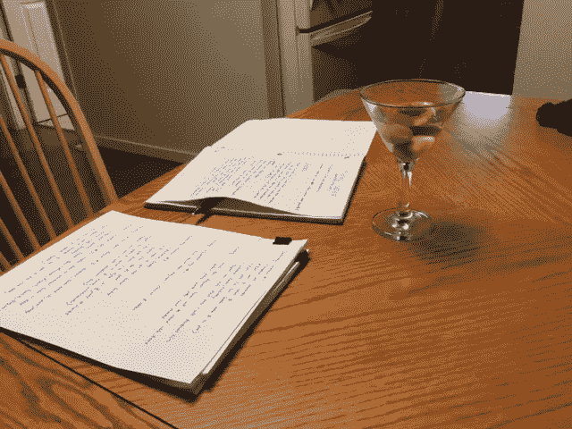

# 我是如何骗自己写小说的

> 原文：<https://medium.com/swlh/how-i-tricked-myself-into-writing-a-novel-d726953979b6>

My happy place: writing. Also, a martini.

在我生命的大部分时间里，我一直想写一些伟大的东西:一些字数令人印象深刻的东西。一本小说。最理想的是，一本写得好、读起来愉快的小说，能卖出一百万本，在 GoodReads 上获得五颗星，让我有资格成为我这一代最伟大的加拿大作家。

然而，尽管收集了书架上积满灰尘、半满的笔记本，尽管有英国文学学位和…