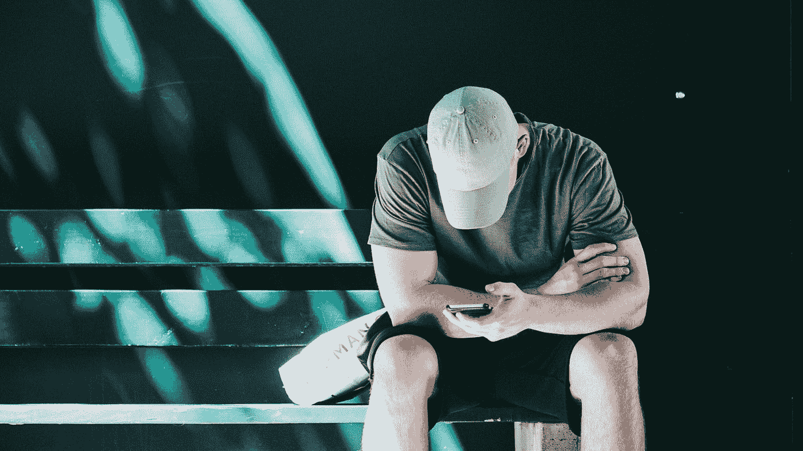

# 我是如何利用周末假期改掉坏习惯的

> 原文：<https://medium.com/swlh/how-i-used-a-weekend-getaway-to-break-a-bad-habit-832dc242f950>

## 这是一个科学支持的习惯黑客，出奇的简单

Photo by [Courtney Clayton](https://unsplash.com/@courtneyrclayton?utm_source=medium&utm_medium=referral) on [Unsplash](https://unsplash.com?utm_source=medium&utm_medium=referral)

值得注意的是，我甚至没有真正尝试过。

前几周，我和一个朋友去度周末假，留下了丈夫、孩子，显然还有我经常用手机查看社交媒体的习惯。