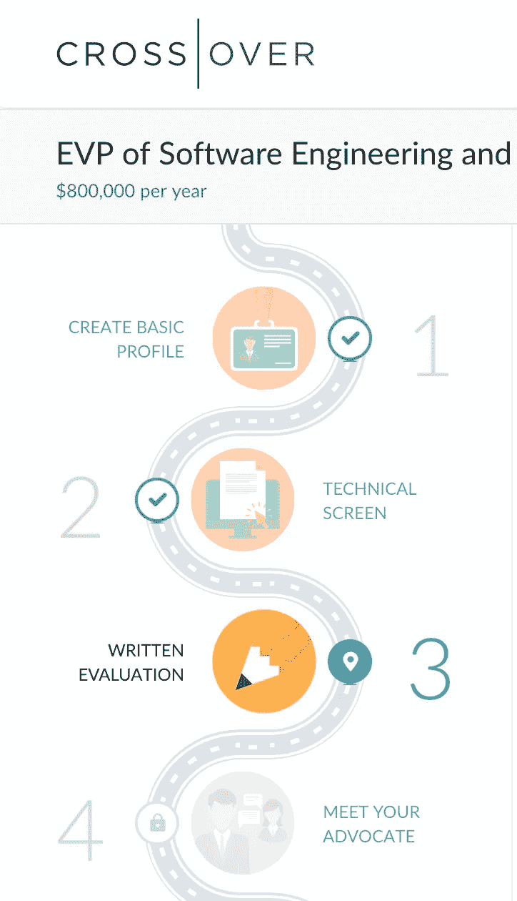
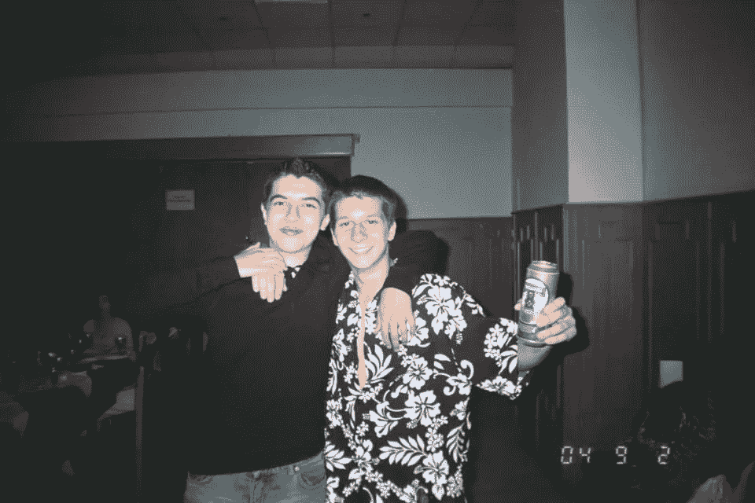
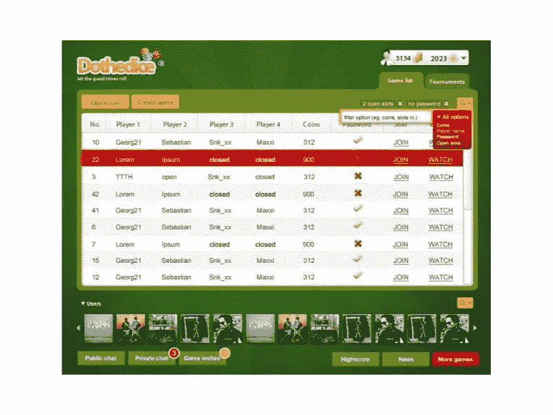
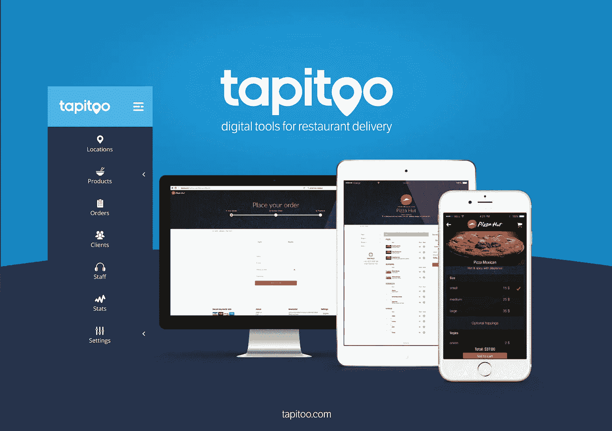
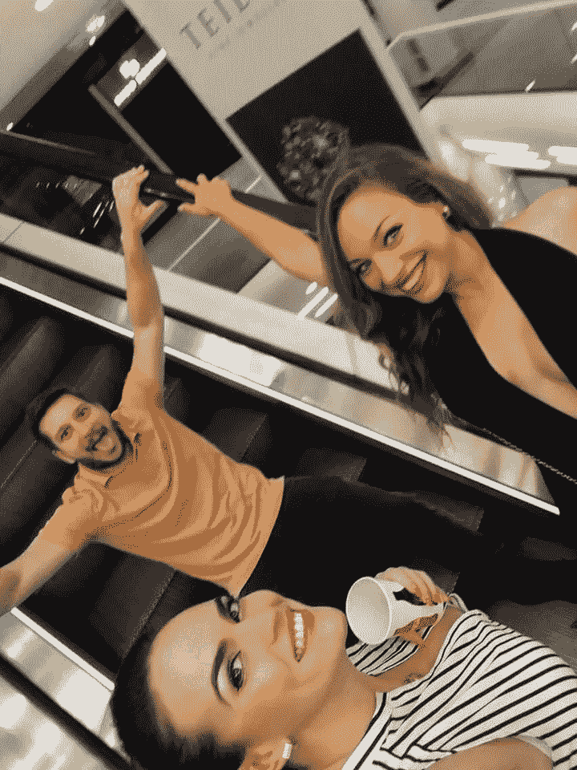
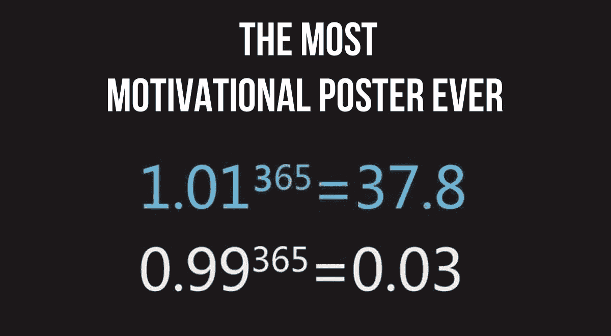

# 我是如何几次从六位数变成破产的

> 原文：<https://medium.com/swlh/how-i-went-from-a-6-figure-income-to-broke-several-times-64d6d338c86c>

你听说过成功的故事——那个 17 岁的孩子每 13 秒钟就赚了几百万。我可以向你保证，我的故事更可信。

警告:此内容可能会令人反感。也许是吧。这当然是毫无歉意的。继续进行，风险自负。

当我告诉我的大学老朋友我最近的创业想法以及我如何验证其中一个想法时，他承认我正在解决的问题很大，解决方案很好，并告诉我应该雇用两个人，在获得客户的同时开始生产产品。

“但是我没有钱做那件事”，我面无表情地告诉他。

当他狂笑的时候，咖啡从他嘴里流了出来。我有时和我的朋友开这样的玩笑，但这是严肃的，当我重申这个信息时，他变得越来越开心。

“是啊，没错！所以，在过去的几年里，你的收入超过了 6 位数(以美元计)，拥有一栋房子，开着一辆 6 系汽车，却没有 2 万美元可以花。”

当我从一名软件工程师一路稳步上升到首席架构师的职位时(我现在处于最后阶段，正在面试一个有交叉业务的 EVP 职位)，我几乎把所有的收入都投入到了几个项目中。30 岁，在银行几乎为零。

我总是着迷于积累财富。在大规模转型时期(从共产主义到狂野的西方资本主义)的东欧长大，无疑是一次爆炸。我们穷得会对耐克鞋惊叹不已。每当朋友要买一双，我们都会仔细检查，看看它们是不是廉价的仿冒品。对我来说，财富是你产生积极影响的记分牌——只要你不去偷窃和欺骗。

我非常感谢我所见证的一切——我参与了新工业革命的三次浪潮，参与了全球对话和价值交换，目睹了生活水平的不断提高，并通过远程软件工作得到了放大。

Me(right) at a friend’s birthday party, around 2004\. Heavy ex-soviet ambient.

在 19 岁开始我的第一笔风险投资业务之前，我有一个干净的记录。我没有做任何失败的事情，包括建立一家互联网服务提供商公司，并在 18 岁时成功出售。然后，随着我的抱负和我接受的挑战的增长，压力和欺骗也在增长。

我的第一次失败来自于建立一个网上赌场。在获得 5 万美元的初始投资后，我缓慢而痛苦地意识到我还不适合领导。我犯了所有的错误:没有很好地委派，在功能方面做得过多(有一段时间我们在建立几个业务，而不是专注于我们产品的核心)并且没有承认我在软件工程方面缺乏高级技能(我只写了 3 年的软件，做了一些小项目)。

11 years later it doesn’t make me anxious anymore

那次经历让我崩溃，在接下来的 3 年里，我一直焦虑和暴力恐慌。这主要是由于我的期望和现实之间的差异。

2011 年左右，在做了大部分远程工作后，我再次跳上了创业列车。这是订餐应用热潮出现的两年前，我们正好赶上了。到目前为止，我的软件构建技能很强，但是我最大的错误是雇佣了 B 级玩家，我们永远不能按时交付。尽管我们在成长，需求也在，但我还是决定关闭这家自举公司。它不会制造任何新闻，也不会带来任何数十亿美元的收入(尽管我们相对轻松地以每月 70 美元的价格出售一款 SaaS 产品)。事后看来，继续增长是件好事。即使我们每个月只卖出 4 份没有客户流失的新订阅，到现在我们已经拥有了大约 400 名超级忠实客户。

“从现在起 7 年后，每月仅 2.8 万美元？噗噗……——老我了。我的父母不相信我，我的朋友不相信我。他们会拍拍我的背，并给对方一个意味深长的眼神。我卖掉了公司，但很快花光了所有的钱，我很快就破产了，并再次收缩。

我的饮酒和聚会越来越不受控制，可能每周出去 3 到 5 次，并严重喝醉。美好时光，我想我需要它。有一次，我和我的(喝醉的)朋友偷了几个灭火器，并在一大早堵住了镇上的一条主要街道。一辆警车从雾中出现，那天我们用吸管喝咖啡。但那是后话了。

i have GB of this

我显然需要重新开始，所以我去了加那利群岛，在那里呆了几个月。一个朋友问我理想中的一天会是什么样子，我说我会住在海滩附近的某个地方，从事有意义的、艰苦的、高科技产品的工作。为什么不做呢？

那时，我正在为一些 Neo4j(图形数据库)项目做贡献，我遇到了在那里的 GrapheneDB 团队。我们开始一起工作。直到今天，图表仍然让我着迷，这个领域的工作可能是最有收获的，无论是在智力上还是在影响力上。

回家后，我担任了一个不重要的角色，即首席架构师。两年的时间几乎悄无声息地过去了，我在职业上不断成长，并领导了 30 人的团队。

去年夏天，我与以太坊基金会(Ethereum Foundation)开始了一项安全工具的尽职调查，该工具将生成自动测试，以突出智能合同中的漏洞。他们让我怀孕了，承诺预付 40 万美元，然后把过程拖到停顿。我花了大部分积蓄在这个项目上，还有一辆车。银行存款不足 1000 美元，没有收入，我开始寻找选择。

在经历了所有的高潮和低谷后，我的信心非常好，我诚实地保持冷静和集中，知道我会再次上升。

我很快得到了一份做内容营销的合同，每周收入 750 欧元。我决定投资这笔钱来推广我的图形数据库咨询业务——我吸取了 Crossover 关于建立软件工厂的经验教训，并提出了[一个公司利用图形力量的好剧本](https://mihairaulea.github.io/GraphConsultingServices/)。做了几次免费咨询。短短一周之后——砰！，我的第一个顾客。

在这一点上，我 100%致力于解决图形领域的难题和创新，同时为公司带来巨大的投资回报。我确实从我的经历中学到了很多。与 AAA+的人一起工作是必须的。委派和领导软件项目是一门艺术。除非你验证了这个想法，否则永远不要构建任何东西(看看精益创业，它会为你节省很多美元美元)，时机很好，市场支持大增长(因为最终，这将决定你的成功)。这个清单可以一直列下去。

为什么要选择 graph consulting，尤其是这份年薪 80 万美元的工作就在眼前？

在过去的 12 年里，我参与了令人惊叹的、世界首创的突破性项目。我学了，学了又学。我成长了很多。但是我的努力都没有效果。

我在伦敦工作的咨询公司从 7 名顾问发展到 37 名。Neo4j 同比增长 50%。GrapheneDB 增长了好几倍。这个清单很长，但是你可以想象一下。我没有复合任何价值，主要是由于缺乏重点。当两种截然不同的概念相互渗透时，创新就产生了。也许我以前的经历会让我有能力想出一个秘密。我相信一切都会水到渠成，我会利用我所学到的一切。

但是我想现在是我专注于一件事的时候了，特别是因为我对这个主题充满热情和好奇。在接下来的一年里，我将在另外 5 名顾问的帮助下，通过使用一个零废话、零时间损失的工厂剧本，帮助 50 家公司解决以前不可能解决的问题，从而带来最大的投资回报。附带问题:对于图形数据库的采用动针。

为我祈祷吧！

## 这篇文章发表在[《创业](https://medium.com/swlh)》上，这是 Medium 最大的创业刊物，有+423，678 人关注。

## 订阅接收[我们的头条新闻](https://growthsupply.com/the-startup-newsletter/)。

