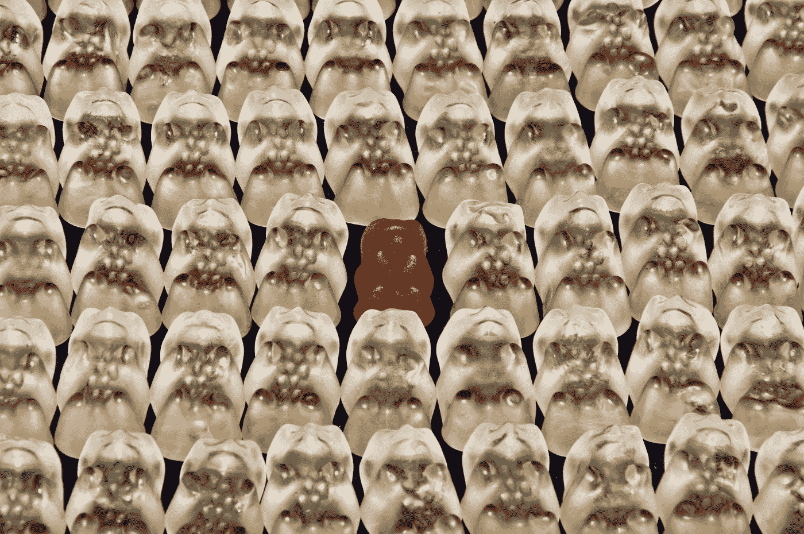

# 我在招聘时有多么偏见

> 原文：<https://medium.com/swlh/how-im-biased-when-it-comes-to-hiring-b565692fb631>

关于我的无意识偏见，我学到了什么，为什么有些偏见是好的。

# 我的第一次招聘经历

几年前，我去加拿大学习计算机科学。身无分文的我决定推出一个已经酝酿了一段时间的商业创意:给人们送蛋糕。

几个通宵之后，我把生意做好了。在创建了一个像野火一样传遍当地校园的脸书事件后，我上了大学的报纸——尽管我实际上并不是那里的学生。

这让我有了第一次招聘的经历。考虑到气温是零下 30 摄氏度，而且我没有驾驶执照，我需要一名送货司机。工作规范非常简单。

*   他们需要拥有一辆汽车
*   他们需要在周五和周六晚上有空
*   他们需要在两天内出发
*   他们需要接受 50 美元的现金，因为我还没有想出如何向加拿大政府纳税

三个人申请，一个人决定不能放弃他们的周五晚上，另一个人不能那么快开始，第三个人接受了这份工作。录用了！

事实证明，我经营蛋糕配送业务的经验并没有真正帮助我在创业公司招人。

# 招聘做错了

我的第二次招聘经历是为 Spill 招聘我们的第一位顾问。我对心理咨询略知一二(我妈妈是心理咨询师，我爸爸是临床心理学家)，但我对最佳招聘实践以及如何成为一名优秀心理咨询师的了解有限。我犯了很多错误。

我当然有偏见，这种偏见是我从生活中带到招聘过程中的。而且，就像初创公司的许多事情一样，这个过程时间紧迫。以下是我做错的几件事:

**偏见一:声音**

他们的口音让我产生了偏见。我通过电话和每个人交谈，我注意到每当我挂断电话，我首先评论的事情之一就是他们的声音听起来像什么。我会说这样的话:“他们听起来真的很好”或“辉煌的口音”。

**偏差二:图片**

当我浏览咨询目录时，我会把他们的照片作为主要的数据点，在我决定是否点击他们的个人资料时使用。我会一直点击那些有专业照片(由专业人士用专业相机拍摄)的人。

**偏向三号:北方**

我还注意到，在电话采访中，我特别喜欢北方的辅导员。我来自约克，在我的日常生活中，我总是发现我对其他北方人有一种亲切感。我意识到，在电话里，我给了北方辅导员更多的自由。

**偏差四:性别**

我对女辅导员有偏见。我年轻时遇到过很多来我家咨询的人，他们都是女性。除了善意狩猎，电视上大多数伟大的顾问和治疗师都是女性。

我们的第一个顾问是一个利物浦人，名叫雷切尔。

Photo by [Markus Spiske](https://unsplash.com/photos/QozzJpFZ2lg?utm_source=unsplash&utm_medium=referral&utm_content=creditCopyText) on [Unsplash](https://unsplash.com/search/photos/racism?utm_source=unsplash&utm_medium=referral&utm_content=creditCopyText)

# 我们都有偏见

显然，我是一个非常糟糕的招聘经理。我对人做了一些基本的假设，这些假设只基于我自己的感知。这很大程度上是因为我缺乏经验，有些是因为我是个白痴。我应该向以前成功做过这件事的人寻求更多的帮助。

自从雇佣了我们的第一个顾问，我们已经改变了我们的招聘程序，很多。这些变化归功于溢油应急小组，他们比我聪明得多，也更有经验。我们已经采取了一些措施来避免无意识的偏见。

然而，雇佣顾问的经历让我对自己持有的偏见思考了很多。我想我当时确实意识到了其中的一些偏见——比如我对有专业照片的人有偏见。该理论认为，如果你有一张专业的照片，你就更有可能在你工作的其他领域变得专业。这个想法延伸到了今天很多招聘的方式。当我们阅读简历时，我们会忽略那些有拼写错误的人，因为这显示了“粗心大意”。

我们在溢出时谈论这个话题很多。我们都同意，顾名思义，雇佣是有偏见的。你实际上是在歧视某些你用来决定某人是否擅长某项工作的代理人。通过找到合适的衡量标准，你可以更准确地判断这个人是否适合这个角色。目标应该是找到正确的代理人，并对他们有偏见，而不是错误的。

# 如何(正确地)偏向

我们在 Spill 的解决方案是创建一个面试流程，衡量这个人将要扮演的角色。这样，我们就能以正确的方式产生偏见。

例如，我们对写作不好的人有着难以置信的偏见。我们是一个基于信息的治疗应用程序，我们发现用户对语法不好或在写作中犯明显错误的人感到厌烦。这就是为什么我们面试过程的四个阶段中有三个是通过书面形式或模拟完成的。

在给申请人打分之前，我们把名字从申请中去掉了。名字并不是衡量一个人是否会成为一名好顾问的有用标准，所以为什么要显示它呢？我们也避免显示任何年龄指标。我注意到，当我和朋友谈论 Spill 时，他们会立刻认为我们的辅导员一般都比较年轻。“我猜年轻的辅导员喜欢处理泄漏问题，因为他们对这项技术更熟悉。”。这是我没有持有的少数偏见之一，因为我的父母非常精通技术。

最后，我们总是有多人阅读申请，每个人都独立提交反馈。我们使用 1-4 的排名系统来衡量一些指标，如他们写得如何，他们如何有效地传达同情和理解，以及他们是否准确理解“提出的问题”。

# 总结

我们已经尝试了很多东西，很明显，我们一直在努力改进我们能改进的地方。在招聘中“有偏见”有很多负面含义。我认为不应该，你只需要知道你是否想对某件事有偏见——否则，每个人最终都会得到这份工作！我很想多听一些关于招聘的经验。比如什么对你有用，什么没用。你可以在 calvin@spill.chat 上联系。另外，如果你想知道更多，你可以看看由 Spill 写的[更多故事。](https://medium.com/spill-stories)

感谢阅读！

## 这篇文章发表在[《创业](https://medium.com/swlh)》上，这是 Medium 最大的创业刊物，有+420，678 人关注。

## 订阅接收[我们的头条新闻](https://growthsupply.com/the-startup-newsletter/)。

