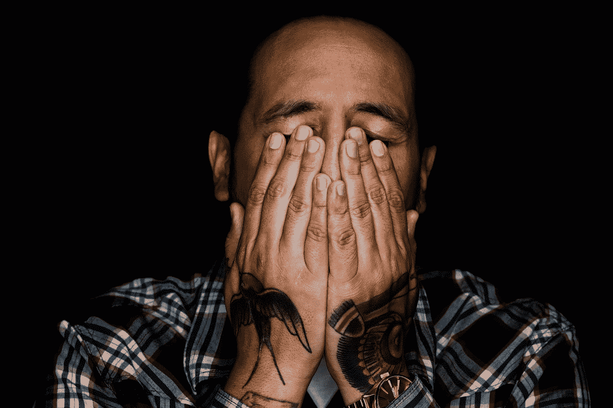

# 我是如何学会拥抱痛苦、困难的感觉的

> 原文：<https://medium.com/swlh/how-im-learning-to-embrace-painful-difficult-feelings-1b5a313ef1f3>

## 我们不拥有的，最终会拥有我们。

Photo by [Ayo Ogunseinde](https://unsplash.com/@armedshutter?utm_source=medium&utm_medium=referral) on [Unsplash](https://unsplash.com?utm_source=medium&utm_medium=referral)

在大学里，我的两个好朋友背叛了我。

这不是一个有趣的故事，我确信我在这场冲突和友谊不可避免的破裂中扮演了一个角色。众所周知，在大多数情况下，真的没有完全无可指责的一方。