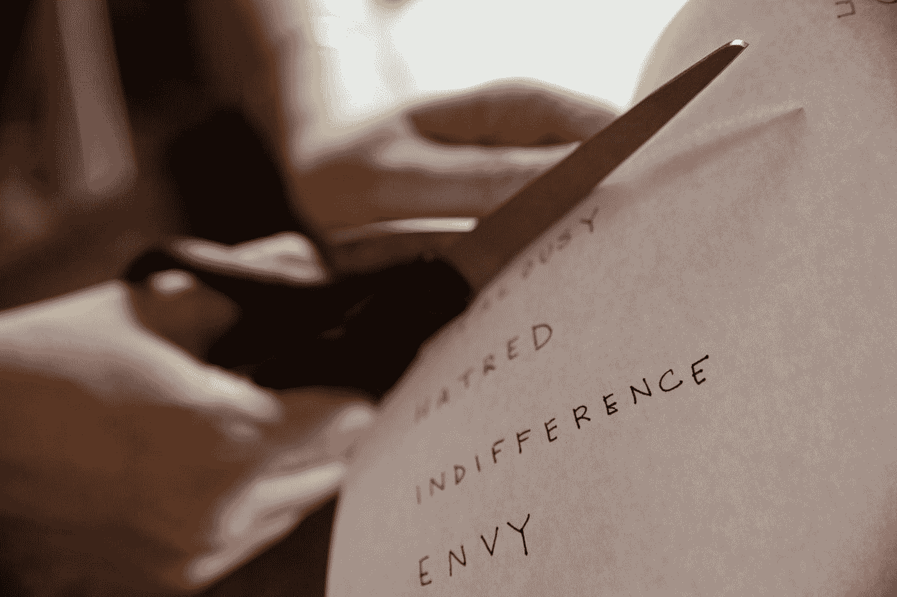

# 我是如何学会将嫉妒转化为优势的

> 原文：<https://medium.com/swlh/how-im-learning-to-turn-my-envy-into-an-advantage-fb286c33485d>

## 它可以成为一种强大的动力，也是一条重要的线索，让你明白自己在生活中真正想要的是什么

Photo by [Pro Church Media](https://unsplash.com/@prochurchmedia?utm_source=medium&utm_medium=referral) on [Unsplash](https://unsplash.com?utm_source=medium&utm_medium=referral)

嫉妒是最不愉快的情绪之一。

韦氏词典将嫉妒定义为“痛苦或怨恨地意识到他人享有某种优势，并渴望…