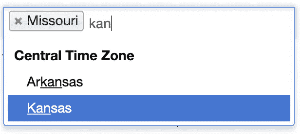
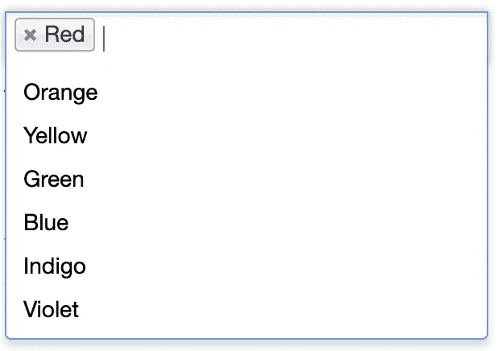
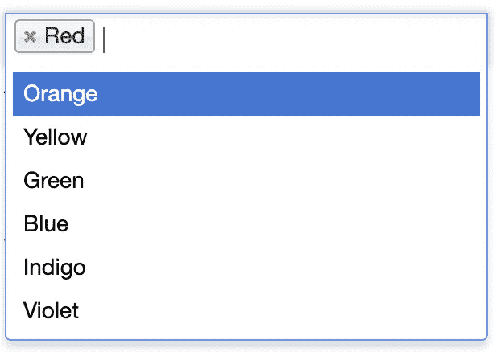
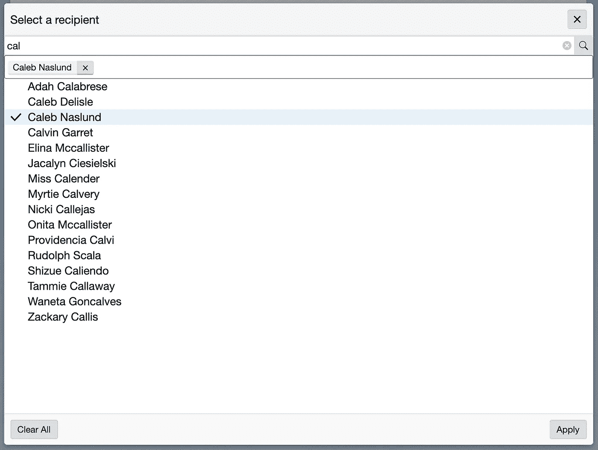

# iOS VoiceOver 如何展示 React 的强大功能和灵活性💪

> 原文：<https://medium.com/swlh/how-ios-voiceover-demonstrates-the-power-and-flexibility-of-react-5369679b6a6b>


React.js Logo

我最近有幸参与了一个优先级极高的项目，该项目旨在修复多选组件中的一个可访问性缺陷。首先，我将讨论我们在处理什么，以及为什么这是一个问题。然后，我将介绍我们是如何解决潜在问题的。

TLDR:iOS voice over 是新的 IE 浏览器🙅‍♂️和反应是真棒😎

我们开始吧！

假设有一个遗留解决方案目前处于生产和维护模式。该解决方案使用了贵公司已经放弃的技术堆栈，而您对此一点也不熟悉。有一个怪异的结构，模板，还有一堆你不懂的代码。您所知道的是，在通过一些 jQuery 呈现的非浏览器原生的选择/下拉列表中有一个可访问性缺陷。

好吧，假设先不说，这个组件实际上首先通过 Django 模板呈现，然后用外部依赖项增强/修饰。这个组件实际上使用了一个[流行的 JavaScript 下拉库:Select2](https://select2.org/) 。



Select2 Multi-Select Example

问题是 Select2 并没有为 iOS VoiceOver 用户提供良好的用户体验。这是为什么呢？好吧，这一切都归结为两件事:苹果对 iOS VoiceOver 虚拟指示器的启发是出了名的糟糕，当你是一个网络应用程序时，没有可访问的 API(感谢苹果😒).但是，把责任推给苹果公司(虽然有道理😤)并不能解决客户发现的问题。作为一名工程师，我们应该解决问题，所以让我们解决它！在我们修复它之前，我们必须了解问题。

# 理解问题🤔

那么虚拟指示器是如何工作的呢？在很大程度上，它遵循正常的 DOM 结构和 tabIndex 排序。一般来说，焦点在哪里就是虚拟指示器在哪里(除非它不在！).当 DOM 中的某个东西在视觉上只是一个兄弟*时，它就崩溃了。*这通常是通过在正常的 DOM 流之外呈现内容(例如，在主体的末尾)并应用 CSS 转换使新内容出现在兄弟内容旁边来实现的。

你怎么会陷入这种境地？模态、弹出窗口和下拉框。无论是好是坏(肯定是坏🙃)，我们的 UX 部门喜欢用模态、弹出窗口和下拉菜单构建复杂的工作流。尽管如此，严肃地说，对他们大声喊出来🗣是一个很好的帮助，引导我们通过这个问题🙌。

网络开发是一种工程，工程带来了权衡。Select2 也不能幸免。

Select2 是如何工作的？嗯，这里有一个简化的解释。假设您在一个表单中有一个多选工作流，并且有一个数据列表可供选择，如下所示:

```
const data = ['Red', 'Orange', 'Yellow', 'Green', 'Blue', 'Indigo', 'Violet'];
```

给定这个列表，在一个简化的世界中，当您在一个隐藏的输入(用于表单提交)周围呈现一个 Select2 多选时，您的屏幕将看起来像这样:



Example Select2 rendering given the data list of colors above

您对应的 DOM 可能如下所示:

DOM layout of a trivial Select2 Example

请注意，Select2 结果不是 Select2 容器的直接同级。这是 iOS VoiceOver 出错的地方。

再看一下上面 Select2 下拉菜单的截图。您认为 iOS VoiceOver 虚拟指示器会有什么表现？

如果你回答说下一次导航滑动是在下拉选项上，那么你就大错特错了，我的朋友😢。[窟](https://www.destroyallsoftware.com/talks/wat)。确实是水..



This is NOT what iOS VoiceOver navigates to next when focused on the input

敏锐的眼睛会注意到在 Select2 容器 div 和 Select2 下拉 div 之间还有另一个可聚焦的元素: ***提交按钮*** 。在更复杂的表单中，在下拉列表和提交按钮之间会有许多不同的字段，这只会加剧问题。

iOS VoiceOver 实际上做的是浏览整个 DOM 的其余部分，然后是下拉选项。 对，就是那么差。

# 用反应🛠修理坏掉的东西

既然我们已经了解了我们是如何走到这一步的，那么我们是如何用 React(和原生浏览器 API)解决这个问题的呢？

还记得上面的例子中有一个隐藏的输入吗？嗯，我们也有一个从 Django 模板生成的。我们正在处理的特定隐藏输入被赋予了一些便利的[数据属性](https://developer.mozilla.org/en-US/docs/Learn/HTML/Howto/Use_data_attributes)，我们可以用它们作为道具传递给一个 React 树。有一些属性，如`placeholder` *、* `maxSelection` 计数，如果数据是异步获取的，还有一个`searchUrl`。还有一个我们可以用作选择器的属性，它可以是以下两种情况之一:`data-dynamic-list`或`data-dropdown-list`，前者是异步加载的数据，后者是典型的静态下拉列表。

React 最酷的一点是它非常灵活。你可以把它添加到网站上。让这个变得如此酷的是，只要有一个容器，你就可以[在里面渲染 React 组件。](https://reactjs.org/docs/rendering-elements.html#rendering-an-element-into-the-dom)在我们的例子中，我们有一个容器，它是隐藏输入的父组件，标有`data-dynamic-list`或`data-dropdown-list`属性！我们所需要的只是一点本地浏览器 API 的魔力，我们已经拥有了🎯：

Get all the dynamic and dropdown lists on the page

现在我们已经有了页面上的每个列表，我们可以用一个容器替换它们，并在其中呈现我们的自定义 React 代码！请注意，如果有多个动态和/或下拉列表，这将在页面上生成多个反应树😉

在此之前，我们只需要从列表元素中提取出`dataset`,然后将它们作为道具传递给 React 树。这可以简单地做到:

```
const { dataset } = element;const {
  isMultiple,
  placeholder,
  maxSelection,
  // etc,
} = dataset;
```

现在，由于我们希望完全控制树，因此隐藏用于表单提交的输入或选择，我们可以用我们的容器替换它:

Replace the given node with a React tree container

现在剩下要做的就是把它们放在一起，并呈现我们的定制组件。

Render Our Custom React Select2 Dynamic List Replacement

有了这种完全的控制，我们可以使用 [refs](https://reactjs.org/docs/refs-and-the-dom.html) 的魔力来操纵隐藏的`input`和/或`select`节点。

# 结果是:请击鼓..🥁

那么，做了这么多工作，我们有什么可展示的呢？嗯，我不能展示其余的代码(公司机密🤫😉).然而，我们现在有了一个响应迅速且可访问的多选异步下拉菜单！



Responsive and Accessible Asynchronous Multi Select Dropdown

我们最终响应性地呈现了一个模式，其中下拉选项是搜索输入的直接兄弟。然而，我们遇到了一些有趣的问题。

通常在网络上，窗口大小足以检测移动设备。然而，我们的客户经常在 iPads 上操作，这可能比典型的移动屏幕尺寸大得多，如果我们只注意窗口宽度，它看起来就像是一个桌面设备。因此，我们检测我们是否在移动断点或者是否`'ontouchstart' in window`(比用户代理字符串解析更好🙌).

当我们打开模态时，虚拟指示器最初并没有向它移动。为了解决这个问题，我们使用了一个 ref 来聚焦右上角的 close 按钮。我们最初试图专注于`h1`标题，但 iOS VoiceOver 真的只喜欢当你以编程方式将焦点转移到 ***可交互元素上时。*** 🎶*像周日早晨一样简单*🎶

对 UX 来说，同时出现`X`(关闭)和`Apply`按钮是一个有趣的选择。这意味着点击`X`将取消您的更改，而点击`Apply`将提交它们。因此，当每个下拉列表中所选内容的状态为[提升](https://reactjs.org/docs/lifting-state-up.html)时，我们需要在打开的模态组件中维护一个*本地状态*。只有当我们点击提交时，我们才会提交(应用)我们的更改。因此，我们用父节点的当前状态初始化本地选择状态，然后保持本地选择状态正常🎣)。当用户点击`Apply`按钮时，我们会通过`onApply`回调将本地选择状态传递回父节点。相当整洁📸

Handling Local Modal State

# 最后🎬

到目前为止，这个项目绝对是我最喜欢的项目之一。这很有挑战性，也很有收获。作为工程师，有时 OS 或 API 中的限制似乎会阻止我们前进。不过，很多时候，这只是一个展示我们思维能力的机会，为一个复杂的问题提供一个新颖的解决方案。在解决这个问题的过程中，我确实学到了很多关于浏览器 API 和 React 的能力，以及获得正确的可访问性有多难。我还要感谢一路上帮助我的工程师们，以及我们的 UX 部门，他们在如此短的时间内为我们提供了视觉效果和不同的工作流程🚀。

在此之前，我已经是 React ⚛︎的超级粉丝了，但这无疑巩固了我对该框架的欣赏。我希望你已经学到了一些东西，并享受阅读。请在下面的评论中告诉我你的想法！✌️

【https://codyaprice.com】亦发表于[](https://codyaprice.com/the-best-practice-is-shipping/)**。**