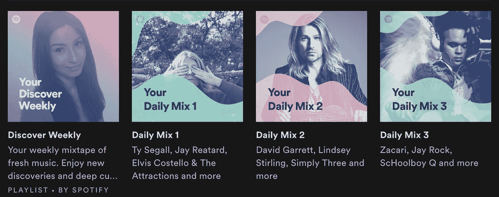

# Spotify 欣欣向荣的推荐系统如何成为一个新的广告平台

> 原文：<https://medium.com/swlh/how-is-spotifys-thriving-recommendation-system-becoming-a-new-advertising-platform-a2b97ffe2012>

# Spotify 简介

对于那些不知道的人来说，Spotify 是瑞典的音乐流媒体服务，于 2008 年推出，拥有大约 1 亿付费用户和另外 1 亿免费增值服务用户，这是一种广告支持的模式。用户贡献了该公司 90%的收入。