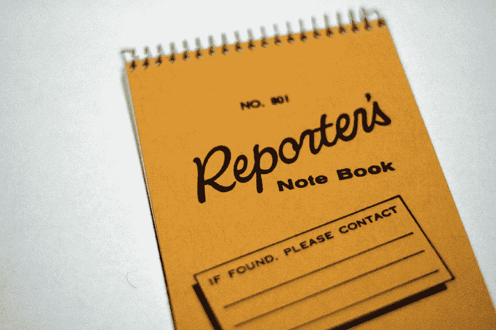

# 新闻业如何帮助你成名

> 原文：<https://medium.com/swlh/how-journalism-can-help-you-create-a-name-d880c74c55e1>

我的第一份职业，新闻业，教会了我很多关于营销的宝贵经验。事实证明，新闻业也是名字和标语发展的智慧源泉。

新闻业的 ABC 是五个“w”——*谁、什么、何时、何地、为什么*——加上 H 代表*如何。*以下是他们如何帮助你写出[一份可靠的命名摘要](http://nancyfriedman.typepad.com/away_with_words/2009/07/why-you-need-a-naming-brief.html)，从而引出一个伟大的名字或口号。

Photo by flickr/niclas