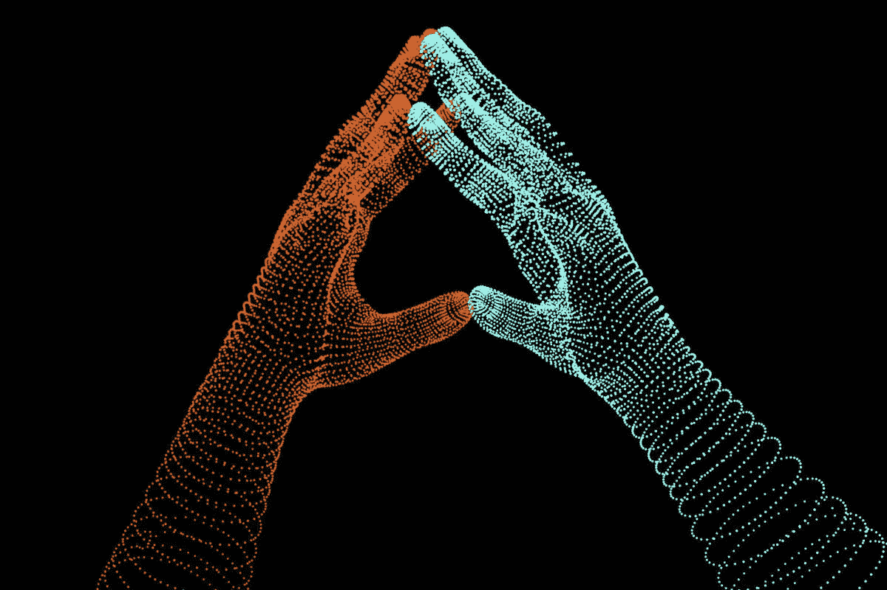

# 在数字时代，领导者如何促进联系，而不是分离

> 原文：<https://medium.com/swlh/how-leaders-can-foster-connection-not-separation-in-the-digital-age-5483ac19b706>

Creating Human, But Digital Connections

最近 IWG 对 96 家公司 18000 名员工的调查显示，大约 70%的全球员工每周至少远程工作一次。弹性工作机会越来越多，节省了时间和金钱，同时[提高了整体生产力](https://cdn2.hubspot.net/hubfs/443262/pdf/TINYpulse_What_Leaders_Need_to_Know_About_Remote_Workers.pdf)。然而，新的统计数据表明 [49%的远程员工](https://buffer.com/state-of-remote-work-2019)正为与数字工作空间相关的健康问题而苦恼…