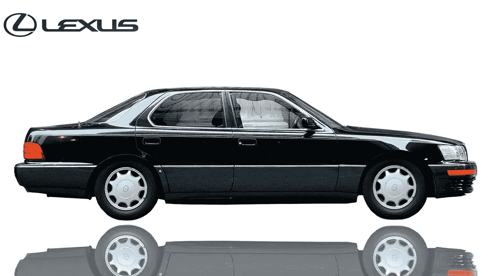

# 雷克萨斯如何将第一次失败变成最大的胜利

> 原文：<https://medium.com/swlh/how-lexus-turned-its-first-loss-into-its-biggest-win-ccece35ae3a1>

1989 年最后一个季度，丰田发现自己处于尴尬的境地。该公司刚刚推出了雷克萨斯系列，同年 9 月首次推出 LS400 车型。到 12 月份，已经售出 8000 辆汽车，看起来丰田确实有机会打入美国的豪华车市场。一切都很顺利，直到两名 LS400s 的司机报告了他们的[巡航控制](https://www.autonews.com/article/20060327/SUB/60322012/how-a-recall-earned-lexus-a-top-reputation)的一个小问题。雷克萨斯本可以等待更多的问题出现，但由于豪华系列处于起步阶段，雷克萨斯做出了一个大胆的举动，主动召回了所有已售出的 8000 辆 LS400s。

The 1989 Lexus LS400, (SuperSedans YouTube channel).

正如马尔科姆·格拉德威尔在他的书 [*引爆点*](http://onebiteatatime.tumblr.com/post/548782421/excerpt-from-malcolm-gladwell-on-mavens) 中详细描述的那样，雷克萨斯召回 LS400 的决定与该公司此后取得的成功密不可分。格拉德威尔强有力地证明了雷克萨斯处理召回的方式至关重要——在召回当天给每位 LS400 车主打电话，在执行召回时洗车并给油箱加满油，并派一名机械师到距离雷克萨斯经销商 100 英里或更远的车主家中。格拉德威尔认为，雷克萨斯从召回中获得的最大好处来自于当时拥有雷克萨斯的消费者类型。

格拉德威尔称之为“汽车专家”,他们构成了雷克萨斯的消费者基础。那些在雷克萨斯投产第一年就购买了该公司汽车的人，很可能对汽车有着浓厚的兴趣，也可能有喜欢汽车的朋友，即使不比他们更喜欢汽车，也和他们一样喜欢汽车。通过发布召回，雷克萨斯发出信号，他们提供最高质量的服务，这是仅靠销售几千辆漂亮闪亮的汽车无法在全国范围内建立起来的。从这个意义上说，这次召回既是对雷克萨斯品牌的投资，也是工厂的失误。

事后看来，这次召回似乎是天才的过度反应。没有办法衡量召回对雷克萨斯品牌的经济效益，但很明显，召回对汽车生产线第一年的典型影响被压制了。甚至值得考虑的可能性是，雷克萨斯的 LS400 车型可能根本没有问题。如果做得好，公司可以提供“优秀”的客户服务，如果他们编造一个可修复的问题，然后在修复问题的同时提供一流的服务。当然，消费者不喜欢不方便，但如果消费者因为不方便出现时受到关注而对公司有更好的看法，那么公司有目的地采取行动弥补缺陷可能是有益的。

没错——这样的活动会花费大量的金钱，但是如果活动不仅仅作为服务信号，而且作为一种有效的广告形式，这是值得的。一个潜在的雷克萨斯购买者看到的不是一个广告，鼓励他们购买“[对完美的不懈追求”](https://www.youtube.com/watch?v=D4qnl19axAU)的车型，而是潜在的雷克萨斯车主在咖啡厅听到他们的同事说，“猜猜当他们召回我的车时，雷克萨斯做了什么？”虽然不是故意的，但雷克萨斯发生的最伟大的事情可能是两名司机抱怨汽车的巡航控制。

即使雷克萨斯伪造了召回事件，这与今天公司追求影响客户产品预期的做法也没有太大区别。试想一下，一家航空公司为其每趟航班增加了 20 分钟的预期飞行时间。公司必须领先一步才能在竞争中领先一步，如果做得好，制造一个可修复的问题可能会做到这一点——只要没人发现。