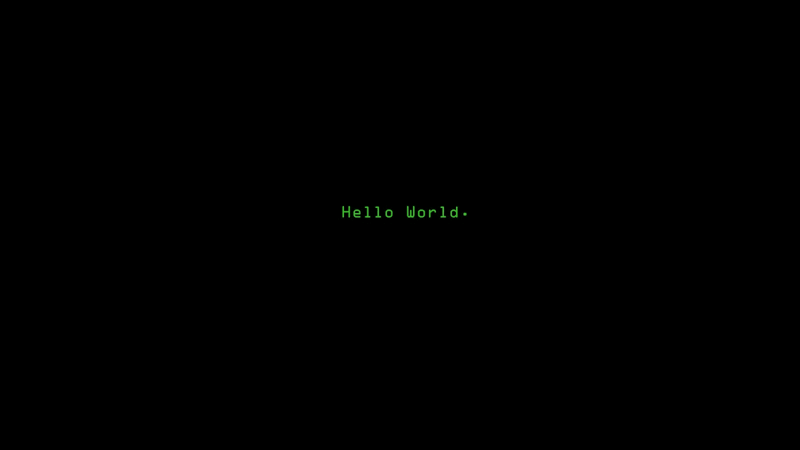

# 代码行如何让火箭爆炸？

> 原文：<https://medium.com/swlh/how-lines-of-code-made-a-rocket-explode-77df73deb0a4>

***世界上最昂贵的软件 bug 的故事。***

1996 年 6 月 4 日，天气晴朗，就在著名的发射 37 秒后，阿丽亚娜 5 号火箭向错误的方向翻转了 90 度。任务控制中心的关键警报开始响起；在法属圭亚那海岸。

火箭正在做一个不必要的突然的航向修正，以补偿一个…