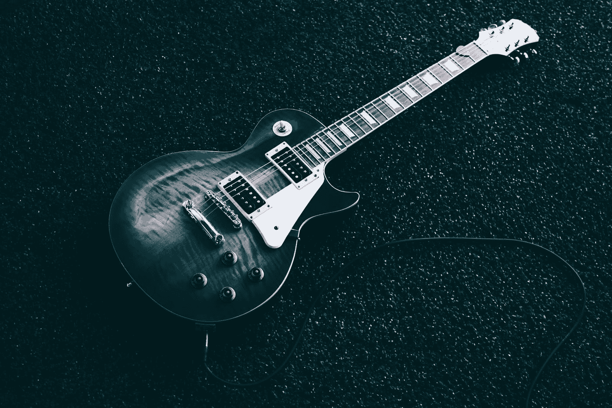

# 听摇滚如何让我成为一个更好的作家

> 原文：<https://medium.com/swlh/how-listening-to-rock-roll-made-me-a-better-writer-eb633c29ad84>

Photo by [Jeremy Allouche](https://unsplash.com/@labandestyle?utm_source=medium&utm_medium=referral) on [Unsplash](https://unsplash.com?utm_source=medium&utm_medium=referral)

怪异而神秘的文字作品。

我当时 13 岁，刚刚和人上床。那是我的第一次。摇滚乐的生活方式像不可否认的诱惑一样吸引着我。

我们在一次学校舞会上相遇。这似乎是命运。我们随着“让我们疯狂”旋转，这是王子的一首难以置信的歌。