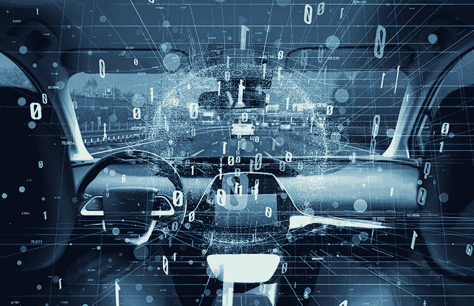
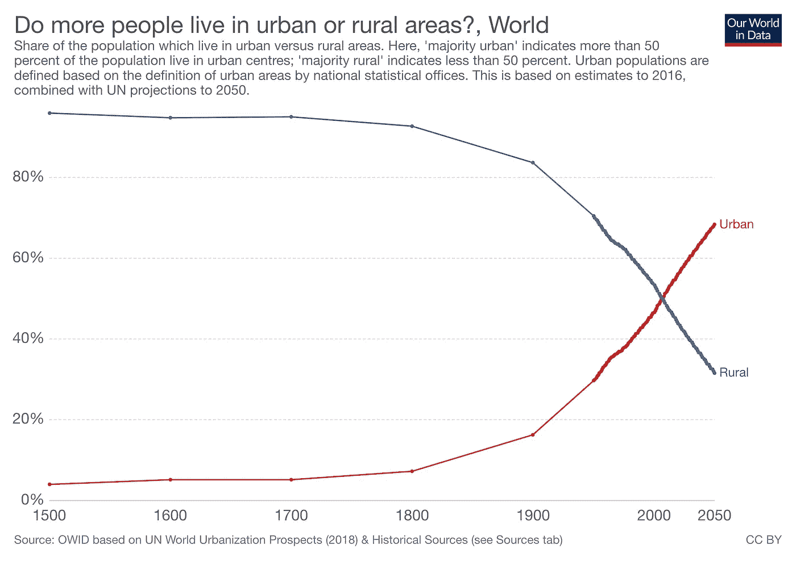

# 由于汽车的商品化，汽车制造商转向何处以及为什么

> 原文：<https://medium.com/swlh/how-major-automobile-manufactures-need-to-move-towards-car-as-a-service-d0bdd237ef2f>

世界各地的汽车制造商已经开始意识到汽车行业最大的颠覆性威胁——汽车的商品化，这意味着对汽车的设计、效率和其他特征属性的漠视。最近的几个趋势导致了这一点。

首先是日常驾驶汽车的乐趣下降。这是由各种因素造成的，其中最大的因素是大规模的城乡移徙。由于对第三产业服务部门的高需求以及农业和制造业部门自动化程度的提高，就业机会从农村城镇和村庄急剧转移到城市。这导致了高人口密度，进而增加了道路上的车辆数量。下图描述了到 2020 年，城市人口是如何从少数增长到多数的，目前占全球人口的 54%。这给每天往返于家和工作地点的汽车司机带来了非常糟糕的体验，充满了交通灾难和事故焦虑。这意味着，即使你拥有这座城市里最强最快的车——法拉利、兰博基尼或保时捷，你也和车流中最慢的车一样慢。

其次是 Uber 化。无线技术和智能手机的进步催生了各种叫车和拼车移动应用，对于饱受交通拥堵困扰的汽车司机来说，这是一个完美的解决方案。优步模式的可持续性还有待定论，但对于城市中的大多数人来说，每天使用一辆优步似乎比购买和维护大多数汽车更实惠。这意味着，对于中产阶级(通常占城市人口的大多数)来说，坐在丰田卡罗拉(Toyota Corolla)、雨燕(Swift DZire)或大众(Volkswagon)优步的后座上，要比驾驶小型或中型掀背车好得多。

第三是全球移民。由于互联网服务时代和全球化，全球各地的就业机会已经标准化，不在乎你是具有本地知识的本地公民还是具有所需技能的移民。更好的与爱人远程通信的方式意味着现在你不必通过公共电话拨打昂贵的国际电话来与爱人保持联系，因为你只需 Skype。更便宜的机票意味着你可以在一年中穿越一两次大陆去看望你的家人。所有这一切意味着，普通人比以往任何时候都更具流动性，更愿意收拾行装，改变城市。这意味着汽车——个人拥有的最昂贵的商品(仅次于房子),是一个人在换城市时首先放弃的资产。当你每隔几年就要换一个城市时，为什么还要拥有一辆车呢？

第四，拥有汽车所获得的社会资本减少了。由于汽车变得如此便宜，而且大多数国家的购买力都有所提高，所以买车比以前便宜多了。例如，在德里，每千人拥有的汽车数量在过去 11 年里从 317 辆增加到 598 辆。早些时候，拥有一辆汽车可以提升社会地位，但现在人们真的质疑拥有一辆昂贵的汽车对于社会福利和更明智地选择购买一辆仅用于该目的的汽车有多大价值。使用优步作为明智选择的观念也无助于这种情况。

第五是车辆电气化。世界各地的人们对气候变化越来越有良知，他们准备并渴望购买更小的电动汽车，而不是世界上最快的耗油超跑，这一趋势是由特斯拉推动的。

第六，汽车的软件化。谷歌将 Waymo 定位为汽车操作系统，就像该领域其他所有自动驾驶汽车初创公司一样。苹果已经收购了 Drive.ai，优步也将推出自己的自动驾驶汽车服务。这意味着汽车将基于软件而非硬件来区分，就像智能手机一样。

上述因素导致汽车制造商采取新的策略。宝马和 MINI 多年来一直在运营一项名为 ReachNow(之前称为 DriveNow)的拼车服务，而大众汽车今天也推出了一项名为 WeShare 的新电动拼车服务。丰田越来越多地通过投资优步、Lyft 和 Grab 等全球打车业务来对冲赌注。其他汽车制造商也纷纷效仿。特斯拉推出 Model 3 等有限的大众市场车型，并宣传它们将成为未来的自动驾驶汽车的策略，也表明了汽车低差异化的增长趋势。

那么这个行业未来会是什么样子呢？

人们将开始使用打车和拼车服务，而不是拥有汽车。这也将更有意义，因为一个人每天将使用公共交通工具、优步或小型掀背车去上班，周末在最近的海滩上乘坐共享轿车进行一天的旅行，而在 4 个月内与朋友一起乘坐共享 SUV 进行一次为期 3 天的长途越野旅行。当你可以拥有三种车时，为什么要选择一种呢？

所有主要汽车制造商将逐渐转向生产全电动汽车，这些汽车看起来都很相似。他们不会根据汽车的功能来区分，而是根据他们向现有消费者提供的销售服务、充电、维护和支持网络的质量来区分，就像特斯拉对其客户所做的那样。

自动驾驶离成为现实还很远，所以我不会深入探讨，但当这种变化真的发生时，这将意味着汽车的进一步商品化——不再需要愉快的驾驶体验，甚至不再需要方向盘。

然而，商品化可能还有另一个影响——定制汽车。我怀疑对燃气动力或电动老式但设计现代的汽车的需求将会增加。富人仍然希望让他们的电动汽车与众不同，并会选择定制的油漆和设计以及复古外观的汽车，就像富人更喜欢住在带有木制家具的罗马式建筑房屋中，而不是带有极简钢铁和塑料壁橱的玻璃钢摩天大楼。