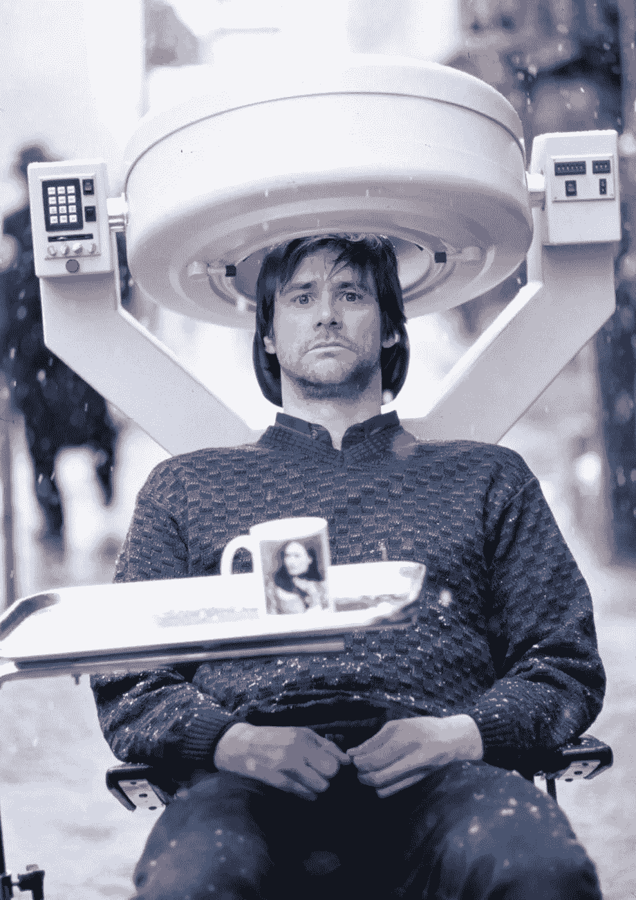

# 记忆如何让我们失望，摧毁我们，让我们成为人类。

> 原文：<https://medium.com/swlh/how-memory-fails-us-wrecks-us-and-makes-us-human-739b06a8b4a5>

“How happy is the blameless vestal’s lot”. Movie — Eternal Sunshine of the Spotless Mind, Focus Features

我们都忘记了名字，有些话“就在嘴边”这是人类的一部分；除非你是所罗门·舍列舍夫斯基。

具有讽刺意味的是，我们对这位不能忘记的人的大部分了解都是模糊的，与他的传奇“民间传说”混在一起。但是，要点仍然很清楚。人们首先注意到“ *S.* ”是因为他在担任莫斯科报纸记者期间被发现的不同寻常的能力。他从来不在他报道的故事上做笔记，因为他根本不需要为了记住它们而把事情写下来。怀疑和不相信导致了惊讶，并导致他的老板把他送到 T2 的共产主义学院，以便有人可以对他进行检查。在那里，他遇到了心理学家 Alexander Luria，他与 Shereshevsky 一起工作了多年，并撰写了著名的关于“*s .*”[的案例研究。Luria 描述了 s 如何能够完美地记住一长串随机的单词和数字、外国诗歌、科学公式以及 Luria 在他们相遇的第一天穿的衣服，即使在多年以后。](https://www.edubloxtutor.com/solomon-shereshevsky/)

然而他的记忆能力也是件好事。他不仅无法摆脱不必要记忆的负担，而且他在作为人类的核心能力方面也有困难，比如理解抽象概念，或者在不同的环境中识别面孔。更悲惨的是，他的痛苦让他变得对生活漠不关心。

记忆远非完美，但远比你想象的要多得多。记忆进化，完全自我创造，或者，对于像舍列舍夫斯基这样的人来说，记忆永远不会忘记。

有些人把记忆描述为有七个“罪”或缺陷，但你可能只能想到一个:遗忘。赫尔曼·艾宾浩斯在 1880 年和 [1885 年](https://archive.org/details/memorycontributi00ebbiuoft)，通过测试自己的记忆进行了一些关于遗忘的初步研究。例如，他会记住一系列无意义的音节，由两个辅音之间的一个元音组成(例如，TUY，XEF，LOL)。随着时间的推移，他测试了自己对不同长度的随机序列中的 [2300 个音节的记忆的准确性](https://archive.org/details/memorycontributi00ebbiuoft/page/22)

他发现了他所说的可以预见的东西:[“遗忘在过程的开始会非常快，在结束时会非常慢”。](https://archive.org/details/memorycontributi00ebbiuoft/page/76)尽管关于这条“遗忘曲线”类似于哪种类型的函数还存在持续的争论，但总体而言，信息丢失率会随着时间的推移而降低这一观点已经得到认同。

那另一个缺点呢，哦，你知道的那个，你确信你知道一个单词或一段记忆，但它不知何故被隐藏在表面之下，那个无论你如何努力都无法回忆起来的缺点，那个它…它…是的，就在你的舌尖上！这是一种叫做遗忘的现象。这在说不同语言的人群中普遍存在，并且随着年龄的增长而恶化。所谓的[“丑陋的姐妹”通常出现在回忆一个单词的过程中，指的是灰姑娘的兄弟姐妹，他们有血缘关系，但不是你要找的正确单词。正是这些相关的单词似乎阻碍了实际的、想要的单词的成功检索；通常情况下，最好是查找答案，或者远离阻碍单词，因为一些研究表明，这也会让你在未来更难记住正确的单词。](http://scholar.harvard.edu/files/schacterlab/files/schacter_american_psychologist_1999.pdf)

虽然记忆可以简单地被遗忘或封锁，但更具破坏性的是，它们也可能被错误地回忆起来，被操纵，并受到未来的影响。为什么有人会把这些称为更危险的记忆缺陷呢？浏览一下无罪项目的无罪释放者页面，他们中的许多人最初是因为目击者的证词而被判刑的。你会看到在监狱里度过了几年甚至几十年的男男女女。你会看到生活被毁了的人；失去了合作伙伴，名誉扫地，失去了多年的机会。随着司法系统严重依赖目击者的报告(大约 [20%的案件使用目击者作为他们的主要证据来源](http://theconversation.com/new-research-reveals-how-little-we-can-trust-eyewitnesses-67663)，目击者对有偏见或完全错误的记忆的敏感性是对一个公正社会的真正威胁。

还是不信？如果你是由于不准确的目击者描述而导致的 [70%的误判](https://www.innocenceproject.org/causes/eyewitness-misidentification/)中的一员，你会的。只有这样才有意义。记忆的这些[阶段](https://www.pnas.org/content/114/30/7758)中的每一个阶段——编码、存储和提取——都容易受到外界影响，导致我们对有缺陷的记忆充满信心。

不仅仅是目击者和受害者会在记忆和信心方面受到影响；“罪犯”也可以。以著名的保罗·英格拉姆为例，他是华盛顿州瑟斯顿县的共和党主席，也是县警察局的首席民事代表，于 1998 年因虐待儿童被捕。尽管英格拉姆起初否认了所有指控，但经过几个月的询问以及心理学家和侦探的建议，他后来对自己的“罪行”进行了描述认罪清单包括“强奸、殴打、儿童性虐待，以及参与一个据称杀害了 25 名婴儿的崇拜撒旦的邪教。”加州大学伯克利分校现已退休的社会学教授理查德·奥弗舍甚至让英格拉姆写了一份 3 页的自白书，讲述了一件奥弗舍自己虚构的事件。事实上，他所有的罪行都是捏造的，但是通过他的思想，这些罪行对他来说才是真实的。

记忆以这种方式与想象内在地联系在一起。让英格拉姆想象这些从未发生过的罪行让他相信这些罪行确实发生了。这也是谢列舍夫斯基成为传奇记忆学家的原因之一；他的联觉倾向，即一个人的感官变得混乱的现象，使他将数字视为命名的、生动的字符，或将“餐馆”一词解释为一个精心制作的、有着人、盘子和音乐的动人场景。这也让一些人相信*和*的记忆并不完美。是的，高于平均水平，但这只是令人印象深刻的想象力的结果。

像英格拉姆或一个过于自信的目击者一样，我们都容易受到这些记忆缺陷、偏见和可塑性的影响。我们就像威廉姆斯学院 70%的[本科生一样，他们承认通过按 ALT 键故意让计算机程序崩溃，他们被告知这一举动会导致许多问题。事实上，没有人真的按下按钮。我们就像那 35%的人一样，他们甚至想出了在假事件中发生的事情的描述。我们在回忆中都会有偏见，就像参与“虚假名声”研究的参与者一样，他们平均记得的黑人罪犯是白人罪犯的 1.7 倍，而实际上所有的名字都是编造的。一项针对斯坦福大学本科生的研究显示，我们是倾向于记住更多积极事件的乐观主义者，而沮丧的参与者会回忆起更多消极事件。](https://web.williams.edu/Psychology/Faculty/Kassin/files/kassin_kiechel_1996.pdf)

有时，无论记忆是对是错，我们都希望能够抹去过去的一些部分，创伤性事件或令人不安的关系。记忆顽固地存在，这一事实可以简单到“不要想猴子”这句话的不可能性，也可以简单到“几种精神疾病，从焦虑到成瘾”杏仁核在这里很重要，在大多数情况下，它是大脑中的战斗或逃跑中心——主要负责恐惧反应的区域。经历 PTSD 症状的个人和动物在这个大脑区域表现出更强的活性。根据一项研究，它对情感记忆也很重要，例如，杏仁核内的活动量与后来回忆一部情感电影的能力直接相关[。这种相关性在非情感电影中并不存在，这表明这个大脑区域与更强烈的记忆有关。](https://www.ncbi.nlm.nih.gov/pmc/articles/PMC38867/pdf/pnas01519-0601.pdf)

虽然能够将一个人从记忆中完全抹去的*永恒阳光技术*可能还很遥远，但科学已经向我们展示了一些摆脱不想要的历史的方法。这个领域的大部分工作都集中在帮助那些患有创伤后应激障碍的人。一项发现是，像普萘洛尔(通常用于治疗心脏问题的药物)这样的β受体阻滞剂[关闭了杏仁核内的某些受体。通过这种方式，它们影响恐惧中枢的蛋白质合成，进而影响创伤记忆。需要注意的是，在给药期间，不需要的记忆必须被“重新激活”或回忆起来，否则记忆痕迹不会被普萘洛尔修改。有趣的是，我们发现记忆本身仍然存在——只是压倒性的恐惧反应消失了。](https://www.tandfonline.com/doi/pdf/10.1080/21507740.2016.1218377?needAccess=true)

谁能对这种治疗虚弱状态的方法提出异议呢？我当然不能。对于那些记忆是诅咒而不是祝福的人来说，记忆修改的潜力看起来像是一种救赎的恩典；但是记忆光谱的另一端，极度遗忘，也同样令人恐惧。如上所述，β-受体阻滞剂通常被认为是安全的，因为它们只会影响情绪，而不会影响记忆的片段内容。但情况并非总是如此，著名的病人 H.M .就是一例

亨利·莫莱森患有癫痫；几乎每天都有一次癫痫发作，他的痛苦使人虚弱，需要进行神经外科手术。至少可以说，手术的范围是戏剧性的，从 H.M .的内侧颞叶两侧切除了大约 8 厘米。手术后，他的癫痫发作奇迹般地下降到每年一次，他的智商甚至增加了(尽管这可能是因为他不再需要药物治疗)。对于这样一个有风险的手术，令人惊讶的是，他“快乐平和”的个性似乎没有太大的不同。然而，当你离开房间一会儿，当你回来时，他会把你看成一个完全陌生的人。

H.M .患有顺行性健忘症；他无法形成任何新的记忆。他也不记得手术前的一两年。但是，他可以无数次地完成一个谜题，而不记得过去的尝试，也不厌倦娱乐。他可以和他在[相伴 46 年的神经科学家苏珊·柯金](https://www.theguardian.com/science/2013/may/05/henry-molaison-amnesiac-corkin-book-feature)打招呼，就好像她每天都是一张新面孔。

然而，有趣的是，莫莱森可以形成新的程序性记忆。这仅仅意味着，随着时间的推移，他可以，比如说，提高照镜子时画东西的技能，这是一项需要反向动作的任务。尽管不记得下一次他尝试的任务，但他每次都做得更好。然而，这对你来说不应该是一种安慰；程序性记忆并不像失忆症所丧失的其他能力那样是我们人类不可或缺的一部分。

以肯特·科克伦为例，他是另一位著名的健忘症患者，在一次摩托车事故中失去了记忆。他独特的健忘症包括失去个人的、片断的记忆，这意味着他的生活，对他来说，在某种程度上从未超出表面水平。他可以告诉你他的名字、出生时间和住址。或者，他可以告诉你墨西哥城在芝加哥以南，或者如何换一个漏气的轮胎。但他不记得自己换过公寓。看了[对他的采访](https://www.youtube.com/watch?v=2TBr5EC3PmY&index=6&list=PLzLhVs1Z4UhDzQ68BskT8W9U6C2lP8TJ0)，他的故事有多悲惨就变得很清楚了。当被要求描述他的生活时，他只能犹豫地说，“我不知道，我想是宜居吧。”他似乎只是简单地存在，对过去没有任何有意义的依恋，他的头脑“一直都很清晰”，就像一个平静的池塘，表面上没有一丝涟漪。遗憾的是，如果没有他深刻的个人记忆，这张空白的大脑是不完整的。

记忆会麻痹我们或者欺骗我们去错误的信仰，当然它也不是没有缺点。但这也造就了我们。随着时间的推移，生命的随机音节可能会消失，或者在虚假的现实中变得模糊。但这些都是必要的罪恶。没有记忆，构成人类特殊生活的很大一部分就简单地消失了:冒险、争论、令人捧腹的后见之明的历史、你喜欢的歌曲、故事、食物和面孔及其原因、你去过的地方以及在那里度过的好时光和坏时光、你认识的人以及使他们不仅仅是你生活故事中的一个额外角色的联系，使你与其他人不同的一切。记忆可以让我们痛苦，但它让我们成为我们。