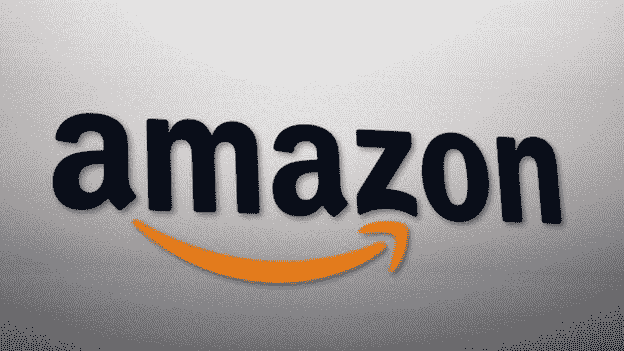

# 亚马逊对 Prime 收费多少？

> 原文：<https://medium.com/swlh/how-much-could-amazon-charge-for-prime-997b4321fdc3>

注:本文原载于 [*市场兄弟传媒*](https://marketbrothersmedia.com/how-much-could-amazon-charge-for-prime/) 。

亚马逊凭借其 Prime 订阅服务拥有巨大的定价能力。两天、一天和即将到来的当天运输加上大量的电视和电影内容非常值得 119 美元的年费，这还不包括折扣和其他优惠，如 Prime Day。当公司将费用从每年 100 美元提高到 5 美元时，没有人反对